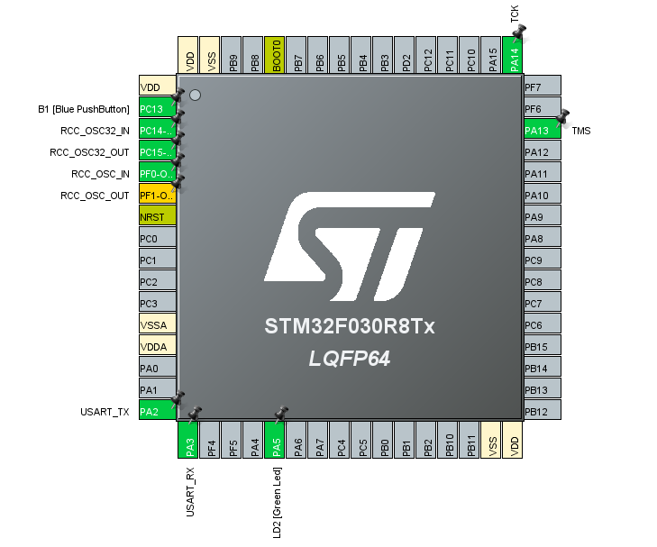
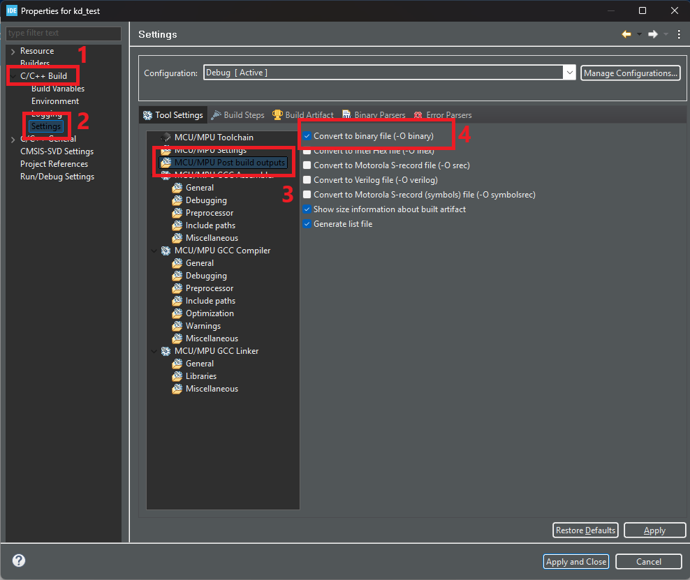
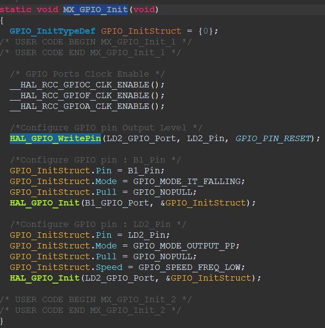

Merhabalar. Bu yazıda Firmware Reverse Engineering'e devam ediyoruz. Bu blogta ise Bare Metal Reversing'e girişeceğiz.

Hatırlarsanız önceki konumuzda TP-LINK Archer AX 21 V4.6'ın 2024 yılında çıkmış Firmware'ini analiz etmiştik. Bu konuda ise işleri birazcık ileriye götüreceğiz.  

Elimde bir Nucleo F030R8 kart (ARM Cortex M0 işlemcili) var ve bunu Firmware Reverse Engineering için değerlendirmek istedim. Bu blogta yapacağımız şey de bu kart'ı basitçe programlayacağız ve ardından firmware'ini reverse edip karta tekrar yükleyeceğiz. Tipik olarak bir Iot kartını hackliyor gibi düşünelim ancak daha basit bir senaryo ile.  


Elimdeki kart bu. Eğer elinizde nucleo'nun farklı bir kartı var ise de bu blogtaki adımları takip edebilirsiniz.

Açıkçası mikrodenetleyici kodlama konusunda kendimi geliştirmedim. Ancak bu konsept sürecinde beraber hem mikrodenetleyici kodlamaya hem de firmware reverse engineering alanlarında kendimizi geliştireceğiz. 

Gerekli programlar ise CubeIde, CubeProgrammer ve Ghidra olacaktır. CubeIde ile kartımız için programlamayı yapacağız, Ghidra ile aldığımız firmware yani .bin dosyasını reverse edeceğiz ve son adımda CubeProgrammer ile reverse ettiğimiz firmware’i kartımıza yükleyeceğiz.

## **Kodlama**

Yapacağımız kodlama tamamen basit. **Nucleo F030R8** kartında bir adet User Button (Fotoğrafta mavi button'a göz atabilirsiniz) ve Green led (LD2) bulunmakta. Button'a basıldığında Green Led'i yakan bir kodlama yapacağız. Daha sonra Ghidra kullanarak IDE'den aldığımız firmware reverse ederek bu programın çalışma prensibini tersine çevireceğiz. Yani reverse ettikten sonra button'a basmadığımız durumlarda Green led'i yakacak. 



CubeIDE'de projeyi oluşturduktan sonra **.ioc** dosyasına yönlenebiliriz. Kart üzerindeki button ve led ile çalışacağımız için fotoğraftan da görüldüğü üzere ayarlamalar zaten IDE tarafından yapılmış durumda. Bu yüzden burada yapacağımız ekstra bir şey yok. Benim kartımdan User Button **PC13**'da ve Led2 ise **PA5**'de bulunmakta. 

Kodlamaya geçmeden önce oluşturduğumuz projede ufak bir ayar yapmamız gerekecek. Firmware'i analiz edeceğimiz için programın karta yüklenmesiyle .bin dosyasını almamız gerekecek:



Oluşturduğumuz projeye sağ tıklayalım ve **Properties** seçeğine tıklayalım. Daha sonra **C/C++ Build > Settings > MCU/MPU Post Build Outputs**'a gidelim ve **Convert to binary file (-O binary)** seçeneğini aktifleştirelim.

Şimdi ise IDE'nin en solunda bulunan **Project Explorer** sekmesinde **Core > Src > main.c** projesine yönelelim. Bu bizim ana projemiz.

**main.c** içerisinde kodlamaya geçmeden önce oluşturulmuş **MX_GPIO_Init** fonksiyonuna göz atabiliriz. Bu fonksiyon, IDE tarafından hazırlanan pin'lerin konfigurasyonunu içerir: 



Göründüğü üzere **F030R8** kartı için User Button'a GPIOA olarak B1_Pin (GPIO_PIN_13) ve LED2 için ise GPIOA ve LD2_PIN (GPIO_PIN_5) olarak ayarlanmış. Eğer farklı bir kartta iseniz bu ayarları kontrol edebilirsiniz.

Şimdi ise main fonksiyonuna dönelim ve kodlamalara başlayalım:

```c
  /* USER CODE BEGIN 2 */
  uint8_t ButtonStatus = 0;
  while (1)
  {
	  ButtonStatus = HAL_GPIO_ReadPin(B1_GPIO_Port, B1_Pin);
	  if (ButtonStatus == 0) {
		  HAL_GPIO_WritePin(LD2_GPIO_Port, LD2_Pin, SET);
	  }
	  HAL_GPIO_WritePin(LD2_GPIO_Port, LD2_Pin, RESET);
  }
```

Göründüğü üzere kod gayet basit bir durumda. Şimdi tek tek ele alalım:

```c
ButtonStatus = HAL_GPIO_ReadPin(B1_GPIO_Port, B1_Pin);
```
İlk olarak main'in while içerisinde **HAL_GPIO_ReadPin** fonksiyonunu kullanıyoruz.Bu fonksiyon ilgili pinin durumunu okumak için kullanılıyor ve iki parametre almaktadır. İlk parametre, pinin bulunduğu GPIO portunu belirtir. STM32 mikrodenetleyicilerinde, GPIO pinleri belirli portlara (A, B, C, vb.) bağlıdır. Örneğin, GPIOA, GPIOB, GPIOC gibi portlar bulunur. Bu parametre, pinin hangi portta yer aldığını belirtmek için kullanılır. Kodumuzda ise **GPIOA** olduğunu belirtiyoruz. 

İkinci parametre ise okumak istediğiniz GPIO pinini belirtir. Her portun üzerinde birden fazla pin bulunabilir (örneğin, port A'da PA0, PA1, PA2 vb.). Bu parametre, hangi pinin durumunu okuyacağınızı belirtir. Kodumuzda ise B1_Pin yani **GPIO_PIN_13** olduğunu belirtiyoruz. 

Son olarak ise bu fonksiyonun dönüş adresi **uint8_t** tipinde olan ButtonStatus değişkenine aktarılır. Yani kısaca bu fonksiyon, belirtilen pin'deki durumu okur ve ButtonStatus değişkenine sonucu aktarır. 

```c
if (ButtonStatus == 0) {
    HAL_GPIO_WritePin(LD2_GPIO_Port, LD2_Pin, SET);
}
HAL_GPIO_WritePin(LD2_GPIO_Port, LD2_Pin, RESET);
```

Pin okumasından sonra bir if karşılaştırması yapıyoruz. ButtonStatus'a atanan değer eğer sıfır ise **HAL_GPIO_WritePin**  ile LED2 için işlem yapıyor.

ButtonStatus değerinin 0 olması demek Button'a basıldığı anlamına gelmektedir. 1 olması durumunda Button'a basılmadığı anlamına gelir. Yani biz bu if içerisinde Button'a basıldığında Led'in yanmasını sağlayacağız.

**HAL_GPIO_WritePin** fonksiyonu, belirli bir GPIO pinini t1 - HIGH durumu) veya "reset" (0 - LOW durumu) durumuna getirmek için kullanılır.

İlk parametre, önceden anlatıldığı gibi hangi GPIO portunun kullanılacağını belirtir ve kodumuzda GPIOA olarak belirttim. İkinci parametre, ayarlanacak veya sıfırlanacak GPIO pinini belirtir ve tanımlanan GPIO_PIN_5 değerini taşıyan LD2_PIN değişkeni verdim. Son olarak üçüncü parametre ise Pinin durumu belirtilir. İf içerisindeki amacımız led'i yakmak olduğu için **SET** değerini verebiliriz. Bu ilgili pinin durumunu 1 olarak ayarlayacaktır. 

Eğer button'a basılmadığı sürece yine **HAL_GPIO_WritePin** fonksiyonunu kullanıyoruz ancak son parametresi **RESET** olarak belirtiliyor. Bu, button'a basılmadığı zaman ilgili pini 0 olarak ayarlar. Böylece button'a basılmadığı zaman led yanmayacaktır.

Şimdi ise bu kodu kartımıza yükleyelim ve sonuca bir bakalım:


Göründüğü gibi sorunsuz bir şekilde programımız çalışıyor. Button'a tıkladığım anda green Led yanmakta. Şimdi ise Ghidra'ya dönelim ve aldığımız .bin dosyasını ghidra'da analiz etmeye başlayalım. Oluşturulan .bin dosyası Debug dosyasının altında olacaktır:


## **Firmware Reversing**

.bin dosyasını ghidra'da **File > Import File** tıklayarak .bin dosyamızı seçelim ancak direkt olarak çıkan ekranı kapatmayın önemli ayarlamaları yapmamız gerekecek.

Öncelikle Languages kısmını ayarlayarak başlayalım ve filter alanına **ARM** diye aratalım:


Ben Language olarak **Cortex 32-bit, Little Endian** olarak seçtim. Eğer aynı karta sahip iseniz bu seçeneği, farklı karta sahip iseniz kartınıza uygun olarak dil seçimini yapın. Daha sonra OK diyerek bu Language sekmesinden çıkabilirsiniz. 


Daha sonra aynı ekrandan **Options** kısmına tıklayalım ve burada yapacağımız ayar gerçekten önemli. Burada Base Address gibi ayarlamalar yapacağız. 

İlk olarak base address ayarını yapmamız gerekecek. **ki ama bir firmware'in Base Addresini nasıl bulabiliriz? diye bir soru gelebilir. En iyi yöntem cihazın memory haritasına bakmak olacaktır.

ARM tabanlı bir kartta çalışıyoruz. Nucleo'nun datasheet'leri aracılığıyla Base Address'i bulabiliriz:


Yukarıdaki fotoğraf **STM32F030x4/x6/x8/xC** kartlarının memory haritası. Benim kartım bu cihazlar arasından olduğundan dolayı bu memory haritasından yararlanmam gerekecek:


Fotoğrafa daha detaylı baktığımızda Flash memory alanın **0x8000000** olduğunu görebiliriz. ARM Tabanlı işlemcilerin Base Address'in çoğu zaten bu adrestedir ancak yine de farklı karta sahip iseniz datasheet ile adresine bakmakta fayda olacaktır.

Daha sonra datasheet ile elde ettiğimiz adresi Ghidra'nın Options sekmesinden **Base Address** alanına yazalım:


Block Name ismine **flash** olarak verdim. Sizde böyle yapabilirsiniz. Diğer ayarlara dokunmamıza gerek yok sadece **Block Name** ve **Base Address** değerlerini vermemiz yeterlidir. OK button'a tıklayalım ve artık ekranda .bin dosyasına çift tıklayalım.

Fakat birkaç daha ayar yapmamız gerekecek. CodeBrowser ekranı açıldığında ekranın ortasında bulunan **Memory Map** kısmına tıklayalım:


Daha sonra bu ekranda sağ üste bulunan '+' işaretine tıklayalım:


Yine burada birkaç bellek alanı ayarlamamız gerekecek. İlk olarak **Flash Memory** alanını ayarlamamız gerekecek. Peki nedir bu?

Flash Mirror, firmware'in çalıştırılabilir kodunun genellikle saklandığı alanı temsil eder. Çoğu gömülü sistemde, bu bölge işlemciye bağlı olarak 0x0 adresinden başlar ve firmware'in yüklenip çalıştırılacağı yerdir. Flash bölgesi kod bölgesini (örneğin, main fonksiyon, başlangıç kodları, vb.) içerir

Yinede offset'i doğrulamak için datasheet'e bakabiliriz. Yukarıda paylaştığım fotoğrafa tekrar göz atarsak benim kart için 0x0 alanında olduğunu görebiliriz. Şimdi ise bu alanı ayarlayalım:


**Block Name** alanına 'flash_mirror' ismini verebiliriz. **Start Addr** alanına ise default olarak 0'da bırakalım. **Length** alanını ise okla gösterildiği gibi flash ismi ile ayarladığımız alanın boyutu ile aynı olacak şekilde ayarlayın. Daha sonra Execute kutucuğunu işaretleyelim. **Block Types** alanında File Bytes kutucuğunu işaretleyelim ve **File Offsett** değerini 0 olarak bırakalım ve bitirmek için OK tuşuna basalım.

Son alanımızı ayarlamak için yine '+' tuşuna basalım. Bu sefer ise SRAM alanını ayarlayacağız. Genel olarak adresi **0x20000000**'dir ancak yine de bunu doğrulamak için kartımızın dahasheet'ine bakabiliriz:


Göründüğü üzere 0x20000000 adresinde olduğunu görebiliyoruz. Şimdi SRAM'in de alanını ayarlayalım:


**Block Name** alanına 'RAM' ismini verebiliriz. **Start Addr** alanına 20000000 değerini verelim. **Length** değerine ise 80000 verelim. Daha sonra OK diyerek ekranı kapatalım.

İşlemlerimiz bitti. Şimdi ise ekranın sol üstünde bulunan kaydetme tuşuna basalım ve Memory Map ekranını kapatalım:


Son bir işlemimiz kaldı. Ekranı kapattıktan sonra Ghidra'nın sol üstündeki bar'dan **Analysis > Auto Analyze'<project>.bin'** kısmına gidelim ve bu ekranda **'ARM Aggressive Instruction Finder (Prototype)'** seçeceğini aktifleştirelim ve 'Analyze' button'a tıklayalım:


Artık her şey için hazırız. Şimdi ise Disassembly ekranından en üst tarafa bir göz atalım:


Eğer benim gibi yeni iseniz burada işaretlenenleri gördüğünüzde biraz kafanız karışabilir ama aslında basit.

Fotoğrafta gördüğünüz bu alana 'vektör tablosu' deniyor. CPU, sistem başlatıldığında ilk olarak buradan Stack Pointer’ı (yığın işaretçisi) yükler. Yani tablonun ilk adresi, sistemin yığın belleğinin başlangıç adresini gösterir. Daha sonra işlemci, bu tabloda tanımlı olan Reset Handler (Reset İşleyicisi) adresine sıçrayarak çalışmaya başlar.

Vektör tablosu, mikrodenetleyicinin işletim sırasında karşılaşabileceği tüm kesme (interrupt) ve hata (fault) durumlarına nasıl tepki vereceğini tanımlar. Örneğin:

- **Reset:** CPU yeniden başlatıldığında çalışacak kodun adresini belirler. Bu, genellikle sistemin ilk ayarlarını yapan başlatma fonksiyonudur.
- **NMI (Non-Maskable Interrupt):** Maskelenemeyen, yani her zaman işlenmesi gereken bir kesme durumudur.
- **HardFault:** Kritik bir hata meydana geldiğinde çağrılan işleyicidir.
- **BusFault:** Bellek erişim hataları gibi donanım sorunlarını yönetir.
- **UsageFault:** Yanlış talimat veya matematiksel hatalar gibi yazılımla ilgili sorunlar için işleyici sağlar.

Bizim burada ilgileneceğimiz kısım **Reset** alanı olacaktır. **Reset** vektörü, C Programın giriş bölümüne benzer şekilde basit kurulum kodları içermektedir. Bu vektör içerisinde main fonksiyon çağırıldığı için buradan ana fonksiyonu bulacağız.

Şimdi Reset vektör ile işaretlenen adrese çift tıklayalım:


Assembly kodlarını okuyan hayatsız bir birey olmak yerine normal bir insan gibi decompiler ile bakabiliriz:


Burada umursamadığımız birkaç döngü vs. kullanıldığını ve fonksiyon çağırıldığını görmekteyiz. Çağırılan üç fonksiyonundan ikisine göz attım ancak bir şey anlamadım ve son çağırılan fonksiyona göz attığımda main fonksiyon olduğunu doğruladım:


Daha anlaşılır gözükmesi için Fonksiyon adlarını vs. güncelledim. Fonksiyona baktığımızda zaten kodlama yaptığımız esnada anlatmıştım. Bir farklılık bulunmamakta. Şimdi Assembly kodlarına dönüp Patch işlemi yapacağız.

Yapacağımız şey de basit. if koşulundaki '0' değerini '1' ile değiştireceğiz. Böylece button'a basmadığımız zamanlarda led yanmış olacak.

main fonksiyonun Dissassembly ekranında if koşuluna karşılık gelen instruction'u bulalım ve sağ tıklayıp **Patch Instruction** seçeceğine tıklayalım:


Daha sonra 0x0 değerini **0x1** olarak değiştirelim ve enter tuşuna basalım. Bu işlemden sonra Decompiler'dan kontrol ettiğimizde sonuç şu şekilde olmalı:


Her şey bu kadar. Şimdi Ghidra ekranında sol üstünde **File > **Save '.bin' As...** sekmesine tıklayalım:


Sonu '.bin' ile bitecek şekilde bir isim vererek projeyi kaydedin.

Son olarak CodeBrowser ekranını kapatın ve kaydettiğiniz projeye sağ tıklayıp export diyerek projeyi bilgisayara kaydedin:


Şimdi bu reverse ettiğimiz .bin dosyasını CubeProgrammer aracılığıyla kartımıza yükleyeceğiz.

CubeProgrammer'i başlatalım ve programın sağ üstündeki **Connect** buttonu ile kartımızı bağlayalım:


Göründüğü gibi kartımıza bağlandığında memory address'leri vs görmekteyiz. 

Programda 'Open File' seçeceğine tıklayarak reverse ettiğimiz .bin dosyasını seçelim ve ardından 'Download' seçeceğine tıklayarak reverse ettiğimiz firmware'i kartımıza yükleyelim:


Göründüğü gibi ekranda 'File Download Complete' mesajı alıyoruz. Tebrikler artık elimizde reverse edilmiş bir firmware ile çalışan  kartımız var! 

## **Sonuç**

Şimdi kartın son haliyle bir kez daha göz atalım:


Videodan göründüğü üzere Button'a basmadığımız durumlarda Led yanıyor. Eğer button'a basarsak led sönüyor.

Temel olarak yaptığımız şey oldukça basitti. Basitçe kartımızı button'a basıldığında led yakacak şekilde kodladık ve Ghidra ile kartın firmware'ini reverse ederek kodladığımızın tersini yapacak şekilde ayarladık ve karta tekrar yükledik. 

Umarım içerik sizin için faydalı olmuştur. Eğer konuyu daha detaylı araştırmak isterseniz **referans olarak bıraktığım kaynaklara göz atabilirsiniz.**

İyi çalışmalar dilerim efenimmm.

## **References**

- [**Stacksmashing - Bare-metal ARM Firmware Reverse Engineering with Ghidra**](https://www.youtube.com/watch?v=q4CxE5P6RUE)

- [**Cutaway Security - Learning Ghidra Basics Analyzing Firmware**](https://www.cutawaysecurity.com/learning-ghidra-basics-analyzing-firmware/)

- [**Cybergibbons - Reading and Writing Firmware on an STM32 using SWD**](https://cybergibbons.com/hardware-hacking/reading-and-writing-firmware-on-an-stm32-using-swd/)
