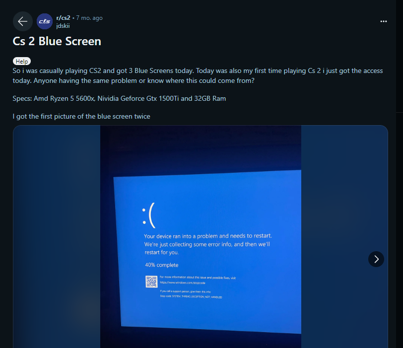
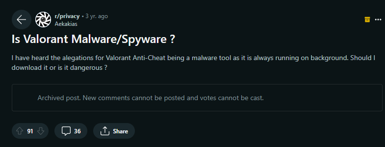
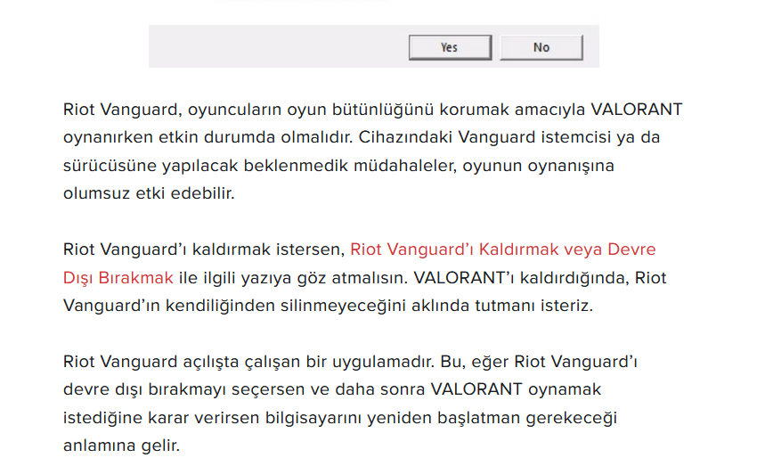
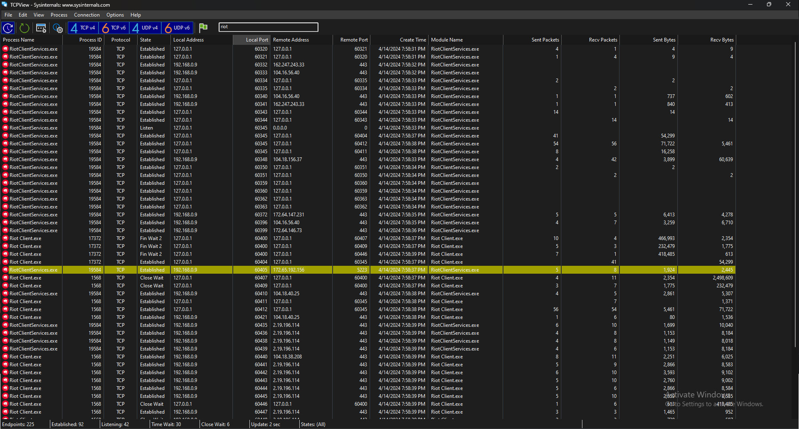
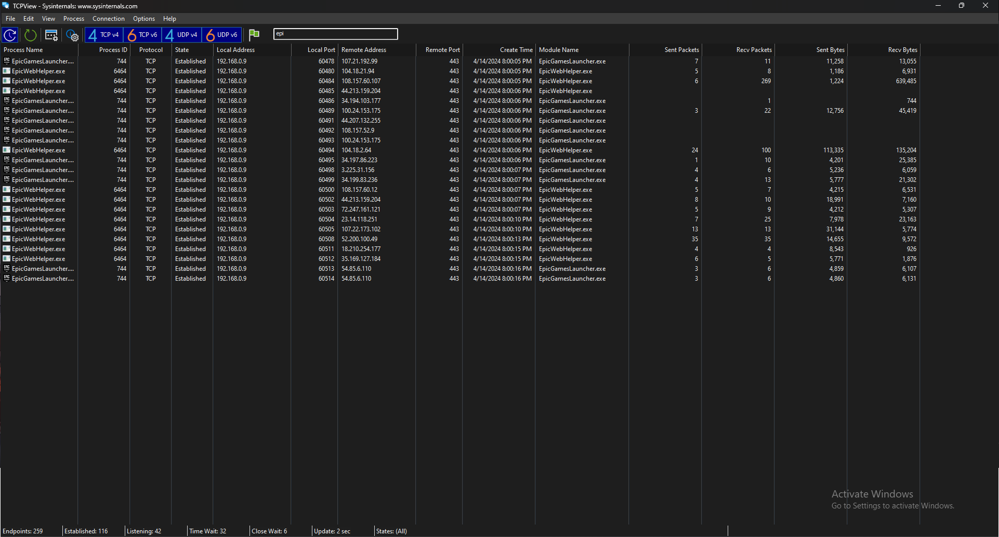
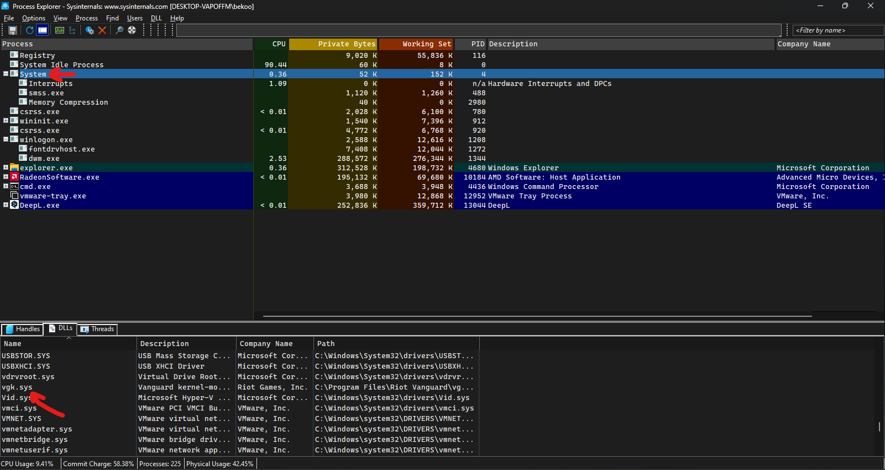
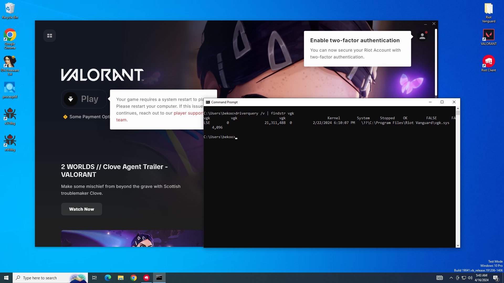
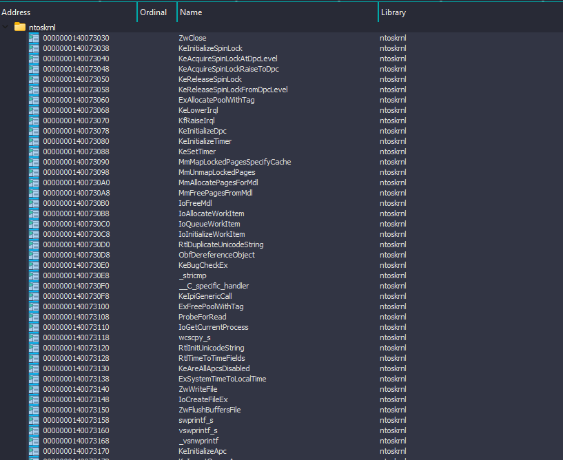

## Giriş

Valorant oyunu, çıkışından beri hem oyuncuların ilgisini çeken hem de tartışmalara neden olan bir yapım olmuştur. Özellikle oyunun anti-cheat sistemi olan Vanguard’ın, oyuncuların gizlilik haklarını ihlal ettiği ve spyware olarak adlandırılabilecek bir yazılım olduğu iddialarıyla sıkça gündeme gelmiştir. Bu iddialar, oyuncuların güvenlik endişelerini artırmış ve Valorant’ın popülaritesiyle birlikte bu konuda birçok tartışma başlatılmıştır.

Reddit ve diğer sosyal medya platformlarında yayılan bu iddialar, Valorant’ın geliştiricisi olan Riot Games’in, oyuncuların bilgisayarlarında istenmeyen izleme ve kontrol yeteneklerine sahip olduğu yönünde eleştirilmesine neden olmuştur. Ancak, bu iddiaların gerçekliği ve Vanguard’ın gerçekten bir spyware olup olmadığı konusu hala netlik kazanmamıştır. Bu yazıda, Valorant’ın spyware olduğu iddialarını ele alacak ve bu iddiala bir göz atacağız.

> [!WARNING]
> Bu yazıdaki analiz ve değerlendirmeler, yalnızca araştırma amaçlıdır ve herhangi bir suçlama içermemektedir. Valorant’ın güvenlik önlemleri ve Vanguard anti-cheat sistemi hakkındaki iddiaların objektif bir bakış açısıyla incelenmesi amaçlanmıştır.

## Anti-Cheat Yazılımları nasıl Çalışır?
Araştırmamıza Anti-Cheat yazılımların nasıl çalıştığını anlayarak başlamamız gerekiyor.

Genel olarak Anti-Cheat yazılımları, oyun içerisinde hile yapılmasını engellemek ve hile yapanları tespit etmek amacıyla geliştirilmiş yazılımlardır.

Bu yazılımların çalışma mantığını ikiye ayırabiliriz: server-side (sunucu taraflı) ve client-side (istemci taraflı) çalışma yöntemleri.<sup>[1]</sup>

Server-side tabanlı anti-cheat yazılımları, genellikle oyuncunun oyun sunucusuna gönderdiği verileri izler ve analiz eder. Bu veriler, oyuncunun oyunu nasıl oynadığı, hangi komutları gönderdiği, ne kadar hızlı tepki verdiği gibi bilgileri içerebilir. Amacı, oyuncunun normal oyun davranışları ile potansiyel hile kullanımı arasındaki farkları tespit etmektir.

Client-side tabanlı anti-cheat yazılımları ise oyuncunun kendi bilgisayarında çalışır ve oyuncunun bilgisayarına tamamen erişimi olabilir. Böylece oyuncunun bilgisayarında çalışan hile programlarını tespit etmeye çalışır ve bunları engellemeye veya raporlamaya yönelik çeşitli teknikler kullanabilir. Ayrıca bu yazılımlar kernel seviyesinde tam yetkili ve erişimli olarak çalışır. Yani oyuncunun bilgisayarına tamamen hakimdir.

Her iki tür anti-cheat yazılımının avantajları ve dezavantajları vardır. Server-side anti-cheat yazılımları genellikle daha güvenilirdir çünkü sunucu tarafında çalışırlar ve oyuncuların kendi bilgisayarlarında yapabilecekleri manipülasyonlara daha az açıktır. Client-side tabanlı anti-cheat yazılımları ise oyuncunun bilgisayarında daha kapsamlı bir kontrol sağlayabilir ve bu, bu yazıda sıkça tartışacağımız gizlilik ihlallerine veya oyuncunun güvenliği konusunda endişelere neden olabilir.


İlk başlarda Anti-Cheat yazılımları Ring 3 seviyesinde çalışıyordu. Bilindiği gibi ring 3 alanı, User Mode olarak geçmektedir. Eğer bu konuya aşina değilseniz hızlı bir şekilde araştırmanızı tavsiye ederim.

User Mode alanında ayrıcalıklar çok kısıtlıdır; işletim sistemi üzerinde her ayrıcalığa sahip olmadığınız ve çok kısıtlı olduğunuz bir alan. Anti-Cheat yazılımları ise bu alanda çalışıyordu. Bu alanda doğrudan donanıma erişim sağlayamadığınız için ve belleğe erişim sağlayamadığınız için anti-cheat yazılımları herhangi bir tarama gerçekleşmeden önce gerekli izinlere sahip olması gerekirdi. Bunlarla beraber bu alanda anti-cheat yazılımları, diğer uygulamara göre izole bir şekilde çalışırdı ve bu yüzden başka bir uygulamaya ait olan datalara müdahale edemez ya da datayı değiştiremezdi<sup>[2]</sup>

Fakat Cheater’lar, anti-cheat yazılımların Ring 3 seviyesinde çalıştığını bildikleri için daha sofistike yöntemler geliştirdiler. Yöntemleri ise hazırladıkları hileleri Ring 3 seviyesinde değil Ring 0 alanında çalıştırmaktı yani Kernel Mode alanında. Böylece hazırladıkları hileler daha fazla ayrıcalıklara sahip oluyordu ve tespit edilmesi ciddi anlamda zorlaşıyordu. Ring 0 yani Kernel Mode alanı, User Mode alanı gibi kısıtlamalara sahip değildir. User mode alana kıyasla daha fazla ayrıcalıklara sahiptir; herhangi bir instruction yürütülebilir ve herhangi bir bellek adresini rahatça okunabilir veya en önemlisi donanımla iletişime geçilebilir. Hatta Cheater’lar o kadar ileri seviyeye gitmişler ki, Ring 3 alanında çalışan Anti-Cheat yazılımlara ait verileri almak için bu yazılımların kullandığı system call’ları bile hooklayabiliyordı.<sup>[2]</sup>

Oyun şirketleri ise bu yönteme karşı bir cevap vermesi gerekiyordu ve User mode alanında kısıtlı bir şekilde çalışan anti-cheat yazılımlarını kernel seviyesinde yani Ring 0 alanına taşıdılar. Ring 0’da çalışan bu yazılımlar, Ring 3 alanında olduğu gibi sistemi aynı şekilde tarayabiliyor ancak bunu direkt kernel seviyesinde yapıyor yani tamamen yüksek yetkiler ile. Bunun avantajı olduğu gibi de bu blogta baya tartışacağımız dezavantajı da vardır. Anti-Cheat yazılımların Ring 0 alanında çalışma avantajı, tespit edilemesi zor olan hileleri bile kolayca tespit etmesi ve oyunu hileye karşı daha güvenli tutmasıdır. Dezavantajı ise gizlilik problemi.

Düşünün ki, eğer bu yazılımlar sizi hilelerden korumak için yüksek yetkiler ile tarama yapıp ve her şeyi okuyabiliyorsa teorik olarak bilgisayarınızdaki her şeye de erişebilir anlamına da geliyor. Bu yazılımlar kernel seviyesinde çalışıyor. Yani yüksek ayrıcalıklarla sizin bilgisayarınızdaki anlık her şeyi okuyabilir ve erişebilirler. Sizlere şu soruyu yönlendirmek isterim, oynadığınız oyunda hilecilere katlanmak istemezsiniz ve bu hilecilere karşı bir önlem alınmasını istersiniz ama bununla beraber gizliliğinizi riske atmak ister miydiniz?

## Anti-Cheat yazılımların getirdiği Potansiyel Tehlikeler

Geçmiş yıllarda anti-cheat yazılımların gizlilik ilkelerini ihlal eden olaylar olmuştur. Bunlardan biri de 2013 yılında ESEA şirketinden bir geliştiricinin işletim sisteminin kernel seviyesini kullanarak oyuncuların bilgisayarından gizli ve büyük ölçekte bir bitcoin madenciliği gerçekleştirmesi bu konuya güzel örnektir. Geliştirici, 14.000 oyuncunun bilgisayarındaki GPU ile yerleştirdiği mining yazılımıyla yaklaşık 4.000$ elde etti<sup>[3]</sup> ve bu olay ortaya çıktıktan sonra ESEA şirketi US Regulators (ABD Düzenleyicileri) tarafından 1.000.000 para cezası verildi. Bu olaylardan sonra ESEA şirketi bizzat kamuoyundan özür diledi ve ESEA şirketi mining ile elde edilen paraları ödül potları aracılığıyla oyunculara dağıttı ve American Cancer Society (Amerikan Kanser Derneği)’ne $7.427.10 bağışladı.<sup>[3]</sup>

Bununla beraber bazı İşletim sistemi için problemlere neden olabilirler. Eğer sıklıkla oyun oynayan biriyseniz bu durumla belki karşılaşmış olabilirsiniz. Anti-Cheat yazılımları kernel sürücüsü olarak çalıştığı için sürücüde bulunan kodda küçük bir hata, işletim sistemin Blue Screen of Death (BSOD) benzeri çökmelere neden olabilir. Örneğin şu görsele bir bakabiliriz:


Burada kullanıcı bilgisayarı açtığı anda yukarıda bahsettiğim SYSTEM THREAD EXCEPTION NOT HANDLED hata koduyla mavi hata ekrana düştüğünü belirtiyor. **vgk.sys**, RIOT Games’a ait olan bir Vanguard anti-cheat yazılımın sürücü dosyasıdır.



Burada ise kullanıcı Counter Strike 2 oyununu oynadığı sürece yine aynı hata koduyla mavi ekrana düştüğünü ve çözüm aradığını belirtiyor. 

## Valorant için Spyware iddiaları

Valorant için bu iddiaların bulunmasındaki en büyük sebeplerden biri de Çin ülkesine ait olan Tencent şirketinin RIOT Games’ın %100’üne sahip olması, bu iddialara öncülük etmektedir. Tencent şirketi, Şubat 2011’de Riot Games’in yüzde 93 hissesi için 400 milyon yatırım yapmıştı ve 16 Aralık 2015’te kalan yüzde 7 hisse için de belirtilmeyen fiyat ile yatırım yaparak %100 hisseyi almıştır.[4]

Tencent şirketi, Çin hükümeti ile yakın ilişkileri olan bir şirkettir ve Çin hükümeti, internet üzerindeki tüm faaliyetleri kontrol etmek istemektedir. Bu durum, Tencent’in RIOT Games’ın %100’üne sahip olması ve Valorant’ın anti-cheat yazılımının kernel seviyesinde çalışması, bu yazılımın Çin hükümeti tarafından kullanılabileceği iddialarına neden olmuştur.

Bu tartışmaların başlangıcını 3-4 yıl öncesinde başladığını görebiliriz. Mesela r/privacy subreddit’inde denk geldiğim şu konuya bir göz atabiliriz:



İçerikte, Valorant’ın anti-cheat yazılımı olan Vanguard’ın tehlikeli olup olmayacağına dair bir soru sorulmuş. Yine içerikte bu yazılımın arka tarafta sürekli çalıştığı söyleniyor.

Öncelikle bu iddiaların doğruluğunu araştırarak başlamaya karar verdim ve RIOT’un kendi makalesi olan ‘Vanguard Nedir’ ile göz atarak başladım. Makalenin şu kısmı çok dikkatimi çekti:



Açıkçası bu metinler beni tatmin etmedi. Evet, RIOT makalesinde Vanguard’ın zaten bilgisayar açılışından itibaren çalıştığını açıkça söylüyor ancak bana soracak olursanız açıklama yetersiz. 

Bu makale bana yetersiz geldiği için tekrardan reddit ortamlarına döndüm ve tekrar araştırmaya başladım. Daha sonra r/VALORANT subreddit’inde bu soruna yönelik açılan bir post'un altında u/RiotArkem'in uzun bir [açıklamasına](https://www.reddit.com/r/VALORANT/comments/fzxdl7/comment/fn6yqbe/?utm_source=share&utm_medium=web3x&utm_name=web3xcss&utm_term=1&utm_content=share_button) denk geldim


Bu açıklama, Vanguard üzerine okuduğum makaleye kıyasla daha açıklayıcıydı. Bir göz atalım.

vgk.sys sürücüsünün gerçekten bilgisayar başlangıcında çalıştığını söylüyor ancak oyun çalışmadığı sürece hiçbir şeyin taramadığını, sunucularla iletişim kurmadığını ve mümkün olduğunca az sistem kaynağı kullanarak çalıştığını söylüyor ve bu yazılımın istendiği zaman kaldırılabileceği söyleniyor.

**"Neden başlangıçtan itibaren çalışıyor?"** sorusuna karşılık ise sistem başlangıcında yüklenmediği sürece bilgisayarı güvenilir olarak kabul etmediği ve en önemlisi de anti-cheat yazılımları bypass etmenin yollarından biri olan anti-cheat yazılımların yüklenmesinden hemen önce hilenin yüklenmesi gibi yöntemler için çözüm olabileceği söylenmiş.

Ayrıca bu sürücünün güvenliğine ve ayrıcalıklarına da değinmiş. Güvenlik olarak, güvenlik araştırma ekiplerine incelettiklerini, sürücünün mümkün olduğunda az şeyler yaptığını ve sürücüye en az ayrıcalıklar verdiklerini söylemiş

Açıklamaya göz attığımızda orijinal makaleye kıyasla daha açıklayıcı ve güzel duruyor. Şimdi ise bu topladığımız bilgileri analize dökerek bir kontrol edelim.

## Analizin gerçekleşmesi
Şimdi temel bilgilerden sonra artık basitçe neler yapabileceğimizi çözdük ve artık yavaştan analize başlayabiliriz.

Öncelikle analize wireshark ile başlamak istedim. RIOT Client uygulaması başlatıldığında nerelere bağlantı kurduğunu görerek başlayalım:


Göründüğü gibi Client uygulaması çalıştırıldığında düşünüldüğünden daha fazla birçok yere veri gönderiliyor.

Burada gönderilen verilerin içeriğini göremeyiz çünkü videoda görülebileceği gibi veriler şifrelenmiş halde. Dolayasıyla bunun izinden gitmemiz pek mümkün olmayacaktır. Bu yüzden bende bireysel bağlantıların adreslerinden bir kaçına göz atmaya karar verdim:



Verilerin nereye gönderildiğine dair bir iz sürmeye çalıştığımda sonuca varamadım ancak The PC Security Channel adlı kanalın ‘Is Valorant Spyware?’ videosunun analizinde kendisinin birçok IP adresinin Amazon sunucularına ait olduğunu belirtiyor. Ayrıca bu konuyu hazırlarken ilham aldığım bahsi geçen videoya da göz atabilirsiniz. Gerçekten güzel ve açıklayıcı bir analiz gerçekleştiriyor.

Bağlantı sayılarına buradan da göz attığımızda çok kadar fazla bağlantı olduğunu görebiliyoruz ve maalesef bu iç açıcı bir şey değil. Kendi kendime bunun abarttığımı düşündüm ve bilgisayarımda yüklü olan Epic Games uygulaması için de kontrol etmek istedim ve sonuç:



Göründüğü gibi RIOT Client uygulamasına kıyasla daha az bir bağlantı var. Yani RIOT Client uygulamasının cidden fazla veri gönderimi yaptığını anlayabiliyoruz.

Daha sonra yönümü .sys dosyasına çevirdim ve Process Explorer aracılığıyla vgk.sys’e kısaca bakmak istedim:



Aynı zamanda vgk.sys’in durumunu driverquery aracı ile daha hızlı kontrol edebiliriz:


Fakat bir sorun var. Şuan işletim sisteminde RIOT’un herhangi bir uygulaması çalışmıyor - arka planda bile -. Bu, Riot Vanguard için de geçerli:


İşletim sistemimde RIOT’un tüm uygulamaları başlangıçta başlaması kapalı. Ancak yine de vgk.sys’in çalıştığını tespit ettim. 

RIOT’un makalesinde zaten arka planda çalıştığını belirtse de RIOT ile ilgili tüm uygulamaların kapalı olmasına rağmen bu kernel sürücüsünün yine arka planda çalışması çok olanaksız. Oyun tamamen kapalı ise oyunlarda hileden koruyan bir yazılım beni neyden koruyabilir?

Araştırmalara, yukarıda Vanguard’ın eski lideri Arkhem’in bahsettiği şu kısmı ele alara devam etmek istiyorum:

> <i>"Yes we run a driver at system startup, it doesn’t scan anything (unless the game is running), it’s designed to take up as few system resources as possible and it doesn’t communicate to our servers. You can remove it at anytime."</i>

Yazılımın istendiği zaman kaldırabileceği belirtilmiş. Bunu tekrar okuduktan sonra Vanguard’ı kaldırdım ardından işletim sistemini yeniden başlattım ve vgk.sys’in yine sistemde olup olmadığını kontrol ettim ve sonuç:


Gerçekten de Vanguard yazılımı kaldırıldığında vgk.sys sistemden kaldırılıyor. Bunu doğrulamış olduk.

## vgk.sys Sürücüsünü Analiz Etme

vgk.sys sürücüsünü yakından analiz etmeye başlayacaktım ancak maalesef bunun izinden süremedim. Çünkü RIOT’un hiçbir şekilde vgk.sys’i analiz etmemize fırsat vermediğini öğrendim.

İlk başta VALORANT oyununu sanal makineye kurdum ve sistemi yeniden başlattıktan sonra VANGUARD yazılımın başlatılmadığını fark ettim. Hatalardan olabileceğini düşünerek çeşitli yollar denedim ancak olmadı:



Sanal makinede valorant çalıştırmak istediğimde karşıma çıkan ekran buydu. Bunun sebebi ise vgk.sys sürücüsünün başlatılmaması.
Sanal makinelerde hiçbir şekilde vgk.sys sürücüsünü başlatılmıyor ve analizde fark ettiğim bir diğer şey ise sanal makine olmasa bile eğer işletim sisteminizde debugging aktifse vgk.sys çalıştırılmıyor. Yani ana makinenizde çalışan vgk.sys dosyasını analiz etmek için debugging aktifleştirseniz bile kendini devre dışı bırakacaktır.


Dinamik analizine gidemediğim için statik analize yönelmeye karar verdim ve .sys dosyasının kullandığı fonksiyonlara göz atmak istedim:



API’lara göz attığımızda vgk.sys sürücüsü oyuncunun bilgisayarın çalışma ortamını kontrol edebileceğini, sistem saat ve sistem dizinini elde edebilecek API’lar kullandığı gözüme çarptı. Tabi ki dinamik analiz gerçekleştiremediğimiz bunların ne amaçla kullandığını da bilemeyiz.

Eğer fonksiyonların tamamına siz de göz atmak isterseniz aşağıya listenin tamamını ekliyorum:

```
ZwClose	
KeInitializeSpinLock	
KeAcquireSpinLockAtDpcLevel	
KeAcquireSpinLockRaiseToDpc	
KeReleaseSpinLock	
KeReleaseSpinLockFromDpcLevel	
ExAllocatePoolWithTag	
KeLowerIrql	
KfRaiseIrql	
KeInitializeDpc	
KeInitializeTimer	
KeSetTimer	
MmMapLockedPagesSpecifyCache	
MmUnmapLockedPages	
MmAllocatePagesForMdl	
MmFreePagesFromMdl	
IoFreeMdl	
IoAllocateWorkItem	
IoQueueWorkItem	
IoInitializeWorkItem	
RtlDuplicateUnicodeString	
ObfDereferenceObject	
KeBugCheckEx	
_stricmp	
__C_specific_handler	
KeIpiGenericCall	
ExFreePoolWithTag	
ProbeForRead	
IoGetCurrentProcess	
wcscpy_s	
RtlInitUnicodeString	
RtlTimeToTimeFields	
KeAreAllApcsDisabled	
ExSystemTimeToLocalTime	
ZwWriteFile	
IoCreateFileEx	
ZwFlushBuffersFile	
swprintf_s	
vswprintf_s	
_vsnwprintf	
KeInitializeApc	
KeInsertQueueApc	
wcscat_s	
ZwReadFile	
ZwQuerySystemInformation	
IoGetStackLimits	
strchr	
RtlPrefixUnicodeString	
RtlMultiByteToUnicodeN	
MmHighestUserAddress	
ObReferenceObjectByHandle	
IoFileObjectType	
strnlen	
```

Dediğim gibi dinamik olarak analiz yapamadığımız için burada kullanılan fonksiyonların ne işe yaradığını söylemek pek mümkün olmayacaktır.

## Sonuç

Analiz sonucunda, Vanguard’ın sürücüsü olan vgk.sys’in davranışlarını değerlendirdiğimizde, Valorant oyununun spyware olabileceği daha yakın olduğu düşünüyorum. Ancak, bu sonuç daha derin analizlerle doğrulanabilir veya reddedilebilir. Ayrıca RIOT’un bu konuda daha şeffaf olması gerektiğini düşünüyorum. Özellikle, Vanguard’ın ne yaptığı ve nasıl çalıştığı konusunda daha fazla bilgi sağlamaları önemlidir. Kullanıcıların gizlilik ve güvenlik endişelerini gidermek için RIOT’un daha açık bir iletişim politikası benimsemesi gerektiğini düşünüyorum.

Umarım sizler için faydalı bir konu olmuştur. Diğer konuda görüşmek üzere!

# References
- [**[1] - University of HELSINKI: Comparative Study of Anti-cheat Methods in Video Games**](https://helda.helsinki.fi/server/api/core/bitstreams/89d7c14b-58e0-441f-a0de-862254f95551/content)
- [**[2] - Schellman: Understanding Anti-Cheat**](https://www.schellman.com/blog/cybersecurity/what-is-anti-cheat)
- [**[3] - TheRegister: Gaming co ESEA hit by $1m fine for hidden Bitcoin mining enslaver**](https://www.theregister.com/2013/11/20/esea_gaming_bitcoin_fine/)
- [**[4] - EN Wikipedia: Riot Games**](http://en.wikipedia.org/wiki/Riot_Games)
