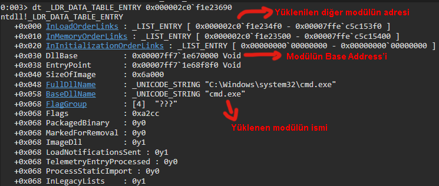

Merhabalar. Bu yazıda, maldev alanındaki API Hashing yöntemini ele alacağım.

## PE (Portable Executable) Yapısı Nedir?

Her şeyden önce PE (Portable Executable) yapısını anlamanın gerekli olduğunu düşünüyorum çünkü bu tekniğimiz tamamen bu yapı üzerine.

PE, Windows işletim sistemlerinde 32 ve 64 bit sürümlerde ve UEFI ortamlarda kullanılan executable dosyalar, object kodlar, DLL’ler ve diğerleri için bir dosya biçimidir. PE, Windows İşletim sistemi loader’in yürütülmek istenilen kodu yönetmesi için gereken veri yapıları içermektedir.

Bir PE dosyası, dinamik linker’a (dynamic linker) yürütülebilir dosyanın dosya belleğin nasıl eşleceğini ve çalıştırılacağını belirten bir dizi başlık ve bölümden oluşur. Bu başlıklar ve bölümler, işletim sisteminin dosyayı doğru şekilde yüklemesine ve çalıştırmasına olanak tanır.


PE yapısında bulunan bazı önemli başlıklar şunlardır:

- **DOS Header (IMAGE_DOS_HEADER):** Bu başlık, eski MS-DOS işletim sistemleri tarafından yürütülebilir dosyanın tanınması için gerekli minimum bilgileri içerir. 

- **DOS Stub:** Bu, yürütülebilir bir dosyanın başlangıcında bulunan ve DOS işletim sistemi tarafından tanınması için gereken minimum bilgileri içerir. Bu, dosyanın yürütülebilir olup olmadığını belirlemek için kullanılır.

- **PE Header (IMAGE_NT_HEADERS):** Bu başlık, PE formatına özgü önemli bilgileri içerir. İşletim sisteminin dosyayı doğru şekilde yüklemesi ve çalıştırması için gerekli olan dosya boyutu, giriş noktası adresi, isteğe bağlı DLL’ler ve diğer bilgiler buradadır.

- **File Header (IMAGE_FILE_HEADER):** Bu başlık, dosyanın genel bilgilerini içerir. Dosyanın mimarisi, dosya türü, bölümler ve diğer bilgiler burada bulunur.

- **Optional Header (IMAGE_OPTIONAL_HEADER):** Bu başlık, dosyanın yüklenmesi ve çalıştırılması için gerekli olan bilgileri içerir. Dosyanın mimarisi, dosya türü, bölümler ve diğer bilgiler burada bulunur.


## EAT (Export Address Table) ve IAT (Import Address Table) Nedir?

EAT ve IAT, PE dosyalarında bulunan iki önemli tablodur. Bu tablolar, dosyanın yürütülmesi sırasında işletim sistemi tarafından kullanılan fonksiyonların adreslerini ve adlarını içerir.

- **EAT (Export Address Table):** Dışa Aktarım Adres Tablosu olan EAT, bir PE dosyasının dışarı aktardığı fonksiyonların adreslerini ve adlarını içeren bir tablodur. Bu tablo, dinamik linker’ın (dynamic linker) yürütülebilir dosyayı yüklerken ve çalıştırırken hangi fonksiyonların kullanılabileceğini belirlemesine yardımcı olur. Bunu özellikle aklınızda tutun çünkü ileride bu tablo üzerinde işlem yapacağız.

- **IAT (Import Address Table):** İçe Aktarım Adres Tablosu olan IAT, bir PE dosyasının diğer PE dosyalarından içe aktardığı fonksiyonların adreslerini ve adlarını içeren bir tablodur. Aynı şekilde bu tabloda dinamik linker’ın yürütülebilir dosyayı yüklerken ve çalıştırırken hangi fonksiyonların içe aktarılması gerektiğini belirlemesine yardımcı olur.

## API Hashing Nedir?
API Hashing, bir API fonksiyonunun adını veya diğer tanımlayıcı özelliklerini bir hash değerine dönüştüren bir tekniktir. Bu hash değeri, fonksiyonun kimliğini temsil etmek için kullanılır. API’ların adlarını ve adreslerini gizlemek için kullanılabilir.

Örneğin, MessageBoxA fonksiyonunu içeren bir projeyi derleyip çalıştırdığımızı düşünelim. Projemizde MessageBoxA kullandığımız için derleme sırasında derleyici (compiler), MessageBoxA API’sinin adresini Import Address Table (IAT) tablosuna ekleyecektir. Bu, programı çalıştırdığımızda MessageBoxA API’sinin bu adresten erişilebileceği anlamına gelir.

Ancak, MessageBoxA’nın adresini gizlemek istiyorsak ne yapabiliriz? İşte burada API hashing devreye girer. Malware’i analiz eden bir kişi, malware’da kullanılan API’ları IAT içerisinde rahatlıkla görebilir. Bu nedenle, projemizde bu API’lara farklı isimler vererek ve ardından bu farklı isimleri hashleyerek IAT’a eklersek, analiz eden kişi bu API’ları kolayca göremez. Temelde, API hashing yöntemi budur: İlgili API’nin adını değiştirip hashleyerek ve sonra IAT tablosuna ekleyerek gizlemek.


```c
#include <stdio.h>
#include <Windows.h>

DWORD CalculateHash(char* data) {
    DWORD hash = 0x99;
    for (size_t i = 0; i < sizeof(data); i++) {
        hash += (hash * 0xab10f29f + data[i]) & 0xffffff;
    }
    return hash;
}

int main() {
    DWORD hash_value = CalculateHash("CreateThread");

    printf("CreateThread: 0x%00x\n", hash_value);
    getchar();
    return 0;
}
```

Yukarıdaki örnekte, verilen API’in hash değerini hesaplayan basit bir kod parçası hazırlanmıştır. İlk olarak API’nin adı alınır ve hesap yapacak CalculateHash fonksiyonuna gönderilir.

Fonksiyon içerisinde hash adında ve 0x99 değer tutan bir DWORD değişkeni oluşturduk. Bu değer, hesaplamanın başlangıç ​​noktası olarak kullandık.

Daha sonra bir döngü başlattık. Bu döngüde, mevcut hash değerini 0xab10f29f sabit değeri ile çarpılır. Bu, her karakterin karma değerine katkısını artırmaya yardımcı olur. Mevcut karakterin değeri, çarpılan değere eklenir. Son olarak ise sonuç, 0xffffff değeri ile bitsel AND işlemine tabi tutulur. Bu, karma değerinin 32 bitlik bir tamsayı olarak kalmasını sağlar. Bu basit bir projedir ve ilerdeki süreçlerde bu fonksiyonu kullanacağız.

## Modülün Base Address’ini Bulma
Şimdi, API’nin adresini bulma işlemine geçeceğiz. Adım adım WinDbg kullanarak, işlem modüllerini ve API’ları nasıl sıralandığını ve PE (Portable Executable) yapısını nasıl görebileceğimizi öğreneceğiz. Ardından, bu bilgileri C projesine uygulayacağız.

İlk olarak, çalışan bir işlemin PEB yapısını inceleyerek, işlemin modüllerinin taban adreslerine göz atacağız. Belirtmek gerekirse, PEB, bir işlemin çalışma zamanı bilgilerini içeren bir yapıdır. Bu yapı, işlemin modüllerinin taban adreslerini, heap ve stack bilgilerini, çevresel değişkenlerini ve diğer bilgileri içerir.

64 bit işlemlerde, PEB, Thread Environment Block bloğundan 0x60 ofsette bulunur. TEB, yürütülen iş parçacığının çalışma zamanı bilgilerini içeren bir yapıdır. TEB yapısı, GS segment kaydı tarafından işaretlenir. Dolayısıyla, PEB yapısına GS segment kaydı ile GS:[0x60] adresinden erişilebilir.

Şimdi, cmd.exe’yi çalıştıralım ve WinDbg kullanarak analize başlayalım:

İlk olarak dt komutu ile TEB’in yapısını inceleyerek başlayabiliriz:


Burada dikkatimizi çeken kısım +0x060 ProcessEnvironmentBlock : 0x000000fc4bacf000 _PEBolması yeterlidir. Yukarıda TEB ve PEB’ten bahsetmiştik ve burada TEB içerisinde PEB’in adresini görmekteyiz. Şimdi ise bu PEB’in adresi ile bu yapıya bir göz atalım:


Yakından ilgili process’in PEB yapısını böylece görmüş olduk. Burada bizi ilgilendiren kısım +0x018 Ldr: 0x00007ffe`c5c153e0 _PEB_LDR_DATA olacaktır. Bu yapı, yüklenen modüllerin listesini içerir. Şimdi ise bu yapıya bir göz atalım:


Bu yapıya göz attığımızda üç farklı liste olduğunu görmekteyiz. Bu listeler, yüklenen modüllerin listesini temsil eder. Bu listelerin içerisinde bulunan yapılar ise LDR_DATA_TABLE_ENTRY yapısına aittir. Bu yapı, yüklenen modülün bilgilerini içerir.

Bu listeleri tanımadan önce LIST_ENTRY yapılarını anlamamiz lazım:


- Flink: İlgili yapıyı işaret eden bir sonraki yapıdır.
- Blink: İlgili yapıyı işaret eden bir önceki yapıdır.

Şimdi ise listeleri tanıyalım:

- InLoadOrderModuleList: Modüllerin yüklenme sırasını temsil eder.

- InMemoryOrderModuleList: Modüllerin belleğe yüklenme sırasını temsil eder.

- InInitializationOrderModuleList: Modüllerin başlatılma sırasını temsil eder.

Bu listelerden ana odağımız InLoaderOrderModuleList olacaktır. Bu listenin modüllerin yüklenme sırasını temsil ettiğinden bahsetmiştik. Şimdi ise bu liste üzerinde işlem yaparak yüklenen modülleri tek tek göz atacağız.

İlk olarak InLoadOrderModuleList yapısındaki 0x000002c0`f1e23690 adres, yüklenen ilk modülün adresidir. Bu adresi kullanarak ilk yüklenilen modüle göz atabiliriz:



İlk yüklenen modülün detaylı bilgilerini fotoğrafta görülebileceği üzere yakından görebiliyoruz. İlk yüklenen modül cmd.exe adıyla ilgili executable dosyanın modülü olduğunu görmekteyiz. Dllbase, ilgili modülün base addressini içerir. BaseDllName ise yüklenen modülün ismi. Bunları görmemiz yeterlidir araştırma için.

Araştırmalara devam etmek için bir sonraki yüklenen modüle geçebiliriz:


Yüklenen diğer modülün ntdll.dll olduğunu görmekteyiz. Bu şekilde yüklenen tüm modülleri tek tek inceleyebiliriz. Son olarak diğer modüle de göz atalım:


Diğer yüklenen modüle göz attığımızda ise kernel32.dll olduğunu görmekteyiz.

Şimdi ise odağımızı C projemize çevireceğiz. Bu öğrendiklerimizi ise C projesine dökeceğiz.

IDE içerisinde bu yapılar tanımlı olmadığı için elle kendimiz tamamlamamız gerekmektedir. Şimdi ise kodlamaya geçebiliriz:

```c
#include "utils.h"

DWORD CalculateHash(char* data) {
    DWORD hash = 0x99;
    for (size_t i = 0; i < sizeof(data); i++) {
        hash += (hash * 0xab10f29f + data[i]) & 0xffffff;
    }
    return hash;
}

DWORD CalcModuleHash(LDR_MODULE* ModuleLink) {
	char*  ModuleName[64];
	size_t counter = 0x0;

	while (ModuleLink->BaseDllName.Buffer[counter] && counter < sizeof(ModuleName) - 1) {
		ModuleName[counter] = (char)ModuleLink->BaseDllName.Buffer[counter];
		counter++;
	}
	ModuleName[counter++] = 0;
	return CalculateHash((char*)CharLowerA(ModuleName));
}

HMODULE GetModuleBaseAddress(DWORD Hash) {
	HMODULE ModuleBaseAddress = NULL;
	INT_PTR PEB				  = __readgsqword(0x60);	// PEB'in offseti
	INT_PTR LDR				  = 0x18;					// PEB içerisindeki LDR'in offseti
	INT_PTR FlinkOffset	      = 0x10;					// InLoadOrderModuleList'in offseti

	INT_PTR PEB_LDR_DATA = *(INT_PTR*)(PEB + LDR);				  // PEB içerisinden LDR'e ulaş
	INT_PTR FirstFlink = *(INT_PTR*)(PEB_LDR_DATA + FlinkOffset); // LDR içerisinden InLoadOrderModuleList yapısına ulaş
	LDR_MODULE* LDR_DATA_TABLE_ENTRY = (LDR_MODULE*)FirstFlink;

	do {
		/* 
			Buradaki döngü, process'e yüklenen tüm modül listesi üzerinde işlem yapar.
			Yüklenen her modülün base address'i ve hash değeri alınır ve kontrol yapılır. 
		*/
		LDR_DATA_TABLE_ENTRY = (LDR_MODULE*)LDR_DATA_TABLE_ENTRY->InLoadOrderModuleList.Flink;
		if (LDR_DATA_TABLE_ENTRY->BaseAddress != NULL) {
			if (CalcModuleHash(LDR_DATA_TABLE_ENTRY) == Hash) {
				break;
			}
		}
	} while (FirstFlink != (INT_PTR)LDR_DATA_TABLE_ENTRY);

	ModuleBaseAddress = (HMODULE)LDR_DATA_TABLE_ENTRY->BaseAddress;
	return ModuleBaseAddress;
}
```

Bu kod parçasında, öncelikle CalculateHash fonksiyonu ile API’nin hash değeri hesaplanmaktadır. Daha sonra CalcModuleHash fonksiyonu, bir modülün ismini alır ve bu ismin hash değerini hesaplar. İşlem sırasında modül ismi küçük harfe dönüştürülür ve her karakterin ASCII değeri ile önceki hash değeri kullanılarak yeni bir hash değeri hesaplanır.

Son olarak, GetModuleBaseAddress fonksiyonu, verilen bir hash değeriyle eşleşen bir modül bulur ve bu modülün başlangıç adresini döndürür. Bunun için, işlem yüklenen modül listesi üzerinde döngü yapar ve her bir modülün hash değeri CalcModuleHash ile hesaplanarak kontrol edilir. Eşleşme bulunduğunda, ilgili modülün başlangıç adresi döndürülür.

Ancak bu kod parçasını kullanmamıza gerek yok. Zaten bunları yapan hazır API’lar bulunmaktadır.

## API’nin Adresini Bulma
Base Address’i bulduktan sonra API’in adresini bulmamız gerekiyor. Bunun için ihtiyacımız olan şey, IMAGE_EXPORT_DIRECTORY yapısıdır. Bu yapı, Export Address Table’ın (EAT) adresini içerir. Bu yapıda içeren bazı önemli alanlar şunlardır:

- NumberOfFunctions: Export edilen fonksiyonların sayısı
- AddressOfFunctions: Export edilen fonksiyonların adreslerinin bulunduğu tablonun adresi
- AddressOfNames: Export edilen fonksiyonların isimlerinin bulunduğu tablonun adresi

Windbg’a dönelim ve ntdll’in EAT tablosunu bularak başlayalım:


ntdll’in yüklü olduğu adresin 00007ffe`c5a90000 olduğunu görebiliyoruz. Şimdi bu adresten IMAGE_DOS_HEADER yapısına ulaşalım:


IMAGE_DOS_HEADER yapısının adresini bulduktan sonra IMAGE_NT_HEADERS yapısına ulaşacağız.

Bu yapının adresini bulmak için IMAGE_DOS_HEADER yapısının e_lfanew’in hex değeri, ntdll’in adresine ekleyerek elde edebiliriz. Böylece IMAGE_NT_HEADERS yapısına ulaşabiliriz:


Daha sonra araştırmamıza _IMAGE_OPTIONAL_HEADER64’a (0x18) ulaşarak devam edeceğiz:

```
0:004> dt _IMAGE_OPTIONAL_HEADER64 00007ffe`c5a90000+0xe0+0x18
ntdll!_IMAGE_OPTIONAL_HEADER64
   +0x000 Magic            : 0x20b
   +0x002 MajorLinkerVersion : 0xe ''
   +0x003 MinorLinkerVersion : 0x1e ''
   +0x004 SizeOfCode       : 0x130000
   +0x008 SizeOfInitializedData : 0xe5000
   +0x00c SizeOfUninitializedData : 0
   +0x010 AddressOfEntryPoint : 0
   +0x014 BaseOfCode       : 0x1000
   +0x018 ImageBase        : 0x00007ff9`373b0000
   +0x020 SectionAlignment : 0x1000
   +0x024 FileAlignment    : 0x1000
   +0x028 MajorOperatingSystemVersion : 0xa
   +0x02a MinorOperatingSystemVersion : 0
   +0x02c MajorImageVersion : 0xa
   +0x02e MinorImageVersion : 0
   +0x030 MajorSubsystemVersion : 0xa
   +0x032 MinorSubsystemVersion : 0
   +0x034 Win32VersionValue : 0
   +0x038 SizeOfImage      : 0x216000
   +0x03c SizeOfHeaders    : 0x1000
   +0x040 CheckSum         : 0x21eed5
   +0x044 Subsystem        : 3
   +0x046 DllCharacteristics : 0x4160
   +0x048 SizeOfStackReserve : 0x40000
   +0x050 SizeOfStackCommit : 0x1000
   +0x058 SizeOfHeapReserve : 0x100000
   +0x060 SizeOfHeapCommit : 0x1000
   +0x068 LoaderFlags      : 0
   +0x06c NumberOfRvaAndSizes : 0x10
   +0x070 DataDirectory    : [16] _IMAGE_DATA_DIRECTORY
```

Dikkatimizi 0x70 offsetine yani IMAGE_DATA_DIRECTORY yapısına çekiyoruz. Bu yapı, Export Address Table’ın RVA’sı (Relative Virtual Address) gibi Import Address Table için önemli bilgileri tutar.

IMAGE_EXPORT_DIRECTORY yapısı ise şu şekildedir:

```c
typedef struct _IMAGE_EXPORT_DIRECTORY {
    DWORD   Characteristics;
    DWORD   TimeDateStamp;
    WORD    MajorVersion;
    WORD    MinorVersion;
    DWORD   Name;
    DWORD   Base;
    DWORD   NumberOfFunctions;
    DWORD   NumberOfNames;
    DWORD   AddressOfFunctions;     // RVA from base of image
    DWORD   AddressOfNames;         // RVA from base of image
    DWORD   AddressOfNameOrdinals;  // RVA from base of image
} IMAGE_EXPORT_DIRECTORY, * PIMAGE_EXPORT_DIRECTORY;
```

Şimdi ise bu bilgilerin ışığında API’in adresini bulmak için C projemize aşağıdaki kodu ekleyeyelim:

```c
PDWORD getFunctionAddressByHash(char* library, DWORD hash)
{
	PDWORD functionAddress = (PDWORD)0;
	HMODULE libraryBase = LoadLibraryA(library);

	PIMAGE_DOS_HEADER dosHeader = (PIMAGE_DOS_HEADER)libraryBase;
	PIMAGE_NT_HEADERS imageNTHeaders = (PIMAGE_NT_HEADERS)((DWORD_PTR)libraryBase + dosHeader->e_lfanew);
	DWORD_PTR exportDirectoryRVA = imageNTHeaders->OptionalHeader.DataDirectory[IMAGE_DIRECTORY_ENTRY_EXPORT].VirtualAddress;
	PIMAGE_EXPORT_DIRECTORY imageExportDirectory = (PIMAGE_EXPORT_DIRECTORY)((DWORD_PTR)libraryBase + exportDirectoryRVA);

	// Export edilmiş fonksiyonlarla ilgili bilgiler için RVA'ları al
	PDWORD addresOfFunctionsRVA = (PDWORD)((DWORD_PTR)libraryBase + imageExportDirectory->AddressOfFunctions);
	PDWORD addressOfNamesRVA = (PDWORD)((DWORD_PTR)libraryBase + imageExportDirectory->AddressOfNames);
	PWORD addressOfNameOrdinalsRVA = (PWORD)((DWORD_PTR)libraryBase + imageExportDirectory->AddressOfNameOrdinals);

	for (DWORD i = 0; i < imageExportDirectory->NumberOfFunctions; i++)
	{
		DWORD functionNameRVA = addressOfNamesRVA[i];
		DWORD_PTR functionNameVA = (DWORD_PTR)libraryBase + functionNameRVA;
		char* functionName = (char*)functionNameVA;
		DWORD_PTR functionAddressRVA = 0;

		// Alınan Export fonksiyonun hash değerini hesapla
		DWORD functionNameHash = getHashFromString(functionName);

		// CreateThread bulunursa Adresini ekrana bastır ve main'e dön
		if (functionNameHash == hash)
		{
			functionAddressRVA = addresOfFunctionsRVA[addressOfNameOrdinalsRVA[i]];
			functionAddress = (PDWORD)((DWORD_PTR)libraryBase + functionAddressRVA);
			printf("%s : 0x%x : %p\n", functionName, functionNameHash, functionAddress);
			return functionAddress;
		}
	}
}
```

Bu kod parçasında, getFunctionAddressByHash fonksiyonu, verilen bir hash değeriyle eşleşen bir API’nin adresini bulur ve döndürür. Bunun için, verilen kütüphane adını yükler ve IMAGE_EXPORT_DIRECTORY yapısını kullanarak Export Address Table’ın adresini alır.

Daha sonra bu yapıdaki adresler kullanılarak, Export edilen fonksiyonların adreslerinin bulunduğu tablo ve isimlerin bulunduğu tablo adresleri alınır. Daha sonra, bu tablolar üzerinde döngü yaparak, her bir fonksiyonun adını ve hash değerini hesaplar. Eşleşme bulunduğunda, ilgili fonksiyonun adresi döndürülür.

Kodun tamamını birleştirelim ve basitçe CreateThread API’sini çalıştıralım:

```c
#include <stdio.h>
#include <string.h>
#include <Windows.h>

typedef struct HANDLE(NTAPI* MyCreateThread)(
	LPSECURITY_ATTRIBUTES   lpThreadAttributes,
	SIZE_T                  dwStackSize,
	LPTHREAD_START_ROUTINE  lpStartAddress,
	LPVOID                  lpParameter,
	DWORD                   dwCreationFlags,
	LPDWORD                 lpThreadId
);

DWORD getHashFromString(char* string)
{
	size_t stringLength = strnlen_s(string, 50);
	DWORD hash = 0x35;

	for (size_t i = 0; i < stringLength; i++)
	{
		hash += (hash * 0xab10f29f + string[i]) & 0xffffff;
	}

	return hash;
}

PDWORD getFunctionAddressByHash(char* library, DWORD hash)
{
	PDWORD functionAddress = (PDWORD)0;
	HMODULE libraryBase = LoadLibraryA(library);

	PIMAGE_DOS_HEADER dosHeader = (PIMAGE_DOS_HEADER)libraryBase;
	PIMAGE_NT_HEADERS imageNTHeaders = (PIMAGE_NT_HEADERS)((DWORD_PTR)libraryBase + dosHeader->e_lfanew);
	DWORD_PTR exportDirectoryRVA = imageNTHeaders->OptionalHeader.DataDirectory[IMAGE_DIRECTORY_ENTRY_EXPORT].VirtualAddress;
	PIMAGE_EXPORT_DIRECTORY imageExportDirectory = (PIMAGE_EXPORT_DIRECTORY)((DWORD_PTR)libraryBase + exportDirectoryRVA);

	// Export edilmiş fonksiyonlarla ilgili bilgiler için RVA'ları al
	PDWORD addresOfFunctionsRVA = (PDWORD)((DWORD_PTR)libraryBase + imageExportDirectory->AddressOfFunctions);
	PDWORD addressOfNamesRVA = (PDWORD)((DWORD_PTR)libraryBase + imageExportDirectory->AddressOfNames);
	PWORD addressOfNameOrdinalsRVA = (PWORD)((DWORD_PTR)libraryBase + imageExportDirectory->AddressOfNameOrdinals);

	for (DWORD i = 0; i < imageExportDirectory->NumberOfFunctions; i++)
	{
		DWORD functionNameRVA = addressOfNamesRVA[i];
		DWORD_PTR functionNameVA = (DWORD_PTR)libraryBase + functionNameRVA;
		char* functionName = (char*)functionNameVA;
		DWORD_PTR functionAddressRVA = 0;

		// Alınan Export fonksiyonun hash değerini hesapla
		DWORD functionNameHash = getHashFromString(functionName);

		// CreateThread bulunursa Adresini ekrana bastır ve main'e dön
		if (functionNameHash == hash)
		{
			functionAddressRVA = addresOfFunctionsRVA[addressOfNameOrdinalsRVA[i]];
			functionAddress = (PDWORD)((DWORD_PTR)libraryBase + functionAddressRVA);
			printf("%s : 0x%x : %p\n", functionName, functionNameHash, functionAddress);
			return functionAddress;
		}
	}
}

int main()
{
	DWORD hash = getHashFromString("CreateThread");
	PDWORD functionAddress = getFunctionAddressByHash((char*)"kernel32", hash);

	DWORD TID = 0;
	HANDLE th = CreateThread(NULL, 0, NULL, NULL, 0, &TID);
	if (th == NULL) {
		printf("Failed to create thread\n");
		return -1;
	}
	printf("Thread created successfully\n");
	CloseHandle(th);
	return 0;
}
```


Sonuca baktığımızda ise başarılı bir şekilde API’in adresinin alındığını ve çalıştırıldığını görmekteyiz.


## References

- [**EN Wikipedia - Portable Executable**](https://en.wikipedia.org/wiki/Portable_Executable)
- [**Tech Zealots - A Comprehensive Guide To PE Structure, The Layman’s Way**](https://tech-zealots.com/malware-analysis/pe-portable-executable-structure-malware-analysis-part-2/)
- [**Red Team Notes - Windows API Hashing in Malware**](https://www.ired.team/offensive-security/defense-evasion/windows-api-hashing-in-malware)
- [**Cognisys Labs - Combining Indirect Dynamic Syscalls and API Hashing**](https://labs.cognisys.group/posts/Combining-Indirect-Dynamic-Syscalls-and-API-Hashing/)
