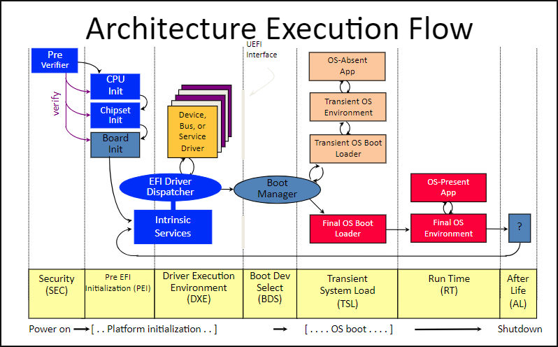
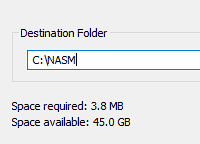
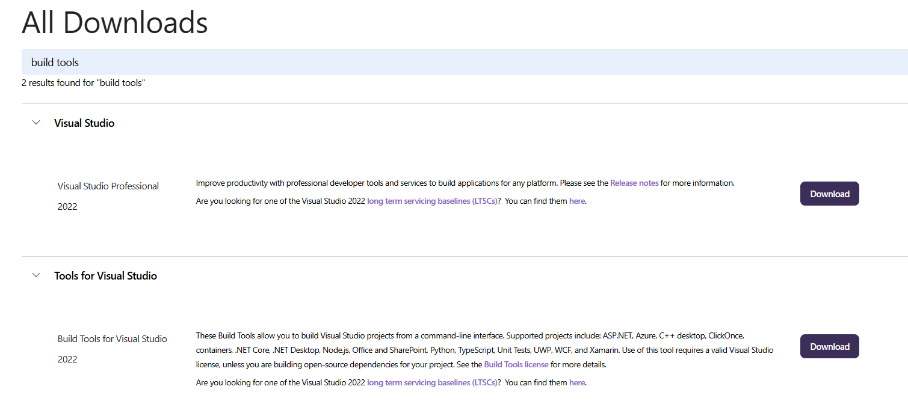
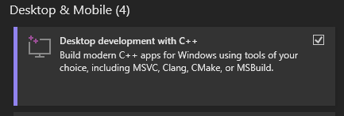

Merhabalar efenimm. UEFI Development'ın ilk bu dökümanında UEFI konusuna teorik olarak giriş yapacağız.

Dün gece boş boş duvara bakma aktivemi gerçekleştirirken "hayatımı daha da nasıl mahvedebilirim" diye düşünürken aklıma UEFI Development'a girişmek aklıma geldi. Gerçekten uzun zamandır ilgilenmek istediğim bir alandı ve hayatımı daha derine ve kötüye götürmek için efsane bir fırsat olduğunu düşünerek şuan bu blogu yazıyorum.

## **UEFI Nedir?**

Direkt olarak kodlamaya girişmek olmaz. Bazı temel şeyleri öğrenmemiz gerekecek.

Kabaca bizim hayatımızı mahvedecek bu **UEFI** (Unified Extensible Firmware Interface), bir bilgisayarın firmware'i için bir spesifikasyondur. UEFI bir Bilgisayarın güç tuşuna basıldığı ilk süreçlerde UEFI, işletim sistemi başlatılmadan önce çalışır. 

UEFI dediğimiz bu şeyi eski BIOS sistemin geliştirilmiş hali olduğunu düşünebiliriz. UEFI modelleri ayrıca donanıma etkileşim için temel I/O sistemlerine de sahiptir ancak sistem önyükleme işlemleri farklıdır. UEFI GPT (Guid Partition Table) kullanır. **GPT**, bir bilgisayarın depolama cihazındaki bölümlerin düzenini belirleyen ve modern yapısı olan bir standarttır. Hepimizin bildiği HDD veya SSD gibi cihazlarda kullanılan standarttır.  BIOS'un yerini alan UEFI gibi, GPT ise de önceden kullanılan MBR (Master Boot Record) bölümleme tablosunun yerini almıştır. GPT ile UEFI uyumlu çalışır. 

UEFI ve GPT birleştirdiğimizde elde edilen avantajlar şu şekildedir:

- 2TB veya daha büyük diskleri desteklemek
- Daha hızlı Booting İşlemi
- Eski BIOS'a kıyasla daha da basitleştirilmiş geliştirme sunma

Gibi şeyler vs. Yani UEFI ve GPT'nin eski sistemlere kıyasla daha avantaj sunduğunu görebiliriz.

UEFI'in BIOS ile aynı görevleri vardır: I/O cihazlarını çalıştırmak ve kontrolü OS'a aktarmak. Fakat görevi sadece bununla sınırlı kalmayıp ve yukarıda anlattığım gibi, aynı zamanda işletim sistemi öncesi yani pre-OS geliştirme için geniş bir yelpaze sunar. 

Aşağıda gösterilen Legacy BIOS ve UEFI arasındaki farkı gösteren şemaya göz atalım:


Şemaya göz attığımızda BIOS, donanım ile doğrudan iletişim kuran bir firmware ve aynı zamanda bir donanımdır. Şemadan UEFI'ye göz attığımızda donanım ile işletim sisteminin arasındaki arayüzü birleştirdiğini görebiliriz. UEFI'nin bu işlevi, geliştiriciler için kolaylık sağlar.

Kısacası UEFI'ye göz attığımızda GPT ile beraber eski Legacy BIOS'a kıyasla daha modern ve hızlı bir süreç sunduğunu görmemiz mümkün.

## **UEFI Önyükleme Süreci**

UEFI bir bilgisayarın güç tuşuna bastıktan sonrasında logo görülmeden önce arka planda neler gerçekleştiğine bir de yakından göz atalım.

UEFI, platformun başlatılması sürecinde kritik öneme sahip **altı ana** önyükleme aşamasına sahiptir:



- **Security (SEC)**: Security aşaması, UEFI önyükleme sürecin ilk aşamasıdır. Genel amacı ise Geçici Bellek Deposunu başlatmak, Sistemde root of trust olarak hareket etmek ve Pre-EFI çekirdek aşamasına bilgi sağlamaktır. Bahsi geçen Root of Trust ise tam olarak şöyledir: SEC mekanizması ayrıca PI'da çalıştırılan herhangi bir kodun dijital olarak imzalanmasını sağlayan ve 'Secure Boot' ortamı yaratan bir mekanizma olarak da işlev görür.

- **Pre-EFI Initialization (PEI)**: İkinci aşamada, EFI kodunun çalışması sağlanır. Ana görevi ise bir sonraki aşama olan ve DXE sürücülerini başlatacak olan DXE Foundation'ı indirmektir. Ayrıca işlemci kaynaklarını kullanarak Pre-EFI Initialization Modules (PEIM)'leri dispatch etmekten sorumludur. Bu PEIM'ler, bazı kalıcı bellek tamamlayıcılarının başlatılması gibi kritik süreçlerden sorumlu olduğu gibi bir sonraki aşama olan Driver Execution Environment (DXE)'e geçişi sağlar.

- **Driver Execution Environment (DXE)**: Bu aşamanın gerçekten önemli olduğunu düşünüyorum çünkü sistemi başlatmak için gerekli büyük işlemler burada gerçekleşiyor. Bir önceki aşamada olan PEI'de, DXE'nin çalışması için gereken bellek tahsis edilir ve başlatılır. Artık kontroller DXE'e aktarılmasıyla **DXE Dispatcher** çağırılır. Bu Dispatcher, donanım sürücülerini, runtime hizmetlerini ve işletim sisteminin başlaması için gereken tüm önyükleme hizmetlerini yüklemesinden ve yürütmesinden sorumludur.  Amacımızı düşünürsek, önceden dediğim gibi burası bizim için önemli bir aşamadır. Çünkü geliştireceğimiz sürücü burada çalıştırılacaktır.

- **Boot Device Selection (BDS)**: DXE sürücüleri çalıştırılması ardından kontrol, muhtemelen hepinizin gördüğü BSD'ye aktarılır. Bu aşamada ise işletim sistemi yükleyicisinin hangi aygıtta aranacağına dair bir seçim yapılır. Ardından işletim sistemi yüklenmeye başlanır ve Transient System Load (TSL) aşamasına geçiş için hazırlanılır.

- **Transient System Load (TSL)**: Bu aşamada, seçilen önyükleme yükleyicisinin çalıştığı ve UEFI önyükleme hizmetlerinin sonlandırıldığı aşamadır.

- **Runtime (RT)**: Bu aşamada ise artık UEFI'nin akışı işletim sistemine devrediliyor. Fakat UEFI bu kısımdan itibaren tamamen ortadan kaybolduğu anlamına gelmez. UEFI'ye ait olan Runtime Services (Runtime Hizmetleri) işletim sistemini desteklemek için kullanılabilir durumda kalmaya devam eder. Bu Runtime hizmetleri, donanımla ilgili bazı özel işler için System Management Mode (SMM) devreye girer. SMM, işlemcinin kritik donanım işlevlerini işletim sisteminden bağımsız olarak yönettiği güvenli bir moddur. Örneğin, fan hızının ayarlanması veya batarya durumunun izlenmesi gibi işlemler bu modda yapılır. Eğer İşletim sistemi, donanımla ilgili bir işi kendi başına yapamazsa, **SMI** (System Management Interrupt) adı verilen bir sinyal gönderir. Bu, “yardım çağrısı” gibidir. Örneğin, işletim sistemi fan hızını kontrol etmek istediğinde bir SMI gönderir, SMM devreye girer ve bu işi halleder.

## **UEFI Development'a Giriş**

Gelelim önemli bu kısma. 

Söz konusu UEFI Development için kaynak olduğunda gerçekten bu süreçte kaynakların kısıtlı olduğunu göreceksiniz. Popüler olarak Development sürecinde, aşağıda sıralanan araçlar kullanılabilir:

- **EDK2**: EDK2, UEFI ve PI spesifikasyonlar için modern, zengin ve platformlar arası kodlama gibi özelliklerine sahip bir araçtır. EDK2 projesi, UEFI spesifikasyonuna katkıda bulunan geliştiricilerin birçoğu tarafından (topluluk gönüllüleriyle birlikte) geliştirilmekte ve günümüzde sürdürülmektedir. Bu blog sürecinde ise kodlamayı bununla yapacağız.

EDK2'nin en son UEFI protokollerini içerdiğinden bu araç son derece yararlıdır. Buna ek olarak, öğrenme sürecinde rehber olarak kullanabileceğimiz projeler çok fazladır. 

- **VisualUEFI** VisualUEFI aracı, Windows kullanıcıları için Visual Studio IDE ile EDK2 projeleri geliştirmesine imkan veren bir araçtır. EDK2 projesinin karmaşık düzeninden kurtulmak ve rahat bir şekilde çalışmak isterseniz bu aracı tercih edebilirsiniz. 

Windows kullanıcısı olsam da bu blog sürecinde VisualUEFI'ye yer vermeyeceğim. VisualUEFI kodlama için rahat bir ortam sunsa da, benim için EDK2 gibi projelerin düzenini manuel olarak uğraşmak daha rahat oluyor. Eğer VisualUEFI'yi kurmak isterseniz internette birçok kaynak bulunmakta. 

Projelerimizi geliştirdikten sonra bunları simüle etmemiz gerekecek. Bunun için aşağıdakilerden biri kullanılabilir:

- **QEMU**: QEMU'nun zaten ne olduğunu biliyorsunuzdur. Bir sanal makineden ziyade bir emülatör olması nedeniyle iyi bir debugging olanaklarını sağlayan çok platformlu bir emülatör. Linux veya Windows ortamında bunu tercih edebilirsiniz. 

- **VMWare / VirtualBox**: Vmware, VirtualBox gibi sanal makineleri de tercih edebilirsiniz.

Bu süreçte ise simüle için VMWare'i tercih edeceğim. Özellikle VMware'in doğru çalışan NVRAM emülasyonu ile iyi performans sunar. Benim için en önemli sunduğu özellik ise Windows'ta TSL ve RT aşamalarında debugging için WinDbg ile güzel çalışması.

## **Windows'ta EDK2'nin Kurulumu**

EDK2 projesini kurmadan önce aşağıdaki araçları kurmamız lazım:

- **Git**
- **Python**
- **NASM**
- **Visual Studio**

Öncelikle git indirelim ve ardından Python'u indirelim. Python'u Microsoft Store yerine direkt olarak orijinal sitesinden indirin ve kurulumda ise aşağıda gösterilene dikkat edin:


Fotoğrafta gösterilmiş alandaki kutucukları işaretlemeyi unutmayın. 

Daha sonra NASM'ı orijinal sitesinden indirelim ve indirdiğimiz .exe dosyasını yönetici ile çalıştıralım:



Kurulum esnasında NASM projesinin lokasyonunu **C:\NASM** olarak ayarlayalım.

NASM kurulumundan sonra ise Windows'un **Enviroment Variables** ayarından User Variables için NASM_PREFIX adında bir değişken oluşturalım:


Değeri C:\NASM\ olarak ayarlayalım.

Daha sonra Visual Studio'nın C++ araçlarını kurmamız gerekecek. Bu araçları indirmek için Downloads sayfasından Build Tools araması yapalım:



**Tools for Visual Studio** olanı indirelim ve ardından:



Kurulumda **Desktop Development with C++** olanı seçelim ve kurulumu başlatalım.

Bunları tamamladıktan sonra **cmd.exe** açalım ve edk2 projesini kuralım:

```bash
git clone https://github.com/tianocore/edk2.git
cd edk2
git submodule update --init
```

edk2 projesini de indirdikten sonra **Developer Command Prompt VS 2022** aracını açalım ve daha sonra indirdiğimiz edk2 projesine gidelim. Config/target.txt'i notepad ile açalım:

```bash
notepad Conf\target.txt
```

Bu .txt içerisinde, aşağıda size gösterdiğim değerler ile değiştirin:

```c
ACTIVE_PLATFORM       = ShellPkg/ShellPkg.dsc
...
TARGET                = RELEASE
...
TARGET_ARCH           = X64
...
TOOL_CHAIN_TAG        = VS2022
```

Aynen böyle olacak şekilde değerleri değiştirin ve kaydedip kapatabilirsiniz. Daha sonra **edksetup.bat**'ı çalıştıralım:

```bash
> C:\edk2>edksetup.bat
...

 WORKSPACE      = C:\edk2
 EDK_TOOLS_PATH      = C:\edk2\BaseTools
 BASE_TOOLS_PATH     = C:\edk2\BaseTools
 EDK_TOOLS_BIN      = C:\edk2\BaseTools\Bin\Win32
 CONF_PATH      = C:\edk2\Conf
 PYTHON_COMMAND = py -3
 PYTHONPATH = C:\edk2\BaseTools\Source\Python;


!!! WARNING !!! NASM_PREFIX environment variable is not set
  Found nasm.exe, setting the environment variable to C:\nasm\

!!! WARNING !!! CLANG_BIN environment variable is not set

!!! WARNING !!! No CYGWIN_HOME set, gcc build may not be used !!!
```

Daha sonra araçları derlemek için BaseTools dizinine gidelim:

```bash
> C:\edk2>cd BaseTools

> C:\edk2\BaseTools>nmake
```

Araçları derledikten sonra tekrar ana dizine dönelim ve Build komutunu çalıştıralım:

```bash
> C:\edk2\BaseTools>cd ..

> C:\edk2>Build
...

- Done -
Build end time: 13:14:44, Jan.28 2025
Build total time: 00:02:03
```

Derlemeden sonra **Done** çıktısını almamız gerekiyor. 

## **Hello UEFI World!**

Artık UEFI sürücüsü geliştirmek için gerekli her şeye sahibiz. Programlama geleneğine uygun davranarak "Hello UEFI World" çıktısı veren basit bir proje geliştirelim. Geliştireceğimiz projeleri ShellPkg/Application dizin altında oluşturabiliriz. 

Bir sürücü geliştirirken .c projesinin olması yanı sıra bir de .inf dosyası oluşturmamız gerekiyor. Bu INF dosyası, modülü oluşturmak ve paketlemek için gerekli bilgileri sağlar. Yani sürücümüzün paketlenmesi için gerekli bilgiler sağlayacağız. 

edk2/ShellPkg/Application dizini altında HelloWorld adında bir klasör oluşturalım ve ardından HelloWorld.c projemizi kodlamaya başlayalım:

```c
#include <Uefi.h>
#include <Library/UefiApplicationEntryPoint.h>
#include <Library/UefiLib.h>
#include <Library/PcdLib.h>

EFI_STATUS
EFIAPI
UefiMain (
  IN EFI_HANDLE        ImageHandle,
  IN EFI_SYSTEM_TABLE  *SystemTable
  )
{
  Print (L"Hello UEFI World!\n");
  return EFI_SUCCESS;
}
```

Bazı detaylar haricinde kodlar bizlere yabancı gelmeyecektir.

Main fonksiyon için kodlamalarımızı **UefiMain** içerisinde yapacağız. UefiMain, UEFI sürücülerin başlangıç noktasıdır. Geleneksel main fonksiyonuna benzer şekilde, bir UEFI uygulamasının giriş noktasıdır. UefiMain iki parametre alır:

- **ImageHandle:** Uygulamanın UEFI firmware tarafından temsil edilen benzersiz bir tanımlayıcısıdır.

- **SystemTable:** UEFI sisteminde tanımlanan çeşitli hizmetlere ve tablolara erişim sağlayan bir veri yapısıdır.

Kodlara biraz detaylı göz attığınızda tıpkı benim gibi syntax'ın farklılığı yüzünden eliniz ayağınız titremiş olabilir (örneğin çağırılan Print ile parantez arasına boşluk bırakılması vs). İlk başta benim gibi hatalı bir syntax olduğunu düşünseniz de hatalı değil. Bu EDK2 topluluğuna ait [C kodu tipiyle](https://github.com/tianocore/tianocore.github.io/wiki/Code-Style-C) alakalıdır:


İlgili blogta syntax kurallarına göz atabilirsiniz. Aklınızda bulunsun eğer ileride edk2 projesine katkıda bulunursanız bu syntax kuralına dikkat edin. Madem edk2'den yararlanacağız kurallarına uyalım değil mi? 

Daha sonra **HelloWorld.inf** adında bir proje daha oluşturalım:

```inf
[Defines]
  INF_VERSION                    = 0x00010006
  BASE_NAME                      = HelloWorld
  MODULE_TYPE                    = UEFI_APPLICATION
  VERSION_STRING                 = 1.0
  ENTRY_POINT                    = UefiMain

[Sources]
  HelloWorld.c

[Packages]
  MdePkg/MdePkg.dec
  ShellPkg/ShellPkg.dec
  MdeModulePkg/MdeModulePkg.dec

[LibraryClasses]
  UefiApplicationEntryPoint
  UefiLib
  PcdLib
```

.inf dosyasını da kodladıktan sonra her şey tamam ancak derlemeye geçmeden önce **/edk2/ShellPkg/ShellPkg.dsc** içerisine projemizi eklememiz gerekecek:

```dsc
...
[Components]
  #
  # Build all the libraries when building this package.
  # This helps developers test changes and how they affect the package.
  #
  ShellPkg/Library/UefiShellLib/UefiShellLib.inf
  ShellPkg/Library/UefiShellAcpiViewCommandLib/UefiShellAcpiViewCommandLib.inf
  ShellPkg/Library/UefiShellCommandLib/UefiShellCommandLib.inf
  ShellPkg/Library/UefiShellCEntryLib/UefiShellCEntryLib.inf
  ShellPkg/Library/UefiHandleParsingLib/UefiHandleParsingLib.inf
  ShellPkg/Library/UefiShellBcfgCommandLib/UefiShellBcfgCommandLib.inf
  ShellPkg/Library/UefiShellLevel1CommandsLib/UefiShellLevel1CommandsLib.inf
  ShellPkg/Library/UefiShellLevel2CommandsLib/UefiShellLevel2CommandsLib.inf
  ShellPkg/Library/UefiShellLevel3CommandsLib/UefiShellLevel3CommandsLib.inf
  ShellPkg/Library/UefiShellDriver1CommandsLib/UefiShellDriver1CommandsLib.inf
  ShellPkg/Library/UefiShellInstall1CommandsLib/UefiShellInstall1CommandsLib.inf
  ShellPkg/Library/UefiShellDebug1CommandsLib/UefiShellDebug1CommandsLib.inf
  ShellPkg/Library/UefiShellNetwork1CommandsLib/UefiShellNetwork1CommandsLib.inf
  ShellPkg/Library/UefiShellNetwork2CommandsLib/UefiShellNetwork2CommandsLib.inf
  ShellPkg/Application/HelloWorld/HelloWorld.inf
```

Yukarıda gösterildiği gibi **Components** altına HelloWorld projenizi ekleyin

Şimdi ise projemizi derleyelim:

```bash
Build -m ShellPkg\Application\HelloWorld\HelloWorld.inf
```

Derlemeden sonra efi dosyamız **/edk2/Build/Shell/RELEASE_VS2022/X64** dizini altında 'HelloWorld.efi' olarak oluşturulacaktır. 

## **Sürücüyü Çalıştırma**

Önceden de bahsettiğim gibi simüle işlemleri için VMWare ortamını kullanacağım. Eğer benim gibi VMware veya VirtualBox vs. kullanacaksınız FAT32 ile biçimlendirilmiş bir USB Flash gerekecek. FAT 32 Biçimlendirmeden sonra USB Flash içerisinde **efi/boot** olarak bir dizin oluşturun. 

Yine **/edk2/Build/Shell/RELEASE_VS2022/X64** dizini altında iki shell dosyası olacak:


Buradan herhangi birini efi/boot dizini altında **bootx64.efi** olarak kopyalayın. Daha sonra HelloWorld.efi dosyasını da kök dizine kopyalayın.


Bu işlemlerden sonra USB Flash'ın içeriği aşağıda gösterildiği gibi olmalı:



    
        
            
        
    



Sanal makineyi başlatalım ve aşağıdaki adımları gerçekleştirelim:


**Removable Devices > USB Flash Belleğiniz > Connect** seçeneğine tıklayalım.

Sanal makineyi yeniden başlatalım ve açılışta DEL tuşuna basalım:


Boot Manager ekranından USB Flashımızı seçelim. Bu kadar basit!

Şimdi ise HelloWorld sürücümüzü çalıştıralım:


Başarıyla **'Hello UEFI World'** çıktımızı alıyoruz. 

## **Sonuç**

Evet arkadaşlar bu dökümanda temel olarak UEFI'nin ne olduğunu, Windows'ta EDK2 kurulumunu ve basitçe UEFI sürücüsü ile 'Hello UEFI World' çıktısı veren bir proje geliştirdik. Umarım faydalı olmuştur. 

Konuları daha detaylı öğrenmek isterseniz referanslarda verdiğim kaynaklara göz atabilirsiniz.

İyi çalışmalar dilerim efenimm.

# **References**

- [**Wikipedia - UEFI**](https://en.wikipedia.org/wiki/UEFI)
- [**Dabudabot - Beginning UEFI Development**](https://habr.com/en/companies/acronis/articles/535848/)
- [**Secret Club - Introduction to UEFI: Part 1**](https://secret.club/2020/05/26/introduction-to-uefi-part-1.html)
- [**Binary Ninja - Advanced UEFI Analysis with Binary Ninja**](https://binary.ninja/2024/08/23/uefi-firmware-analysis.html)
