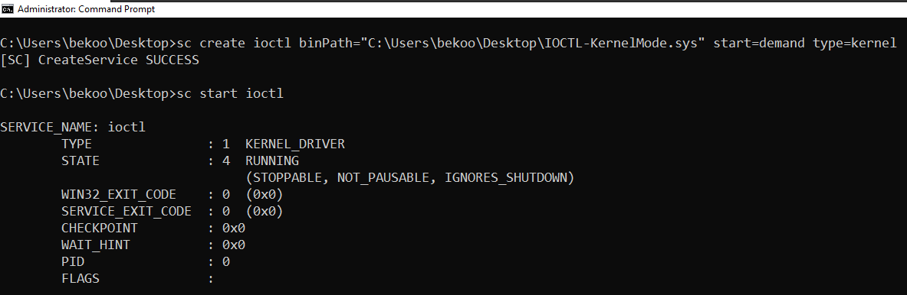
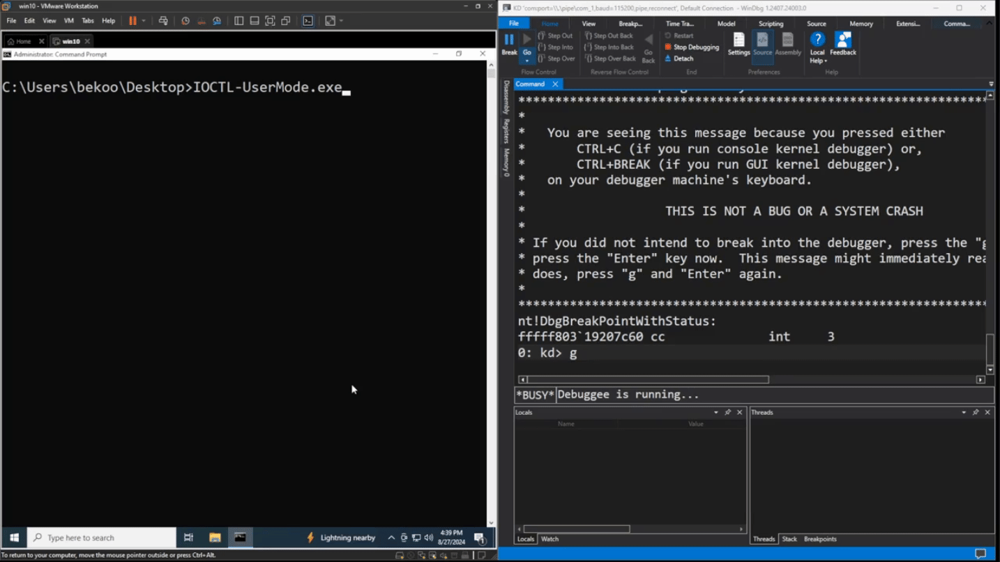

Merhabalar, bu yazıda Windows Kernel Development'tan IOCTL mekanizmasını inceleyeceğiz.

## IOCTL Nedir?

I/O Control Codes (G/Ç Kontrol Kodları) olarak adlandırılan IOCTL, User-mode uygulamarın ve sürücülerin arasındaki iletişim için veya stack içerisindeki sürücüler arasındaki iletişim için kullanılan bir mekanizmadır. I/O Kontrol kodları, önceki konumda bahsettiğim IRP'ler aracılığıyla gönderilir. Eğer IRP'ler hakkında bir bilginiz yoksa [buraya](https://0xbekoo.github.io/posts/wkd-irp/) tıklayarak IRP'ler hakkında bilgi alabilirsiniz.

Windows'ta User-mode programları, ```DeviceIoControl``` API kullanarak sürücülere IOCTL kodlarını gönderir. Bu API, alınan IOCTL kodunu **IRP_MJ_DEVICE_CONTROL** aracılığıyla sürücüye gönderir. Aynı zamanda IOCTL mekanizmanın tek özelliği de bu olmadığını tekrar vurgulayalım. İleri seviye sürücülerin **IRP_MJ_DEVICE_CONTROL** veya **IRP_MJ_INTERNAL_DEVICE_CONTROL** aracılığıya istek oluşturarak, alt sürücülere IOCTL isteği gönderme imkanı sunar. 

IOCTL kodları, genellikle sürücü geliştiricileri tarafından tanımlanan özel kodlar olabilir, ancak aynı zamanda Windows işletim sistemi tarafından belirli standart işlemler için önceden tanımlanmış kodlar da olabilir. Bu standart IOCTL kodları, Windows'un donanım ve yazılım bileşenleri arasındaki iletişimi standartlaştırmak ve kolaylaştırmak amacıyla sağlanır. Örneğin, bazı IOCTL kodları, donanım cihazlarının özelliklerini sorgulama veya belirli işlemleri başlatma gibi genel görevler için kullanılır. Geliştiriciler, özel ihtiyaçlarına göre bu kodları özelleştirebilir veya yeni kodlar tanımlayabilirler, bu da esneklik ve genişletilebilirlik sağlar.

## Code 

Önceki konumuzda olduğu gibi user-mode program ve kernel-mode sürücümüzü oluşturacağız. 

Senaryoda **IOCTL_MEM_ALLOCATE** kodu aracılığıyla user-mode uygulaması sürücüye kernel-space alanında bellek ayırması için kod ve bir veri gönderecek. Öte yandan oluşturacağımız **IOCTL_MEM_READ** kodu ile sürücümüz, bellek adresten veriyi alıp user-mode programa gönderecek. 

Github linki için [buraya](https://github.com/0xbekoo/WinKernelDev/tree/main/IOCTL) tıklayabilirsiniz.

### Kernel Mode - Driver

Öncekikle sürücümüzü kodlayarak başlayalım:

```c
#include "main.h"

#define TAG 'beko'

#define IOCTL_MEM_ALLOCATE \
	CTL_CODE(FILE_DEVICE_UNKNOWN, 0x800, METHOD_BUFFERED, FILE_ANY_ACCESS)

#define IOCTL_MEM_READ \
	CTL_CODE(FILE_DEVICE_UNKNOWN, 0x801, METHOD_BUFFERED, FILE_ANY_ACCESS)

PVOID GlobalMemoryAddr = NULL;

NTSTATUS IoCreateClose(PDEVICE_OBJECT DeviceObject, PIRP Irp) {
	UNREFERENCED_PARAMETER(DeviceObject);

	PIO_STACK_LOCATION Stack = IoGetCurrentIrpStackLocation(Irp);
	NTSTATUS status = STATUS_SUCCESS;

	switch (Stack->MajorFunction) {
	case IRP_MJ_CREATE:
		Irp->IoStatus.Status = STATUS_SUCCESS;
		break;

	case IRP_MJ_CLOSE:
		Irp->IoStatus.Status = STATUS_SUCCESS;
		break;

	default:
		status = STATUS_INVALID_DEVICE_REQUEST;
		break;
	}
	Irp->IoStatus.Information = 0;
	IoCompleteRequest(Irp, IO_NO_INCREMENT);

	return Irp->IoStatus.Status;
}

NTSTATUS IoControl(PDEVICE_OBJECT DeviceObject, PIRP Irp) {
	UNREFERENCED_PARAMETER(DeviceObject);

	PIO_STACK_LOCATION Stack = IoGetCurrentIrpStackLocation(Irp);
	PVOID Data = Irp->AssociatedIrp.SystemBuffer;
	PCHAR UserBuffer = (PCHAR)Data;
	ULONG OutLength = Stack->Parameters.DeviceIoControl.OutputBufferLength;
	ULONG Length = Stack->Parameters.DeviceIoControl.InputBufferLength;

	ULONG Tag = TAG;

	switch (Stack->Parameters.DeviceIoControl.IoControlCode) {
	case IOCTL_MEM_ALLOCATE:
		if (NULL == UserBuffer || 0 == Length) {
			Irp->IoStatus.Status = STATUS_INVALID_PARAMETER;
			Irp->IoStatus.Information = 0;
			break;
		}
		DbgPrintEx(0, 0, "Data from UserLand program: %.*s", Length, UserBuffer);

		GlobalMemoryAddr = ExAllocatePool2(POOL_FLAG_NON_PAGED, Length, Tag);
		if (NULL == GlobalMemoryAddr) {
			Irp->IoStatus.Status = STATUS_INSUFFICIENT_RESOURCES;
			Irp->IoStatus.Information = 0;
			break;
		}
		RtlCopyMemory(GlobalMemoryAddr, UserBuffer, Length);

		Irp->IoStatus.Status = STATUS_SUCCESS;
		Irp->IoStatus.Information = Length;
		break;

	case IOCTL_MEM_READ:
		RtlCopyMemory(UserBuffer, GlobalMemoryAddr, OutLength);

		Irp->IoStatus.Status = STATUS_SUCCESS;
		Irp->IoStatus.Information = OutLength;
		break;
	default:
		Irp->IoStatus.Status = STATUS_INVALID_DEVICE_REQUEST;
		Irp->IoStatus.Information = 0;
		break;
	}
	IoCompleteRequest(Irp, IO_NO_INCREMENT);

	return Irp->IoStatus.Status;
}

NTSTATUS DriverEntry(PDRIVER_OBJECT DriverObject, PUNICODE_STRING RegistryPath) {
	UNREFERENCED_PARAMETER(RegistryPath);

	UNICODE_STRING DeviceName = RTL_CONSTANT_STRING(L"\\Device\\MyDevice");
	UNICODE_STRING SymName = RTL_CONSTANT_STRING(L"\\??\\MyDevice");
	PDEVICE_OBJECT DeviceObject;
	NTSTATUS Status;

	Status = IoCreateDevice(DriverObject, 0, &DeviceName, FILE_DEVICE_UNKNOWN, 0, FALSE, &DeviceObject);
	if (!NT_SUCCESS(Status)) {
		DbgPrintEx(0, 0, "Failed to Create I/O Device!\n");
		return Status;
	}

	Status = IoCreateSymbolicLink(&SymName, &DeviceName);
	if (!NT_SUCCESS(Status)) {
		DbgPrintEx(0, 0, "Failed to Create Symbolic Link!\n");
		return Status;
	}
	DriverObject->MajorFunction[IRP_MJ_CREATE] = IoCreateClose;
	DriverObject->MajorFunction[IRP_MJ_CLOSE] = IoCreateClose;
	DriverObject->MajorFunction[IRP_MJ_DEVICE_CONTROL] = IoControl;
	DriverObject->DriverUnload = UnloadDriver;

	return STATUS_SUCCESS;
}

NTSTATUS UnloadDriver(PDRIVER_OBJECT DriverObject) {
	UNICODE_STRING SymName = RTL_CONSTANT_STRING(L"\\??\\MyDevice");
	DbgPrintEx(0, 0, "Unloading the Driver...\n");

	IoDeleteSymbolicLink(&SymName);
	IoDeleteDevice(DriverObject->DeviceObject);

	return STATUS_SUCCESS;
}
```

Önceki IRP konusuna aşina olduysanız zaten hemen hemen benzer kod olduğunu anlamışsınızdır. Şimdi detaylıca göz atalım:

```c
#define IOCTL_MEM_ALLOCATE \
	CTL_CODE(FILE_DEVICE_UNKNOWN, 0x800, METHOD_BUFFERED, FILE_ANY_ACCESS)

#define IOCTL_MEM_READ \
	CTL_CODE(FILE_DEVICE_UNKNOWN, 0x801, METHOD_BUFFERED, FILE_ANY_ACCESS)
```

Her şeyden önce konumuzla ilgisi olan tanımladığımız IOCTL kodlarına bir bakalım.

**CTL_CODE** makrosu, IOCTL kodlarını tanımlamak için kullanılır ve bu makro, çeşitli parametrelerle birlikte bir IOCTL kodu oluşturur. Parametreler şunlardır:

- **DeviceType:** Cihaz türünü belirtir. Bu, **FILE_DEVICE_UNKNOWN**, **FILE_DEVICE_DISK**, **FILE_DEVICE_KEYBOARD** gibi veya diğerlerinden biri olabilir. Burada kullandığımız FILE_DEVICE_UNKNOWN, belirli bir cihaz türü belirtmediğimiz ve genel bir cihaz tipi kullandığımız anlamına gelir.

- **FunctionCode:** IOCTL işleminin benzersiz bir kodunu belirler. Bu, işlemi tanımlayan bir sayıdır ve genellikle uygulama veya sürücü tarafından belirlenen bir değerdir. Örneğin, 0x800 ve 0x801 gibi değerler olabilir.

- **Method:** IOCTL işleminin veriyi nasıl ileteceğini tanımlar. Bu parametreler **METHOD_BUFFERED**, **METHOD_IN_DIRECT**, **METHOD_OUT_DIRECT**, ve **METHOD_NEITHER** gibi seçenekler bulunur. Kodumuzdaki METHOD_BUFFERED seçeneği, verinin bir bellek tamponu aracılığıyla taşınmasını ifade eder.

- **Access:** IOCTL işleminin hangi erişim izinlerine sahip olduğunu belirtir. Bu parametre için **FILE_ANY_ACCESS**, **FILE_SHARE_READ**, **FILE_SHARE_WRITE** gibi seçenekler kullanılabilir. Kodumuzdaki FILE_ANY_ACCESS, işlemin herhangi bir erişim iznine sahip olduğunu ifade eder.

```c
UNICODE_STRING DeviceName = RTL_CONSTANT_STRING(L"\\Device\\MyDevice");
UNICODE_STRING SymName = RTL_CONSTANT_STRING(L"\\??\\MyDevice");
PDEVICE_OBJECT DeviceObject;
NTSTATUS Status;
```

İlk olarak ```DriverEntry``` **DeviceName** ve **SymName** adında iki adet UNICODE_STRING tanımladık. Bu iki değişken, sürücümüzün adını ve sembolik adını tutmaktadır. Bu değişkenlerle, sürücümüzün adını ve sembolik adını belirlemek için kullanacağız.

```c
Status = IoCreateDevice(DriverObject, 0, &DeviceName, FILE_DEVICE_UNKNOWN, 0, FALSE, &DeviceObject);
if (!NT_SUCCESS(Status)) {
	DbgPrintEx(0, 0, "Failed to Create I/O Device!\n");
	return Status;
}
```

Daha sonra ```IoCreateDevice``` fonksiyonu ile bir aygıt nesnesi oluşturuyoruz. Bu fonksiyon, sürücümüz için bir aygıt nesnesi oluşturur ve bu nesneyi DeviceObject değişkenine atar.

```c
Status = IoCreateSymbolicLink(&SymName, &DeviceName);
if (!NT_SUCCESS(Status)) {
	DbgPrintEx(0, 0, "Failed to Create Symbolic Link!\n");
	return Status;
}
```

```IoCreateSymbolicLink``` fonksiyonu ile sembolik bir bağlantı oluşturuyoruz. Bu sayede, user mode programımızda sürücünün adını ve sembolik adını kullanarak sürücümüze erişiyor olacağız.

```c
DriverObject->MajorFunction[IRP_MJ_CREATE] = IoCreateClose;
DriverObject->MajorFunction[IRP_MJ_CLOSE] = IoCreateClose;
DriverObject->MajorFunction[IRP_MJ_DEVICE_CONTROL] = IoControl;
DriverObject->DriverUnload = UnloadDriver;
```

Son olarak, sürücüde IRP istekleri için **IRP_MJ_CREATE**, **IRP_MJ_CLOSE** ve **IRP_MJ_DEVICE_CONTROL** fonksiyonlarını belirliyoruz. Bu fonksiyonlar, gelecek IRP isteklerini işleyecek olan fonksiyonlardır. Ayrıca, sürücümüzün yüklenmesi sırasında çağrılacak olan ```UnloadDriver``` fonksiyonunu belirliyoruz.

Şimdi ise IOCTL kodlarını işleyecek fonksiyona göz atalım:

```c
PIO_STACK_LOCATION Stack = IoGetCurrentIrpStackLocation(Irp);
PVOID Data = Irp->AssociatedIrp.SystemBuffer;
PCHAR UserBuffer = (PCHAR)Data;
ULONG OutLength = Stack->Parameters.DeviceIoControl.OutputBufferLength;
ULONG Length = Stack->Parameters.DeviceIoControl.InputBufferLength;
ULONG Tag = TAG;
```

İlk olarak ```IoGetCurrentIrpStackLocation``` fonksiyonu ile mevcut IRP yığın konumunu alıyoruz. Daha sonra, user-mode programımızın gönderdiği veriyi almak için ```Irp->AssociatedIrp.SystemBuffer``` kullanıyoruz. Ayrıca, IRP'nin giriş ve çıkış veri boyutlarını almak için ```Stack->Parameters.DeviceIoControl.OutputBufferLength``` ve ```Stack->Parameters.DeviceIoControl.InputBufferLength``` kullanarak alıyoruz. Son olarak, bellek tahsis etmek için kullanacağımız **TAG** değerini tanımlıyoruz.

```c
switch (Stack->Parameters.DeviceIoControl.IoControlCode) {
	case IOCTL_MEM_ALLOCATE:
		if (NULL == UserBuffer || 0 == Length) {
			Irp->IoStatus.Status = STATUS_INVALID_PARAMETER;
			Irp->IoStatus.Information = 0;
			break;
		}
		GlobalMemoryAddr = ExAllocatePool2(POOL_FLAG_NON_PAGED, Length, Tag);
		if (NULL == GlobalMemoryAddr) {
			Irp->IoStatus.Status = STATUS_INSUFFICIENT_RESOURCES;
			Irp->IoStatus.Information = 0;
			break;
		}
		RtlCopyMemory(GlobalMemoryAddr, UserBuffer, Length);
		Irp->IoStatus.Status = STATUS_SUCCESS;
		Irp->IoStatus.Information = Length;
		break;

	case IOCTL_MEM_READ:
		RtlCopyMemory(UserBuffer, GlobalMemoryAddr, OutLength);

		Irp->IoStatus.Status = STATUS_SUCCESS;
		Irp->IoStatus.Information = OutLength;
		break;
	default:
		Irp->IoStatus.Status = STATUS_INVALID_DEVICE_REQUEST;
		Irp->IoStatus.Information = 0;
		break;
	}
	IoCompleteRequest(Irp, IO_NO_INCREMENT);
```

İlk olarak ```Stack->Parameters.DeviceIoControl.IoControlCode``` ile user-mode'ın gönderdiği IOCTL kodunu alıyoruz. Hangi kod gönderildiyse ona göre işlemleri yapacağız. 

Eğer **IOCTL_MEM_ALLOCATE** kodu gelmişse, öncelikle UserBuffer'ın ve Length'in kontrolünü yapıyoruz. Eğer UserBuffer NULL ise veya Length 0 ise, hatalı parametre hatası döndürüyoruz. Daha sonra, ```ExAllocatePool2``` fonksiyonu ile kernel-space tarafında bellek tahsis ediyoruz. Eğer bellek tahsis edilemezse, yetersiz kaynak hatası döndürüyoruz. Son olarak, ```RtlCopyMemory``` fonksiyonu ile user-mode'dan gelen veriyi kernel-mode belleğe kopyalıyoruz.

Eğer **IOCTL_MEM_READ** kodu gelmişse, kernel-space alanından ayrılan bellek adresinden veriyi alıp UserBuffer'a kopyalıyoruz ve Output olarak veriyi user-mode programa gönderiyoruz.

**default** kısmında ise geçersiz bir IOCTL kodu gönderildiğinde hata döndürerek isteği bitiriyoruz.


### User Mode - Program

Şimdi ise user-mode programımıza göz atalım:

```c
#include <stdio.h>
#include <Windows.h>

#define DEVICE_NAME L"\\\\.\\MyDevice"

#define IOCTL_MEM_ALLOCATE \
    CTL_CODE(FILE_DEVICE_UNKNOWN, 0x800, METHOD_BUFFERED, FILE_ANY_ACCESS)

#define IOCTL_MEM_READ \
    CTL_CODE(FILE_DEVICE_UNKNOWN, 0x801, METHOD_BUFFERED, FILE_ANY_ACCESS)

int main(int argc, char* argv[]) {
	HANDLE HandleDevice = NULL;
	CHAR InBuffer[] = "Piyanis bana biraaak";
	CHAR OutBuffer[sizeof(InBuffer)] = { 0 };
	DWORD InputBytesReturned = 0;
	DWORD OutputBytesReturned = 0;
	BOOL Result = 0;

	HandleDevice = CreateFile(DEVICE_NAME, GENERIC_WRITE | GENERIC_READ, 0, NULL, OPEN_EXISTING, FILE_ATTRIBUTE_NORMAL, NULL);
	if (INVALID_HANDLE_VALUE == HandleDevice) {
		printf("Failed to connect Driver! Error Code: 0x%lx\n", GetLastError());
		return -1;
	}

	Result = DeviceIoControl(HandleDevice, IOCTL_MEM_ALLOCATE, InBuffer, sizeof(InBuffer), NULL, 0, &InputBytesReturned, NULL);
	if (!Result) {
		printf("Failed to Allocate Memory! Error Code: 0x%lx\n", GetLastError());
		return -1;
	}

	Result = DeviceIoControl(HandleDevice, IOCTL_MEM_READ, NULL, 0, OutBuffer, sizeof(OutBuffer), &OutputBytesReturned, 0);
	if (!Result) {
		printf("Failed to get Data!\n");
		return -1;
	}
	printf("Output Buffer: %s\n", OutBuffer);
	
	return 0;
}
```

User-mode kodumuzda bu. Şimdi detaylıca göz atalım:

```c
#define DEVICE_NAME L"\\\\.\\MyDevice"

#define IOCTL_MEM_ALLOCATE \
    CTL_CODE(FILE_DEVICE_UNKNOWN, 0x800, METHOD_BUFFERED, FILE_ANY_ACCESS)

#define IOCTL_MEM_READ \
    CTL_CODE(FILE_DEVICE_UNKNOWN, 0x801, METHOD_BUFFERED, FILE_ANY_ACCESS)
```

User-mode programımızda ilk olarak iletişim kuracağımız sürücünün ismini ve yukarıda bahsettiğim aynı CTL kodlarını tanımlıyoruz. 

```c
HandleDevice = CreateFile(DEVICE_NAME, GENERIC_WRITE | GENERIC_READ, 0, NULL, OPEN_EXISTING, FILE_ATTRIBUTE_NORMAL, NULL);
if (INVALID_HANDLE_VALUE == HandleDevice) {
	printf("Failed to connect Driver! Error Code: 0x%lx\n", GetLastError());
	return -1;
}
```

Bu kısımda ise **CreateFile** aracılığıyla sürücümüzle iletişime geçiyoruz.

```c
Result = DeviceIoControl(HandleDevice, IOCTL_MEM_ALLOCATE, InBuffer, sizeof(InBuffer), NULL, 0, &InputBytesReturned, NULL);
if (!Result) {
	printf("Failed to Allocate Memory! Error Code: 0x%lx\n", GetLastError());
	return -1;
}
```

Bu kısımda ise ```DeviceIoControl``` aracılığıyla sürücümüze **IOCTL_MEM_ALLOCATE** kodunu gönderiyoruz. Eğer IOCTL kodu başarılı bir şekilde gönderilmezse hata döndürüyoruz.

Parametrelere dikkat edin. Bizim şuan bu kod parçasındaki amacımız kernel-space alanından bir bellek ayrımı yapmak ve gönderdiğimiz veriyi yazdırması. Veri göndermek için Input olarak verimizi ve uzunluğunu gönderiyoruz. Birazdan veri alırken bunu output için yaptığımızı göreceksiniz.

```c
Result = DeviceIoControl(HandleDevice, IOCTL_MEM_READ, NULL, 0, OutBuffer, sizeof(OutBuffer), &OutputBytesReturned, 0);
if (!Result) {
	printf("Failed to get Data!\n");
	return -1;
}
printf("Output Buffer: %s\n", OutBuffer);
```

Artık verimiz kernel alanına yazıldı ve tekrar **IOCTL_MEM_READ** kodunu göndererek kernel-space alanından veriyi alıyoruz. Bu sefer ise sürücümüz bize veri göndereceği için göndereceği verileri OutBuffer değişkenie aktarıyoruz. Son olarak ise alınan veriyi ekrana yazdırıyoruz.

Tekrardan parametrelere dikkat edin. Bu sefer Input parametreleri için NULL ve 0 gönderiyoruz. Çünkü sadece veri alacağız. Output olarak ise OutBuffer ve OutBuffer'ın uzunluğunu veriyoruz.

## Sürücü ve Programın Çalıştırılması

Öncelikle sürücümüzü sisteme yükleyip ardından çalıştıralım:




Ardından user-mode programını çalıştıralım:



Göründüğü gibi programımızı çalıştırdığımızda Windbg'dan user-mode programın gönderdiği veriyi ekrana bastırdığını, ardından sürücünün user-mode programına gönderdiği veriyi ekrana bastırdığını görebiliriz.

## Sonuç

Bu konumuzda IOCTL hakkında bilgi verdim ve basit bir örnek üzerinden nasıl kullanıldığını gösterdim. Umarım bu mekanizmayi daha iyi anlamanıza yardımcı olmuştur.

İyi çalışmalar dilerim 🚀🚀

## References 

- [Windows Docs - Introduction to I/O Control Codes](https://learn.microsoft.com/en-us/windows-hardware/drivers/kernel/introduction-to-i-o-control-codes)
- [Windows Docs - Device Input and Output Control](https://learn.microsoft.com/en-us/windows/win32/devio/device-input-and-output-control-ioctl-)
