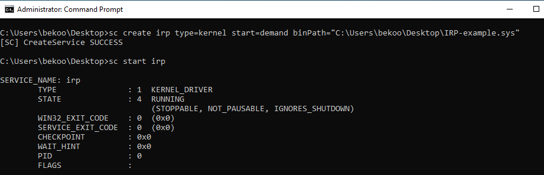
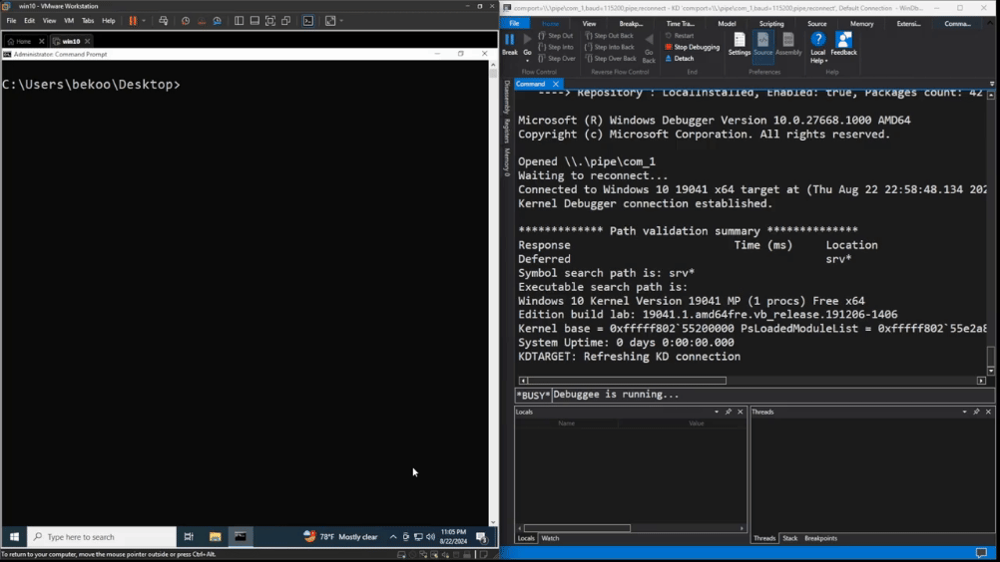
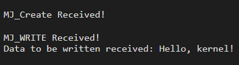

Merhabalar, Windows Kernel Development'ın ilk serisi olarak bu konuda sizlere I/O Request Packet (IRP) konusunu inceleyeceğiz. 

## I/O Request Packet (IRP) Nedir?

I/O Request Packet, kısaca IRP, Windows işletim sisteminde sürücüler ile işletim sistemi arasında bilgi alışverişini sağlayan bir yapıdır. Bunu bir "mesaj taşıyıcısı" gibi düşünebilirsiniz.

Genellikle, sürücülere gönderilen talepler IRP olarak adlandırılan bu paketlerle gönderilir. Bir işletim sistemi bileşeni veya sürücü, IRP’yi bir sürücüye iletmek için IoCallDriver adlı bir fonksiyonu kullanır. Bu fonksiyon, bir aygıt nesnesi (DEVICE_OBJECT) ve bir IRP’yi işaret eden iki bilgi alır. Aygıt nesnesi, bu aygıtla ilişkili sürücüyü (DRIVER_OBJECT) işaret eder. Bu yüzden, IoCallDriver fonksiyonu çağrıldığında, IRP, ilgili aygıt nesnesine veya bu nesneyle ilişkili sürücüye gönderilir. Bazen bu işlem için "IRP’yi iletmek" veya "IRP’yi aktarmak" gibi ifadeler de kullanılır.

Bir IRP, genellikle birden fazla sürücü tarafından işlenir ve bu sürücüler belirli bir sıraya göre düzenlenmiştir. IRP işlenirken, sürücüler yığının her bir katmanı gibi ele alınır. Yani, IRP önce yığının en üstündeki sürücüye gelir. Her sürücü, IRP'yi belirli bir sırayla işler ve gerekli işlemi yapar. İşlem tamamlandığında, IRP bir sonraki sürücüye geçer. Bu süreç, IRP'nin adım adım işlenmesini sağlar. Sonuç olarak, IRP tüm sürücülerden geçtikten sonra nihai işlem gerçekleştirilir ve istenen sonuç elde edilir.

IRP, kullanıcı tarafından başlatılan bir işlemin işletim sisteminin çekirdeği tarafından işlenmesini de sağlar. Bu yapı sayesinde, sürücüler talepleri doğru bir şekilde alır ve yanıt verir. Örneğin, bir dosya yazdırmak istediğinizde, bu talep IRP olarak yazıcı sürücüsüne gönderilir. Yazıcı sürücüsü, IRP'yi alır ve yazdırma işlemini başlatır. Bu sistem, kullanıcı işlemleri ile donanım arasındaki bağlantıyı güvenli ve verimli bir şekilde sağlar.


## Code 

Örnek kod için iki ayrı proje oluşturacağız. İlk projede bir sürücü oluşturacağız ve IRP'in nasıl işleneceğinden bahsedeceğim. Diğer proje ise user mode bir program oluşturacağız ve bu programda WriteFile fonksiyonunu kullanarak sürücüye IRP göndermeyi göstereceğim.

Ayrıca Github link için [buraya](https://github.com/0xbekoo/WinKernelDev/tree/main/IRP) tıklayabilirsiniz.

### Kernel Mode Driver

```c
#include "main.h"

NTSTATUS IrpCreate(PDEVICE_OBJECT DeviceObject, PIRP Irp) {
    UNREFERENCED_PARAMETER(DeviceObject);
    DbgPrintEx(0, 0, "\n\nMJ_Create Received!\n");

    Irp->IoStatus.Status = STATUS_SUCCESS;;
    Irp->IoStatus.Information = 0;
    IoCompleteRequest(Irp, IO_NO_INCREMENT);

    return Irp->IoStatus.Status;
}

NTSTATUS IrpWrite(PDEVICE_OBJECT DeviceObject, PIRP Irp) {
    UNREFERENCED_PARAMETER(DeviceObject);
    PIO_STACK_LOCATION  Stack   = IoGetCurrentIrpStackLocation(Irp);
    PCHAR               Buffer  = Irp->UserBuffer;
    ULONG               Length  = Stack->Parameters.Write.Length;

    DbgPrintEx(0, 0, "\n\nMJ_WRITE Received!\n");

    if (NULL == Buffer || 0 == Length) {
        DbgPrintEx(0, 0, "Failed to Received Data!\n");
        Irp->IoStatus.Status = STATUS_INVALID_PARAMETER;
        Irp->IoStatus.Information = 0;

        return Irp->IoStatus.Status;
    }
    DbgPrintEx(0, 0, "Data to be written received: %.*s\n", Length, Buffer);
    Irp->IoStatus.Status = STATUS_SUCCESS;
    Irp->IoStatus.Information = Length;

    IoCompleteRequest(Irp, IO_NO_INCREMENT);
    return Irp->IoStatus.Status;
}

NTSTATUS DriverEntry(PDRIVER_OBJECT PDrvObj, PUNICODE_STRING RegistryPath) {
    UNREFERENCED_PARAMETER(RegistryPath);
    UNICODE_STRING DeviceName = RTL_CONSTANT_STRING(L"\\Device\\MyDevice");
    UNICODE_STRING SymName = RTL_CONSTANT_STRING(L"\\??\\MyDevice");
    PDEVICE_OBJECT DeviceObject;
    NTSTATUS Status;

    Status = IoCreateDevice(
        PDrvObj,
        0,
        &DeviceName,
        FILE_DEVICE_UNKNOWN,
        0,
        FALSE,
        &DeviceObject
    );
    if (!NT_SUCCESS(Status)) {
        DbgPrintEx(0, 0, "Failed to Create IO Device!\n");
        return Status;
    }

    Status = IoCreateSymbolicLink(
        &SymName,
        &DeviceName
    );
    if (!NT_SUCCESS(Status)) {
        DbgPrintEx(0, 0, "Failed to Create Smybolic Link!\n");
        return Status;
    }
    PDrvObj->MajorFunction[IRP_MJ_CREATE]   = IrpCreate;
    PDrvObj->MajorFunction[IRP_MJ_WRITE]    = IrpWrite;

    return STATUS_SUCCESS;
}

NTSTATUS UnloadDriver(PDRIVER_OBJECT PDrvObj) {
    UNICODE_STRING SymName = RTL_CONSTANT_STRING(L"\\??\\MyDevice");
    DbgPrintEx(0, 0, "Unloading Driver...\n");

    IoDeleteSymbolicLink(&SymName);
    IoDeleteDevice(PDrvObj->DeviceObject);

    return STATUS_SUCCESS;
}
```

Çok uzun gözüksede emin olun çok basit bir sürücü kodu. Adım adım kodlara bakalım ve **DriverEntry** fonksiyonundan başlayalım:

```c
UNICODE_STRING DeviceName = RTL_CONSTANT_STRING(L"\\Device\\MyDevice");
UNICODE_STRING SymName = RTL_CONSTANT_STRING(L"\\??\\MyDevice");
PDEVICE_OBJECT DeviceObject;
```

İlk olarak `DeviceName` ve `SymName` adında iki adet `UNICODE_STRING` tanımladık. Bu iki değişken, sürücümüzün adını ve sembolik adını tutmaktadır. Bu değişkenlerle, sürücümüzün adını ve sembolik adını belirlemek için kullanacağız. 

```c
Status = IoCreateDevice(
    PDrvObj,
    0,
    &DeviceName,
    FILE_DEVICE_UNKNOWN,
    0,
    FALSE,
    &DeviceObject
);
if (!NT_SUCCESS(Status)) {
    DbgPrintEx(0, 0, "Failed to Create IO Device!\n");
    return Status;
}
```

Daha sonra **IoCreateDevice** fonksiyonu ile bir aygıt nesnesi oluşturuyoruz. Bu fonksiyon, sürücümüz için bir aygıt nesnesi oluşturur ve bu nesneyi `DeviceObject` değişkenine atar.

```c
Status = IoCreateSymbolicLink(
    &SymName,
    &DeviceName
);
if (!NT_SUCCESS(Status)) {
    DbgPrintEx(0, 0, "Failed to Create Smybolic Link!\n");
    return Status;
}
```

**IoCreateSymbolicLink** fonksiyonu ile sembolik bir bağlantı oluşturuyoruz.  Bu sayede, user mode programımızda sürücünün adını ve sembolik adını kullanarak sürücümüze erişiyor olacağız.

```c
PDrvObj->MajorFunction[IRP_MJ_CREATE]   = IrpCreate;
PDrvObj->MajorFunction[IRP_MJ_WRITE]    = IrpWrite;
```

Son olarak, sürücümüzün IRP işlevlerini belirliyoruz. Bu işlevler, sürücümüzün IRP'leri nasıl işleyeceğini belirler. Kodlarda ise, **IrpCreate** ve **IrpWrite** kullanıyoruz. **MJ_CREATE**, bir dosya oluşturulduğunda sürücümüzün ne yapacağını belirler. **IrpWrite** ise bir dosyaya yazıldığında sürücümüzün ne yapacağını belirler. IRP'ler, bu işlevler aracılığıyla sürücümüze iletilir ve sürücümüz bu işlevler aracılığıyla IRP'leri işler.


Şimdi ise IRP isteklerini işleyecek fonksiyonlarımıza göz atalım:

```c
NTSTATUS IrpCreate(PDEVICE_OBJECT DeviceObject, PIRP Irp) {
    UNREFERENCED_PARAMETER(DeviceObject);
    DbgPrintEx(0, 0, "\n\nMJ_Create Received!\n");
    ...
```

İlk olarak IrpCreate'e baktığımızda  `DeviceObject` ve `Irp` parametrelerini alır. Bu parametreler, yukarıda bahsettiğim gibi sürücümüzün aygıt nesnesini ve IRP'yi temsil eder. Daha sonra `DbgPrintEx` fonksiyonu ile bir bilgi mesajı yazdırıyoruz.

```c
Irp->IoStatus.Status = STATUS_SUCCESS;;
Irp->IoStatus.Information = 0;
IoCompleteRequest(Irp, IO_NO_INCREMENT);

return Irp->IoStatus.Status;
```

`MJ_CREATE` fonksiyonun son kısmında ise IRP'nin durumunu ve bilgisini ayarlıyoruz. Bu durum ve bilgi, IRP'nin işlem sonucunu belirler. Son olarak, `IoCompleteRequest` fonksiyonu ile IRP'yi tamamlıyor ve işlemi sonlandırıyoruz. 

Şimdi ise `IrpWrite` fonksiyonuna bakalım:

```c
NTSTATUS IrpWrite(PDEVICE_OBJECT DeviceObject, PIRP Irp) {
    UNREFERENCED_PARAMETER(DeviceObject);
    PIO_STACK_LOCATION  Stack   = IoGetCurrentIrpStackLocation(Irp);
    PCHAR               Buffer  = Irp->UserBuffer;
    ULONG               Length  = Stack->Parameters.Write.Length;
    ...
```

Tanımlanan değişkenlere göz atalım:
- `Stack` değişkeni, IRP'nin yığın konumunu temsil eder. 
- `Buffer` değişkeni, IRP'nin veri alanını temsil eder. Bu veri alanı, IRP'nin taşıdığı veriyi içerir.
- `Length` değişkeni, IRP'nin veri uzunluğunu temsil eder. Bu uzunluk, IRP'nin taşıdığı verinin uzunluğunu belirtir.

```c
if (NULL == Buffer || 0 == Length) {
    DbgPrintEx(0, 0, "Failed to Received Data!\n");
    Irp->IoStatus.Status = STATUS_INVALID_PARAMETER;
    Irp->IoStatus.Information = 0;

    return Irp->IoStatus.Status;
}
```

İlk olarak, Buffer işaretçisinin NULL olup olmadığı ve Length değerinin 0 olup olmadığı kontrol ediyoruz. 

Eğer koşul sağlanıyorsa yani veri alınmamışsa `Irp->IoStatus.Status` ile değeri STATUS_INVALID_PARAMETER olarak ayarlıyoruz. Bu, bir parametre hatası olduğunu belirtir. Irp->IoStatus.Information değeri 0 olarak ayarlıyoruz. Sonda ise IRP'nin işlem durumu döndürülerek işleme son verilir.

```c
DbgPrintEx(0, 0, "Data to be written received: %.*s\n", Length, Buffer);
Irp->IoStatus.Status = STATUS_SUCCESS;
Irp->IoStatus.Information = Length;

IoCompleteRequest(Irp, IO_NO_INCREMENT);
return Irp->IoStatus.Status;
```

Bu kısımda ise eğer veri düzgünce alınmışsa bu veriyi yazdırırız. Daha sonra aynı şekilde IRP'nin durumunu ve bilgisini ayarlarız ve işlemi sonlandırırız.

### User Mode Program

Şimdi ise user mode programımızı oluşturalım. Bu programda WriteFile fonksiyonunu kullanarak sürücümüze IRP göndereceğiz.

```c
#include "main.h"

int main(int argc, char* argv[]) {
    HANDLE	HandleDevice = NULL;
    CHAR	Buffer[] = "Hello, kernel!";
    DWORD	BytesWritten = 0;
    DWORD	BytesRead = 0;
    BOOL	Status	= 0;

    HandleDevice = CreateFile(
	    DEVICE_NAME,
	    GENERIC_WRITE | GENERIC_READ,
	    0,
	    NULL,
	    OPEN_EXISTING,
	    FILE_ATTRIBUTE_NORMAL,
	    NULL
    );
    if (INVALID_HANDLE_VALUE == HandleDevice) {
	    printf("Failed to Open Device! Error Code: 0x%lx\n", GetLastError());
	    return -1;
    }

    Status = WriteFile(
	    HandleDevice,
	    Buffer,
	    (DWORD)sizeof(Buffer),
	    &BytesWritten,
	    NULL
    );
    if (!Status) {
	    printf("Failed to Write Data!\n");
	    CloseHandle(HandleDevice);
	    return -1;
    }
    CloseHandle(HandleDevice);
    return 0;   
}
```

User mode program kodlarımız da bu şekilde. Şimdi detaylıca göz atalım:

```c
HandleDevice = CreateFile(
	DEVICE_NAME,
	GENERIC_WRITE | GENERIC_READ,
	0,
	NULL,
	OPEN_EXISTING,
	FILE_ATTRIBUTE_NORMAL,
	NULL
);
if (INVALID_HANDLE_VALUE == HandleDevice) {
	printf("Failed to Open Device! Error Code: 0x%lx\n", GetLastError());
	return -1;
}
```

Programımızda ilk olarak `CreateFile` aracılığıyla sürücümüzü açıyoruz. Bu fonksiyon, sürücümüzü açar ve bir kolu (HANDLE) döndürür. 

"CreateFile kullanılarak sürücü mü açılıyor?" diye düşünen olabilir. Bilmeyenler için CreateFile fonksiyonu, Windows işletim sisteminde bir dosya veya aygıt nesnesi oluşturmak veya açmak için kullanılabilir. Daha fazla araştırma için dökümanlara bakabilirsiniz.

```c
Status = WriteFile(
    HandleDevice,
    Buffer,
    (DWORD)sizeof(Buffer),
    &BytesWritten,
    NULL
);
if (!Status) {
    printf("Failed to Write Data!\n");
    CloseHandle(HandleDevice);
    return -1;
}
```

Bu kısımda ise `WriteFile` fonksiyonu aracılığıyla sürücümüze IRP isteği gönderiyoruz. 

## Sürücünün ve Programın Çalıştırılması 

Öncelikle sürücümüzü windbg'a bağlı sanal makineye yüklememiz ve ardından başlatmamız gerekecek:



Şimdi ise user mode programımızı çalıştıralım:



Göründüğü gibi user mode programımı çalıştırdığımızda sürücüye veri gönderdiğini ve gönderilen veriyi ekrana yazdırdığını gördük:



User mode program tarafından **MJ_WRITE** IRP isteğinin geldiğini ve işlediğini böylece görmüş oluyoruz.

## Sonuç

Bu yazıda IRP'nin ne olduğunu, nasıl oluşturulduğunu ve nasıl kullanıldığını öğrendik. Ayrıca, IRP'nin sürücüler ve işletim sistemi arasında nasıl bir köprü görevi gördüğünü de öğrendik. Bu konuda daha fazla bilgi edinmek isterseniz, Microsoft Docs'ta bulunan kaynaklara göz atabilirsiniz.

Umarım faydalı bir yazı olmuştur. İyi çalışmalar dilerim 🚀🚀🚀


## References 

- [Microsoft Docs - I/O Request Packets](https://learn.microsoft.com/en-us/windows-hardware/drivers/gettingstarted/i-o-request-packets)
