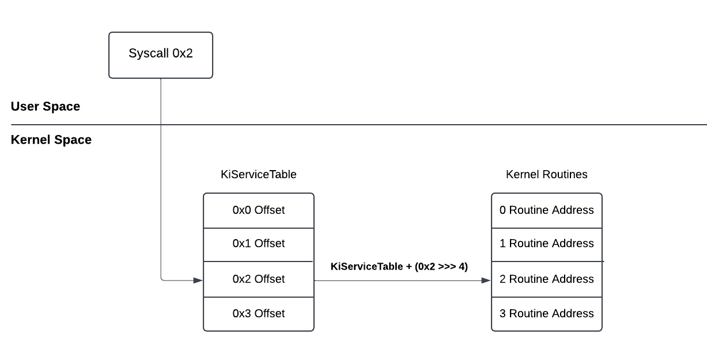
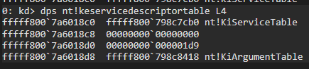
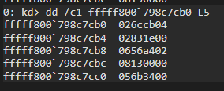
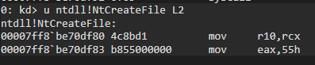
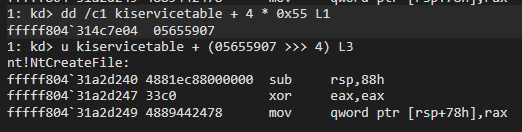
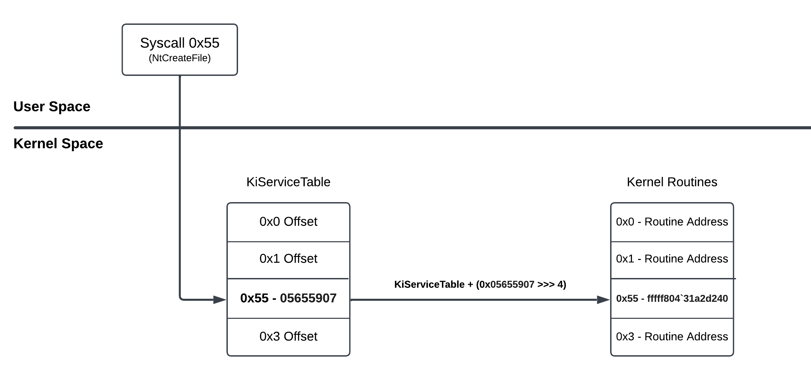
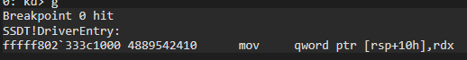
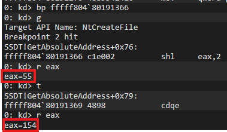
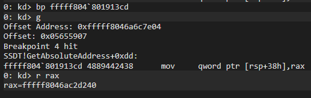
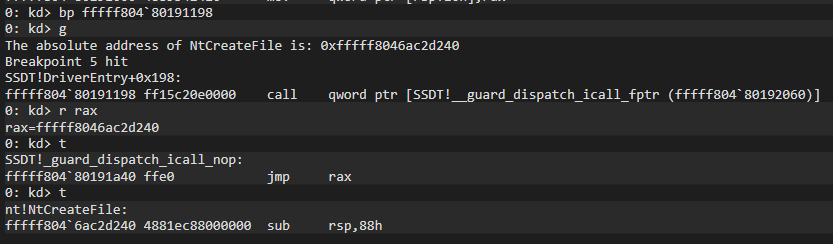

Merhabalar bu yazıda System Service Descriptor Table inceleyeceğiz.

## **SSDT Nedir?**

Basitçe SSDT (System Service Descriptor Table), işletim sistemi tarafından desteklenen sistem çağrılarının bir listesidir. Sistem çağrıları, bir uygulamanın çekirdek seviyesindeki işlevleri kullanması için yapılan çağrılardır.

SSDT, Service Descriptor Table kernel bellek yapısının ilk üyesidir: 

```c
typedef struct tagSERVICE_DESCRIPTOR_TABLE {
    SYSTEM_SERVICE_TABLE nt;    // SSDT Tablosu kendisine etkili bir pointer
    SYSTEM_SERVICE_TABLE win32k;
    SYSTEM_SERVICE_TABLE sst3; 
    SYSTEM_SERVICE_TABLE sst4;
} SERVICE_DESCRIPTOR_TABLE;
```

SSDT, sistem çağrılarını (syscall) çekirdek API adresleriyle eşleştirir. Bir user-mode program tarafından bir sistem çağrısı yapıldığında, bu çağrı bir hizmet indeksi (service index) içerir. Bu indeks, hangi sistem çağrısının kullanılacağını belirtir. İşletim sistemi, bu indeksi kullanarak System Service Descriptor Table (SSDT) üzerinden ilgili işlevin adresini çözümleyip ntoskrnl.exe içerisindeki doğru çekirdek işlevine yönlendirme yapar. Kulağa kafa karıştıcı geliyor olabilir bir de diagram üzerinden anlatayım:




Diyelim ki User-Mode alanından CreateFile işlevini çağırdınız ve syscall numarası 0x2 olsun. Syscall yürütüldüğü zaman artık user-mode alanından çıkılır ve artık akış kernel alanından devam eder. Diagram'dan bunu görebilirsiniz.

Kernel alanına geçiş yapıldığında ilk durak **SSDT** (KiServiceTable) olacaktır. Burada tipik olarak Kernel Routine address'lere erişmek için offset listesi barındırdığını düşünmenizi istiyorum. İlgili syscall numarası ile offset hesaplanır ve ardından ilgili Routine Address'e yönlendirilir. Böylece NtCreateFile yürütülmüş olur. Hesaplama için ise aşağıdaki formül kullanılır:

<div align="center">
    <br>
    <b>
    <i> Offset = KiServiceTableAddress + 4 * SSN </i>   
    </b>
    <br>
</div>

Yani arkadaşlar kısacası SSDT ve syscall'lar, user-mode alanından gelen API çağrılarıyla bunlara karşılık gelen kernel routine adresler arasında bir köprü görevi görür. Bu sayede kernel, user-mode alanından gelen bir sistem çağrısına hangi işlevin yanıt vereceğini belirler.

## **Windbg ile Analiz**

Konuyu teorik olarak bırakmak olmaz. Windbg ile bu SSDT'ye bir göz atalım:


 
Çıktıda verilen ilk adres **fffff800`798c7cb0**, SSDT'nin adresidir. 

SSDT'nin bir tablo olduğunu düşünmenizi istemiştim. Şimdi ise elde ettiğimiz adresle tablodaki birkaç offset'e göz atalım:



Tablodan ilk 5 offset göründüğü gibi sıralanmış durumda. Şimdi bu offset'lerden **056b3400** alalım ve adresini hesaplayalım.

Eğer Diagram'a tekrar bakarsanız kernel routine adresine erişmek için aşağıdaki formül kullanılıyor:

<div align="center">
    <br>
    <b>
    <i> KernelRoutineAddress = KiServiceTableAddress + ( Offset >>> 4 ) </i>   
    </b>
    <br>
</div>

Şimdi örnek olarak aldığımız offset'i bu formül kullanarak routine adresine bir göz atalım:


Göründüğü gibi örnek olarak aldığımız offset, **NtWaitForSingleObject**'e ait. 

## **Syscall ile Routine Adresi bulma**
Şimdi Syscall kullanarak Routine adresini nasıl bulabiliriz buna bir bakalım. 

Örnek olarak **NtCreateFile**'dan bahsetmiştim. Windbg ile bu API'a ait SSN numarasını **ntdll.dll**'den bulabiliriz:



eax register'a **0x55** değerinin aktarıldığını görüyoruz. Bu NtCreateFile'in syscall numarasıdır. 

Şimdi bu syscall numarasını kullanarak offset'i hesaplayıp ardından routine adresine erişelim:



Çıktıdan gördüğümüz üzere NtCreateFile'in routine adresi **fffff804`31a2d240** olduğunu gösteriyor. Yaptığımız bu adımları kafamıza daha iyi oturtmak için şemasını tekrar oluşturabiliriz:



## **Kodlama**

Öğrendiğimiz şeyleri Kernel Driver kullanarak basitçe kodlayalım. 

Senaryomuz ise NtCreateFile ve NtWriteFile API'larını kullanarak bir .txt dosyası oluşturacağız ve içerisine bir metin yazdıracağız ancak bu konuda öğrendiğimiz şekillerle API'ların kernel routine adreslerini alıp API'ları direkt routine adresten çalıştıracağız.

Projenin github linki için [buraya](https://github.com/0xbekoo/KernelDriver-SSDT) tıklayabilirsiniz.

```c
#pragma warning(disable: 4083 4005)
#include "main.h"

#define KiServiceTableAddress 0xfffff800798c7cb0
#define SSN_NtCreateFile 0x55
#define SSN_NtWriteFile 0x8

typedef (NTAPI* My_NtCreateFile)(
	_Out_ PHANDLE FileHandle,
	_In_ ACCESS_MASK DesiredAccess,
	_In_ POBJECT_ATTRIBUTES ObjectAttributes,
	_Out_ PIO_STATUS_BLOCK IoStatusBlock,
	_In_opt_ PLARGE_INTEGER AllocationSize,
	_In_ ULONG FileAttributes,
	_In_ ULONG ShareAccess,
	_In_ ULONG CreateDisposition,
	_In_ ULONG CreateOptions,
	_In_reads_bytes_opt_(EaLength) PVOID EaBuffer,
	_In_ ULONG EaLength
);

typedef (NTAPI* My_NtWriteFile)(
	IN HANDLE FileHandle,
	IN HANDLE Event OPTIONAL,
	IN PIO_APC_ROUTINE ApcRoutine OPTIONAL,
	IN PVOID ApcContext OPTIONAL,
	OUT PIO_STATUS_BLOCK IoStatusBlock,
	_In_reads_bytes_(Length) PVOID Buffer,
	IN ULONG Length,
	IN PLARGE_INTEGER ByteOffset OPTIONAL,
	IN PULONG Key OPTIONAL
);

uint32_t ReadMemory(uint64_t Address) {
	return *(volatile uint32_t*)Address;
}

uint64_t GetAbsoluteAddress(int SSN, UNICODE_STRING APIName) {
	if (0 == SSN) {
		DbgPrintEx(0, 0, "SSN is 0\n");
		return 0;
	}
	DbgPrintEx(0, 0, "Target API Name: %wZ\n", APIName);

	uint64_t RoutineAbsoluteAddress = 0;
	uint64_t OffsetAddress;
	uint32_t Offset = 0;

	// Offset'in adresini hesapla
	OffsetAddress = KiServiceTableAddress + 4 * SSN;
	DbgPrintEx(0, 0, "Offset Address: 0x%llx\n", OffsetAddress);

	// Hesaplanan adresten offseti oku
	Offset = ReadMemory(OffsetAddress);
	DbgPrintEx(0, 0, "Offset: 0x%08x\n", Offset);

	// Formülü uygulayarak kernel routine adresine eri?
	RoutineAbsoluteAddress = KiServiceTableAddress + (Offset >> 4);
	DbgPrintEx(0, 0, "The absolute address of %wZ is: 0x%llx\n", APIName, RoutineAbsoluteAddress);

	return RoutineAbsoluteAddress;
}

NTSTATUS DriverEntry(PDRIVER_OBJECT DriverObject, PUNICODE_STRING RegistryPath) {
	UNREFERENCED_PARAMETER(RegistryPath);
	DriverObject->DriverUnload = UnloadDriver;

	HANDLE HandleFile = NULL;
	OBJECT_ATTRIBUTES ObjAttr;
	IO_STATUS_BLOCK IoStatusBlock;
	NTSTATUS Status = STATUS_SUCCESS;
	uint64_t Address = 0;
	UNICODE_STRING FileName;
	UNICODE_STRING NtCreateFileName;
	UNICODE_STRING NtWriteFileName;
	UNICODE_STRING Data;

	RtlInitUnicodeString(&NtCreateFileName, L"NtCreateFile");
	RtlInitUnicodeString(&NtWriteFileName, L"NtWriteFile");
	RtlInitUnicodeString(&FileName, L"\\??\\C:\\ssdt.txt");
	RtlInitUnicodeString(&Data, L"Hello SSDT!");

	InitializeObjectAttributes(&ObjAttr, &FileName, OBJ_CASE_INSENSITIVE | OBJ_KERNEL_HANDLE, NULL, NULL);	

	// NtCreateFile'in Routine adresini al 
	Address = GetAbsoluteAddress(SSN_NtCreateFile, NtCreateFileName);
	if (0 == Address) {
		return STATUS_NOT_FOUND;
	}
	My_NtCreateFile MyNtCreateFile = (My_NtCreateFile)Address;

	// NtCreateFile'i çağır
	Status = MyNtCreateFile(&HandleFile, GENERIC_WRITE, &ObjAttr, &IoStatusBlock, NULL, FILE_ATTRIBUTE_NORMAL, \
								0, FILE_OVERWRITE_IF, FILE_SYNCHRONOUS_IO_NONALERT, NULL, 0);
	if (!NT_SUCCESS(Status)) {
		DbgPrintEx(0, 0, "Failed to Create File! Error: 0x%08x\n", Status);
		return Status;
	}
	DbgPrintEx(0, 0, "Created File!\n\n");

	// NtWriteFile'in Routine adresini al 
	Address = GetAbsoluteAddress(SSN_NtWriteFile, NtWriteFileName);
	if (0 == Address) {
		return STATUS_NOT_FOUND;
	}
	My_NtWriteFile MyNtWriteFile = (My_NtWriteFile)Address;
	
	// NtWriteFile'i çağır
	Status = MyNtWriteFile(HandleFile, NULL, NULL, NULL, &IoStatusBlock, Data.Buffer, Data.Length, NULL, NULL);
	if (!NT_SUCCESS(Status)) {
		DbgPrintEx(0, 0, "Failed to ZwWriteFile! Error: 0x%08x\n", Status);

		ZwClose(HandleFile);
		return Status;
	}
	DbgPrintEx(0, 0, "Wrote to File\n\n");

	ZwClose(HandleFile);
	return STATUS_SUCCESS;
}

NTSTATUS UnloadDriver(PDRIVER_OBJECT DriverObject) {
	UNREFERENCED_PARAMETER(DriverObject);

	DbgPrintEx(0, 0, "Unloading the Driver...\n");

	return STATUS_SUCCESS;
}
```
Kodumuz bu şekilde. Detaylıca analiz etmeye başlayalım:

```c
#define KiServiceTableAddress 0xfffff800798c7cb0
#define SSN_NtCreateFile 0x55
#define SSN_NtWriteFile 0x8
```

İlk olarak projede KiServiceTable'in adresini ve iki API'in SSN numaralarını tanımlanmıştır. Bu projeyi çalıştırırken aldığınız adresi ve SSN numaralarını buraya ekleyin.

```c
// NtCreateFile'in Routine adresini al 
Address = GetAbsoluteAddress(SSN_NtCreateFile, NtCreateFileName);
if (0 == Address) {
	return STATUS_NOT_FOUND;
}
```
DriverEntry içerisine göz attığımızda ise tanımladığımız ve SSN numarası ve API'in ismini alan **GetAbsoluteAddress* fonksiyonunu çağırıyoruz. Bu API ile burada anlattığım yöntemler ile ilgili API'in kernel routine adresini alacağız.

```c
// Offset'in adresini hesapla
OffsetAddress = KiServiceTableAddress + 4 * SSN;
DbgPrintEx(0, 0, "Offset Address: 0x%llx\n", OffsetAddress);
```

**GetAbsoluteAddress** fonksiyonun içeriğine baktığımızda ise SSDT'nin içerisinden Offset'in adresini bulmak için önceden bahsettiğim hesaplamayı yapıyoruz. Daha sonra elde ettiğimiz offset adresini ekrana bastırıyoruz.

```c
// Hesaplanan adresten offseti oku
Offset = ReadMemory(OffsetAddress);
DbgPrintEx(0, 0, "Offset: 0x%08x\n", Offset);
```

Daha sonra aldığımız offset'in adresin içeriğini okuyarak offset'i elde etmiş oluyoruz ve aynı şekilde offset'i de ekrana bastırıyoruz. 

```c
// Formülü uygulayarak kernel routine adresine eriş
RoutineAbsoluteAddress = KiServiceTableAddress + (Offset >> 4);
DbgPrintEx(0, 0, "The absolute address of %wZ is: 0x%llx\n", APIName, RoutineAbsoluteAddress);
```

Bu fonksiyonda son olarak ise formülü uygularak ilgili routine adresine erişmiş oluyoruz. 

```c
My_NtCreateFile MyNtCreateFile = (My_NtCreateFile)Address;

Status = MyNtCreateFile(&HandleFile, GENERIC_WRITE, &ObjAttr, &IoStatusBlock, NULL, FILE_ATTRIBUTE_NORMAL, \
								0, FILE_OVERWRITE_IF, FILE_SYNCHRONOUS_IO_NONALERT, NULL, 0);
if (!NT_SUCCESS(Status)) {
	DbgPrintEx(0, 0, "Failed to Create File! Error: 0x%08x\n", Status);
	return Status;
}
DbgPrintEx(0, 0, "Created File!\n\n");
```

NtCreateFile'in routine adresini aldıktan sonra ise oluşturduğumuz MyNtCreateFile yapısına bu adresi veriyoruz ve ardından routine adresini kullanarak NtCreateFile API'i çağırıyoruz.

```c
// NtWriteFile'in Routine adresini al 
Address = GetAbsoluteAddress(SSN_NtWriteFile, NtWriteFileName);
if (0 == Address) {
	return STATUS_NOT_FOUND;
}
My_NtWriteFile MyNtWriteFile = (My_NtWriteFile)Address;

// NtWriteFile'i çağır
Status = MyNtWriteFile(HandleFile, NULL, NULL, NULL, &IoStatusBlock, Data.Buffer, Data.Length, NULL, NULL);
if (!NT_SUCCESS(Status)) {
	DbgPrintEx(0, 0, "Failed to ZwWriteFile! Error: 0x%08x\n", Status);

	ZwClose(HandleFile);
	return Status;
}
DbgPrintEx(0, 0, "Wrote to File\n\n");
```

NtCreateFile'i çalıştırdıktan sonra yine aynı işlemler ile NtWriteFile'in routine adresini alıyor ve oluşturduğumuz yapıya adresi veriyoruz ve ardından NtWriteFile API'i çalıştırıyoruz. 

## **Driver'in Analiz edilmesi**

Tabi ki direkt olarak Driver'i kodladıktan sonra direkt olarak sonucu göstermek yerine sisteme yükleyeceğimiz Driver'i adım adım takip edip neler yaptığına beraber bir göz atalım. Böylece kafamızda daha iyi yer edineceğini düşünüyorum.

Öncelikle sanal makinemize bağlı Windbg'a Driver'ımız için bir breakpoint ekleyeceğiz. Böylece kodladığımız Driver sisteme yüklendiğinde duracak.

İlk olarak sanal makineye hazırladığımız .sys dosyasını yükleyelim:

```
sc create SSDT binPath="C:\Users\bekoo\Desktop\SSDT.sys" type=kernel start=demand
```

Daha sonra Windbg'a dönüp bir breakpoint ekleyelim:

```
bp SSDT!DriverEntry
```

Ardından ise sürücüyü çalıştıralım:

```
sc start SSDT
```

Çalıştırdıktan sonra Windbg ekranında bp tetiklendiğine dair bir çıktı almamız gerekiyor:



Elde ettiğimiz adreslere göz atmak için **GetAbsoluteAddress** fonksiyonuna bir bp koyalım ve programı devam ettirelim:

```
kd> bp SSDT!GetAbsoluteAddress
kd> g
Breakpoint 1 hit
SSDT!GetAbsoluteAddress:
fffff802`333c12f0 4889542410      mov     qword ptr [rsp+10h],rdx
```
GetAbsoluteAddress fonksiyonunda durdu. **Disassembly** ekranında GetAbsoluteAddress fonksiyonunu inceleyeceğiz. İlk durağımız Offset'in adresini hesapladığımız kısım olacak:


İlk olarak eax register'a fonksiyonun birinci parametresi olan **SSN** değişkenin değerini aktarıldığını görmekteyiz. Program ilk defa GetAbsoluteAddress fonksiyonuna girdiği için 0x55 yani NtCreateFile'in ssn numarasını içerdiğini biliyoruz. 

Daha sonra alınan SSN numarası **shl eax,2** yani eax'ın değerini 2 bit sola kaydırıyor. Ne yaptığını anlamamız için bu kısmın formülüne tekrar hatırlayalım:

<div align="center">
    <br>
    <b>
    <i> Offset = KiServiceTableAddress + 4 * SSN </i>   
    </b>
    <br>
</div>

Şimdi sunu sorabilirsiniz: **"Formülde çarpma işlemi yapılıyor ama arka planda 2 bit sola kaydırılıyor"** diye. 

Sola kaydırma (shift left, shl) işlemi, bir sayıyı 2'nin katları ile çarpmaya eşdeğerdir. Burada **shl eax, 2** komutu ile eax'i 4 ile çarpıyor. Bunu doğrulamak için bu kısma bir breakpoint koyup eax'ın ne sonuç aldığını görebiliriz:



Fotoğrafta göründüğü üzere ```shl eax,2``` işlemini yapan kısma bir bp koyup akışı burada durdurduğumuzda eax'ın önceki ve işlemden sonraki değerini görebiliriz. Çalışmadan önce eax'ın değeri 0x55 (Dec: 85) iken çalıştıktan sonra 0x154 (Dec: 340) sonucu elde ediliyor.

Daha sonra **cdqe** komutu ile eax register'ındaki değeri rax register'ı için genişletiyor. Yani farklı anlatım ile 32 bitlik değeri 64 bit'e dönüştürmek için kullanılıyor.

Bu formülün son kısmında ise rcx'e KiServiceTable'in adresi aktarılıyor ve **4 * SSN** sonucunu saklayan rax register'dan KiServiceTableAddress'in değeri çıkartılıyor. Şimdi burada kafanızının yine karıştığının farkındayım. 

Burada tipik olarak her ne kadar da **sub** kullanılarak çıkartma işlemi yapılıyor olsa da rax'tan rcx değerini çıkardığına dikkat edin. Yani farklı bir deyişle bu, KiServiceTableAddress'in rax'tan çıkarılması anlamına gelir. Yani bu işlem **KiServiceTableAddress + 4 * SSN** işlemi ile aynı sonucu verecektir. Kafanızın karıştığının farkındayım ancak kısaca şunu aklınızda tutabilirsiniz ki yaptırmak istediğimiz formül ile aynı sonucu verecektir. 

Offset'in adresini görmek için ise ```mov     qword ptr [OffsetAddress (rsp+40h)], rax``` kısmına karşılık gelen adrese bir bp koyalım ve programı devam ettirelim. Elde ettiğimiz adrese bir göz atalım:


Adres olarak **fffff8046a6c7e04** alındığını görmekteyiz. Yukarıda zaten NtCreateFile ile örnek yapmıştık yani adresler uyuşuyor. Doğru adresi aldığından emin olabiliriz.


Son durağımız ise Routine adresini hesapladığımız formül kısmı olacak. 

SSDT'ten NtCreateFile'in offset alındıktan sonra eax'a offset değeri veriliyor ve ardından 4 bit sağ kaydırdığını görüyoruz. Bu formülümüzün bir parçası. 

Daha sonra rcx'e KiServiceTable'in adresi veriliyor ve ardından rax'tan rcx'i çıkardığını (yukarıda bahsettiğim gibi kafanız karışmasın bunu toplama yapıyormuş gibi düşünelim) görmekteyiz. Böylece NtCreateFile'in routine adresine erişmiş oluyoruz. Elde edilen adrese göz atalım:



Göründüğü gibi başarılı bir şekilde **fffff8046ac2d240** sonucunu elde ediyoruz. Şimdi ise DriverEntry'de routine adresine yönlendirdiğimiz kısıma dönelim:


GetAbsoluteAddress çalıştıktan sonra alınan adresi oluşturduğumuz **MyNtCreateFile** yapısına aktarıldığını ve NtCreateFile için parametrelerin hazırlandığını ve en sonda routine adrese yönlendirildiğini görebiliriz. Routine adresin çağırıldığı yere breakpoint koyup akışı nereye yönlendirdiğine bir bakalım:



call yapıldığı kısma bir breakpoint koyup rax'ın değerine baktığımızda elde ettiğimiz NtCreateFile'in routine adresi olduğunu ve devam ettirdiğimizde rax'ın adresine atlayan bir komut çalıştırılıyor ve akış NtCreateFile içerisine giderek devam ediyor. 

Driver'in devamındaki kodlar aynı adımı içerdiği için driver'i devam ettirebiliriz. Devam ettirmeden önce breakpoint'leri kaldıralim ve ardından ```g``` komutuyla devam ettirelim:


Akışın devamında ise NtWriteFile API'si için offset değeri ve routine adresini de görebiliriz. 

Son olarak ise gerçekten bir .txt oluşturulmuş ve içerisine veri yazılmış mı buna bakalım:


Başarılı bir şekilde **C:\ssdt.txt** oluşturulduğunu ve içerisine 'Hello SSDT!' metni yazdırıldığını görebiliriz.

## **Sonuç**

Sonuç olarak, bu yazıda SSDT’nin WinDbg ortamında analizini gerçekleştirdik ve elde ettiğimiz bulguları kodlamaya döktük. Kodlama aşamasında, öğrendiğimiz formüller ile NtCreateFile ve NtWriteFile'in routine adreslerini hesapladık. Bu adresleri kullanarak bir .txt dosyası oluşturduk ve içerisine metin yazdık. Son olarak ise windbg'da kodladığımız driver'i analiz etmiş olduk.

Umarım bu konu sizler için faydalı olmuştur. Konu, ilk bakışta kafa karıştırıcı gibi görünebilir; ancak teoride kalmaması ve daha iyi anlaşılabilmesi için detayları mümkün olduğunca açıklamaya çalıştım.

Hepinize iyi çalışmalar dilerim!

## **References**
- [iRedTeam Notes - SSDT](https://www.ired.team/miscellaneous-reversing-forensics/windows-kernel-internals/glimpse-into-ssdt-in-windows-x64-kernel)

- [Wikipedia - System Service Descriptor Table](https://en.wikipedia.org/wiki/System_Service_Descriptor_Table)
