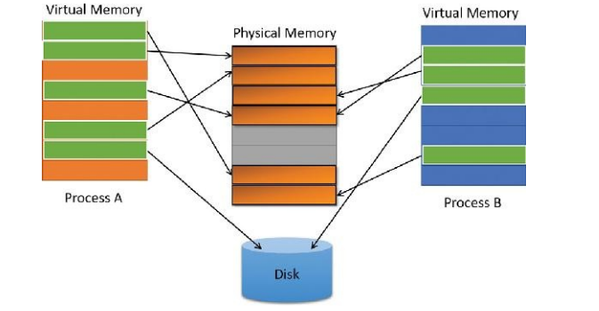
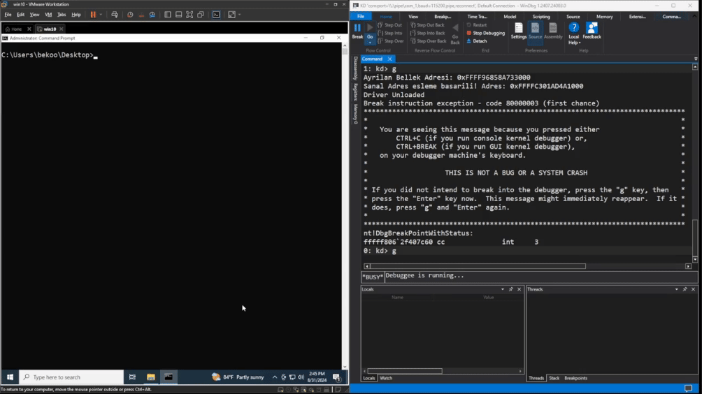
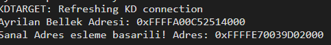

Merhabalar, bu yazıda Virtual Memory konusunu ele alacağım.


## Virtual Memory Nedir?

> <i>"Windows, her bir process için, büyük ve özel bir adres alanına sahipmiş gibi görünen bir sanal bellek sistemi kullanır. Sanal bellek, gerçek fiziksel belleğin düzenine bağlı kalmaksızın, belleğin daha soyut bir görünümünü sunar. Çalışma sırasında, bellek yöneticisi -donanım desteği ile- sanal adresleri verilerin gerçekten saklandığı fiziksel adreslere çevirir. Bu sayede, işletim sistemi her bir process'in, diğer bir process'in belleğine müdahale etmesini veya işletim sisteminin kritik verilerinin üzerine yazılmasını engelleyebilir."</i> 

--**Windows Internals Part 1 - Chapter 1, Page 39**

Yukarıdaki kaynağa göre kısaca **Virtual Memory** (Sanal Bellek), fiziksel bellek adresindeki verilerin ldealleştirilmiş bir soyutlama sağlayan bir bellek yönetim tekniğidir. Bu sayede işletim sistemi her bir process'in, diğer process belleğine müdahale etmesini veya işletim sisteminin kritik verilerinin üzerine yazılmasını engelleyebilir.

Bu sistem, verileri bellekte (RAM) ve sabit diskte (hard disk) saklamak için bir yöntem kullanır. Bu yöntem, verileri küçük parçalara böler. Her bir parça 'page' (sayfa) olarak adlandırılır ve genellikle 4 KB boyutundadır.

Bu sayfalar, bellekte bitişik olarak saklanmak zorunda değildir. Yani, bir uygulamanın verileri bellekte düzensiz bir şekilde yer alabilir. Örneğin, bir uygulamanın bazı verileri bellekte bulunurken, bazıları diskte saklanabilir. Bu yöntem, uygulamanın performansını etkilemeden bellek kullanımını optimize etmesini sağlar.

Bu sistemin avantajı, uygulamaların sayfalamadan yararlanmak için herhangi bir özel değişiklik yapmasına gerek olmamasıdır. Bellek yönetim sistemi, bu işlemleri otomatik olarak yapar. Aşağıdaki şemada bunu daha iyi görebilirsiniz.



<h5 align="center">Windows Internals - Part 1, Page 40</h5>

Sanal adres alanının boyutu her donanım platformuna göre değişiklik gösterir. Örneğin Windows'ta 32-bit x86 sistemlerde toplam sanal adres alanı en fazla 4 GB'dır. Yine bu platformda varsayılan olarak, Windows bu adres alanının alt yarısını (0x00000000 - 0x7FFFFF arası adresler) kendi özel depolama alanlarını ve üst yarısını (0x80000000 - 0xFFFFFF arası adresler) kendi korumalı işletim sistemi bellek kullanımı için ayırır.

Windows'ta 64-bit (x64) sistemlerde ise sanal adres alanı çok daha geniştir. 64-bit bir adresleme sistemi teorik olarak 16 exabyte (2^64 bayt) sanal adres alanı sunar. Ancak, mevcut donanım ve işletim sistemi kısıtlamaları nedeniyle bu alanın tamamı kullanılmaz. Windows x64 işletim sistemlerinde genellikle sanal adres alanı 256 terabyte (2^48 bayt) ile sınırlıdır.

## Code

Bu etapta, sürücü üzerinden kernel space alanından bir bellek ayrımı yapıp ardından bu belleği sanal adres ile eşleştireceğiz.

Github linki için [buraya](https://github.com/0xbekoo/WinKernelDev/tree/main/Virtual_Memory/src) tıklayabilirsiniz.

```c
#pragma warning(disable: 4996)

#include <ntddk.h>

NTSTATUS DriverEntry(PDRIVER_OBJECT DriverObject, PUNICODE_STRING RegistryPath) {
	UNREFERENCED_PARAMETER(RegistryPath);
	SIZE_T MemorySize = 0x1000;
	PVOID VirtualAddress = NULL;
	PVOID MappedAddress = NULL;
	PMDL MDL = NULL;

	VirtualAddress = ExAllocatePool(NonPagedPool, MemorySize);
	if (NULL == VirtualAddress) {
		DbgPrintEx(0, 0, "Bellek Ayrimi basarisiz oldu!\n");
		return STATUS_INSUFFICIENT_RESOURCES;
	}
	DbgPrintEx(0, 0, "Ayrilan Bellek Adresi: 0x%p\n", VirtualAddress);

	MDL = IoAllocateMdl(VirtualAddress, (ULONG)MemorySize, FALSE, FALSE, NULL);
	if (NULL == MDL) {
		DbgPrintEx(0, 0, "MDL Ayrimi basarisiz oldu!\n");
		ExFreePool(VirtualAddress);
		return STATUS_INSUFFICIENT_RESOURCES;
	}
	
	MmBuildMdlForNonPagedPool(MDL);

	MappedAddress = MmMapLockedPagesSpecifyCache(MDL, KernelMode, MmCached, NULL, FALSE, NormalPagePriority);
	if (NULL == MappedAddress) {
		DbgPrintEx(0, 0, "Sanal Adres esleme basarisiz!\n");
		IoFreeMdl(MDL);
		ExFreePool(VirtualAddress);
		return STATUS_INSUFFICIENT_RESOURCES;
	}
	DbgPrintEx(0, 0, "Sanal Adres esleme basarili! Adres: 0x%p\n", MappedAddress);
	
	MmUnmapLockedPages(MappedAddress, MDL);
	IoFreeMdl(MDL);
	ExFreePool(VirtualAddress);

	DriverObject->DriverUnload = UnloadDriver;
	return STATUS_SUCCESS;
}

NTSTATUS UnloadDriver(PDRIVER_OBJECT DriverObject) {
	UNREFERENCED_PARAMETER(DriverObject);

	DbgPrintEx(0, 0, "Driver Unloaded\n");
	return STATUS_SUCCESS;
}
```

Örnek kod parçamız bu. Şimdi bu kodu inceleyelim.

```c
SIZE_T MemorySize = 0x1000;
PVOID VirtualAddress = NULL;
PVOID MappedAddress = NULL;
PMDL MDL = NULL;
```

İlk olarak sürücümüzde parametreleri tanımlayarak başlıyoruz. İşte sırasıyla amaçları:

- **MemorySize**: Bellek ayrımı yapılacak alanın boyutunu belirler. Bu örnekte 0x1000 (4 KB) olarak belirledim.
- **VirtualAddress**: Bellek ayrımı yapıldığında dönen adresi tutar.
- **MappedAddress**: Belleğin sanal adres ile eşleştirildiği adresi tutar.
- **MDL**: Belleğin sanal adres ile eşleştirilmesi için kullanılan MDL yapısını tutar.

```c
VirtualAddress = ExAllocatePool(NonPagedPool, MemorySize);
if (NULL == VirtualAddress) {
	DbgPrintEx(0, 0, "Bellek Ayrimi basarisiz oldu!\n");
	return STATUS_INSUFFICIENT_RESOURCES;
}
DbgPrintEx(0, 0, "Ayrilan Bellek Adresi: 0x%p\n", VirtualAddress);
```

İlk adımımızda **Nonpaged Pool** alanından 4 KB'lık bir bellek ayrımı yapıyoruz. Eğer bellek ayrımı başarısız olursa, hata mesajı yazdırıp işlemi sonlandırıyoruz. Ayrıca başarılı olursa, ayrılan belleğin adresini yazdırıyoruz.

Eğer Nonpaged havuzu hakkında bilginiz yoksa burada bir kısa açıklama yapayım. **Nonpaged Pool**, işletim sisteminde kullanılan bellek havuzlarından biridir. Bu havuz, sistemin her zaman erişilebilir olan ve disk belleği ile değiştirilemeyen (yani "paging" işlemi uygulanamayan) bellek alanını ifade eder. Nonpaged pool içindeki bellek, sistemde kritik öneme sahip işler için ayrılır. Örneğin, donanım sürücüleri veya çekirdek (kernel) modundaki diğer bileşenler, bu havuzdan bellek tahsis ederler çünkü bu bileşenlerin bellek erişiminin her zaman hızlı ve kesintisiz olması gerekir. 

Bunun yanında **Paged Pool** alanı vardır. Bu da işletim sisteminde kullanılan bellek havuzlarından biridir. Bu havuz, sistemin bellek yönetimi için kullanılan ve disk belleği ile değiştirilebilen (yani "paging" işlemi uygulanabilen) bellek alanını ifade eder. Paged pool içindeki bellek, genellikle kullanıcı modunda çalışan uygulamalar ve hizmetler için ayrılır. 

```c
MDL = IoAllocateMdl(VirtualAddress, (ULONG)MemorySize, FALSE, FALSE, NULL);
if (NULL == MDL) {
	DbgPrintEx(0, 0, "MDL Ayrimi basarisiz oldu!\n");
	ExFreePool(VirtualAddress);
	return STATUS_INSUFFICIENT_RESOURCES;
}
```

Kodun devamında ise, bellek bloğunun fiziksel adreslerine erişmek ve bu bloğu bir sanal adres ile eşleştirmek için bir MDL (Memory Descriptor List) yapısı oluşturuyoruz. MDL yapısı, belleğin fiziksel adreslerini ve boyutunu tutar, böylece bu blokla ilişkili verilerin sanal bellekten fiziksel belleğe nasıl eşleştirileceğini tanımlar. 

```c
MmBuildMdlForNonPagedPool(MDL);
```

Daha sonra bı API ile MDL yapısını oluşturuyoruz. Bu fonksiyon, MDL yapısını oluştururken, MDL yapısının fiziksel bellek adreslerini ve boyutunu doldurur.

```c
MappedAddress = MmMapLockedPagesSpecifyCache(MDL, KernelMode, MmCached, NULL, FALSE, NormalPagePriority);
if (NULL == MappedAddress) {
	DbgPrintEx(0, 0, "Sanal Adres esleme basarisiz!\n");
	IoFreeMdl(MDL);
	ExFreePool(VirtualAddress);
	return STATUS_INSUFFICIENT_RESOURCES;
}
DbgPrintEx(0, 0, "Sanal Adres esleme basarili! Adres: 0x%p\n", MappedAddress);
```

Son olarak belleğimizi sanal adresle eşlemek için **MmMapLockedPagesSpecifyCache** API kullanıyoruz. Bu fonksiyon, MDL yapısını kullanarak belirtilen bellek bloğunu sanal belleğe eşler. Eğer işlem başarısız olursa, hata mesajı yazdırıp işlemi sonlandırıyoruz. Başarılı olursa, eşlenen belleğin adresini yazdırıyoruz.

```c
MmUnmapLockedPages(MappedAddress, MDL);
IoFreeMdl(MDL);
ExFreePool(VirtualAddress);

DriverObject->DriverUnload = UnloadDriver;
return STATUS_SUCCESS;
```

Son olarak, işimiz bittiğinde belleği serbest bırakıyoruz. Bu işlemi yaparken, önce **MmUnmapLockedPages** fonksiyonunu kullanarak sanal belleği serbest bırakıyoruz. Daha sonra **IoFreeMdl** fonksiyonu ile MDL yapısını serbest bırakıyoruz. 

## Sürücünün Çalıştırılması



Görüldüğü gibi, sürücüyü çalıştırdığımızda başarıyla ayrılan bellek adresi ve eşlenen sanal bellek adresini windbg üzerinden görebiliyoruz:



## Sonuç

Bu yazıda, Virtual Memory konusunu ele aldım. Umarım faydalı olmuştur. 

İyi çalışmalar dilerim 🚀🚀

## References

- [**Windows Internals Part 1 - Chapter 1, Virtual Memory (PAGE 39- 41)**](https://empyreal96.github.io/nt-info-depot/Windows-Internals-PDFs/Windows%20System%20Internals%207e%20Part%201.pdf)
- [**EN Wikipedia - Virtual Memory**](https://en.wikipedia.org/wiki/Virtual_memory)
