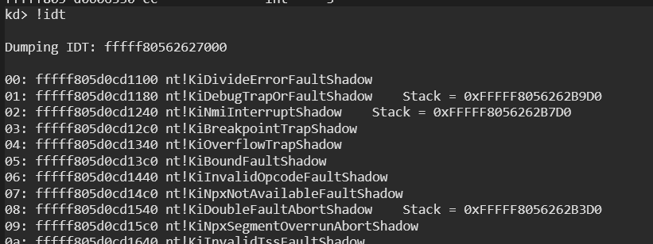
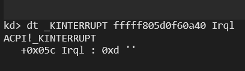
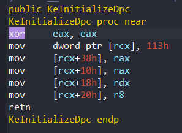
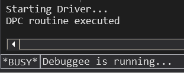

DPC (Deferred Procedure Call) Windows kernel'da bulunan bir mekanizmadır. Amacı, bir fonksiyonun daha sonra daha düşük bir IRQL'de (aşağıda detaylandırılacaktır) çalışmasını planlamak için kullanılır. Başka bir deyişle, Windows'un önemli işleri daha sonra halletmesi için bir yoldur. DPC, bir kesme meydana geldiğinde veya sistemin çok hızlı yanıt vermesi gerektiğinde kullanışlıdır. Bu nedenle, DPC **kesinti işleyici** gibi yüksek öncelikli görevlerin yürütülmesine, ancak daha sonra yürütülmek üzere daha düşük öncelikli görevlerin yürütülmesine izin verir.

Her DPC, çekirdek tarafından oluşturulan ve başlatılan DPC Nesnesi ile ilişkilendirilir. Bir aygıt sürücüsü bir DPC isteği yayınlayabilir ve ardından DPC isteği DPC kuyruğunun sonuna eklenir. DPC Nesneleri **IRQL**'in **DISPATCH_LEVEL**'inde sıralanır. Ancak devam etmeden önce IRQL konusuna bir göz atalım.

#### **IRQL**

'IRQL' (Interrupt Request Level) terimi, basitçe bir CPU'nun herhangi bir zamanda çalıştığı mevcut donanım önceliğini tanımlar.  Bunun için, her donanımın belirli bir istek seviyesine karşılık geldiği haritalar vardır. İşte **X64** için bir harita:

| Number |           Name            |
| :----: | :-----------------------: |
| **15** |       High/Profile        |
| **14** | Inter-Processor Interrupt |
| **13** |           Clock           |
| **12** |           Synch           |
|        |         Device[n]         |
|        |             .             |
|        |             .             |
|        |         Device[1]         |
| **2**  |       Dispatch/DPC        |
| **1**  |            APC            |
| **0**  |        Passive/Low        |

Mevcut çalışan iş parçacığı, CPU durumunu kaydeden ve gelen IRQL ile eşlenen Kesme Hizmeti Rutinini (ISR) işleyen bu kesintileri ele almaktan sorumludur. Her bir kesme rutini Kesme Açıklama Tablosunda (IDT) listelenmiştir. Bu tabloyu Windbg ile dökebiliriz:

<div style="text-align: center;">
  
</div>

Bu kafa karıştırıcı gibi gözülen çıktıda vektör numaralarını, adresleri ve ntoskrnl rutinlerini görebiliriz. Örneğin, KiDivideErrorFault'un gölgesi olan **0x0 KiDivideErrorFaultShadow** vektörü, Kullanıcı Modu veya Çekirdek Modu Alanından bir bölme işlemi hata ile sonuçlandığında çağrılır.

Başka bir örnek, listenin devamında CPU Clock görebiliriz:

```
d1:	fffff805d0cd2948 nt!HalpTimerClockInterrupt (KINTERRUPT fffff805d0f60a40)
```

Böylece, IRQL seviyesinin X64 tablosundaki 13. değere karşılık gelip gelmediğini doğrulayabiliriz:

<div style="text-align: center;">
  
</div>

KINTERRUPT yapısı ise kernel bellek yapısıdır ve interrupt  hakkında önemli bilgiler tutar:

```
kd> dt _KINTERRUPT
nt!_KINTERRUPT
   +0x000 Type             : Int2B
   +0x002 Size             : Int2B
   +0x008 InterruptListEntry : _LIST_ENTRY
   +0x018 ServiceRoutine   : Ptr64     unsigned char 
   ...
```

Bu çıktıda, anahtar üyemiz 0x18 ofsetindeki ServiceRoutine'dir. Bu pointer, ilişkili interrupt tetiklendiğinde, çalıştırılacak olan Interrupt Service Routine (ISR) adresini tutar.

## **Proje**

Basit bir proje ile bu konuyu daha iyi anlayabiliriz:

```c
#pragma warning(error:28251)

#include "main.h"

VOID DpcRoutine(
	_In_ struct _KDPC* Dpc, 
	_In_ PVOID DeferredContext, 
	_In_ PVOID SystemArgument1, 
	_In_ PVOID SystemArgument2
) {
	UNREFERENCED_PARAMETER(Dpc);
	UNREFERENCED_PARAMETER(DeferredContext);
	UNREFERENCED_PARAMETER(SystemArgument1);
	UNREFERENCED_PARAMETER(SystemArgument2);

	DbgPrintEx(0, 0, "DPC routine executed\n");
}

NTSTATUS DriverUnload(PDRIVER_OBJECT DriverObject) {

	UNREFERENCED_PARAMETER(DriverObject);

	DbgPrintEx(0, 0, "Driver Unload\n");

	return STATUS_SUCCESS;
}

NTSTATUS DriverEntry(PDRIVER_OBJECT DriverObject, PUNICODE_STRING RegistryPath) {

	UNREFERENCED_PARAMETER(RegistryPath);
	DriverObject->DriverUnload = DriverUnload;

	DbgPrintEx(0, 0, "Starting Driver...\n");

	KDPC DpcObject;

	/* Initialize Dpc Object */
	KeInitializeDpc(&DpcObject, DpcRoutine, NULL);

	/* Queue the DPC */
	KeInsertQueueDpc(&DpcObject, NULL, NULL);

	return STATUS_SUCCESS;
}
```

Kodlarımız bu şekilde.

İlk olarak projede DPC Object'i **KeInitializeDpc** ile initialize ederek başlıyoruz:

```c
KDPC DpcObject;

/* Initialize Dpc Object */
KeInitializeDpc(&DpcObject, DpcRoutine, NULL);
```

KDPC yapısı ise basitçe DPC Object'ler için kullanılan bir yapıdır:

```
kd> dt _KDPC
nt!_KDPC
   +0x000 TargetInfoAsUlong : Uint4B
   +0x000 Type             : UChar
   +0x001 Importance       : UChar
   +0x002 Number           : Uint2B
   +0x008 DpcListEntry     : _SINGLE_LIST_ENTRY
   +0x010 ProcessorHistory : Uint8B
   +0x018 DeferredRoutine  : Ptr64     void 
   +0x020 DeferredContext  : Ptr64 Void
   +0x028 SystemArgument1  : Ptr64 Void
   +0x030 SystemArgument2  : Ptr64 Void
   +0x038 DpcData          : Ptr64 Void
```

Burada ise anahtar üyemiz **DeferredRoutine** olabilir. Bu üye DPC Rutininin adresini tutar. Bunu KeInitializeDpc kodlarında görebiliriz:

<div style="text-align: center;">
  
</div>

rdx register'ı KeInitializeDpc'nin ikinci parametresini tutar ve bu değer DPC+DeferredRoutine'e aktarılır. KDPC yapısı 0x113 ofsetine karşılık gelir.

Daha sonra, DPC Object'i **KeInsertQueueDpc** ile DPC'i çalıştırmak için kuyruğa ekliyoruz:

```c
/* Queue the DPC */
KeInsertQueueDpc(&DpcObject, NULL, NULL);
```

Ve sonra DPC'miz çalıştırılacaktır:

<div style="text-align: center;">
  
</div>

Yaptıklarımızı tekrar edersek, Bir driver, projede yaptığımız gibi **KeInitializeDpc** 'yi çağırarak bir device object için bir rutin kaydeder bu fonksiyon bir create object oluşturur. Ardından Custom DPC'i (DpcRoutine fonksiyonumuz gibi) yürütmek için **KeInsertQueueDpc** 'yi çağırılır:

<div style="text-align: center;">
  
</div>


Bu figür bize attığımız yaptığımız işlemleri daha iyi anlamamıza yardımcı olabilir.

## **References**

* [Microsoft - Introduction to DPC objects](https://learn.microsoft.com/en-us/windows-hardware/drivers/kernel/introduction-to-dpc-objects)
- [Wikipedia - Deferred Procedure Call](https://en.wikipedia.org/wiki/Deferred_Procedure_Call)
- [Offsec - IRQLs Close Encounters of the Rootkit Kind](https://www.offsec.com/blog/irqls-close-encounters/)
- [ired team - IDT](https://www.ired.team/miscellaneous-reversing-forensics/windows-kernel-internals/interrupt-descriptor-table-idt#kinterrupt)
- [Microsoft Docs - Registering and Queuing a CustomDpc Routine](https://learn.microsoft.com/en-us/windows-hardware/drivers/kernel/registering-and-queuing-a-customdpc-routine)
- [Microsoft Docs - Windows kernel opaque structures](https://learn.microsoft.com/en-us/windows-hardware/drivers/kernel/eprocess#kdpc)