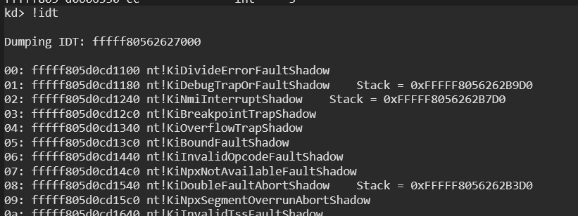
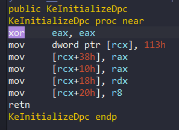

Date: 05.15.2025 

<div style="text-align: center;">
  
</div>

### **DPC**

DPC (Deferred Procedure Call) is a mechanism in windows kernel. It's used to let the schedule a function to run later at a lower IRQL. In other words, it's a way for Windows handle important work later. DPC is useful when an interrupt happens or system must respond very quickly. So, DPC allows to execute high-priority tasks, such as **interrupt handler** but lower-priority tasks for later execution.

Each DPC is associated with DPC Object which created and initialized by the kernel. A device driver can issue a DPC request and then, the DPC request will added to end of DPC queue. The DPC Objects queued in **DISPATCH_LEVEL** of **IRQL**. Now we have to understand that what is 'IRQL'.

#### **IRQL**
The term of 'IRQL' (Interrupt Request Level) is that it is simply defines the current hardware priority at which a CPU runs at any given time.  For this, there are maps that each hardware corresponds to specific request level. Here's a map for **X64**:

| Number |           Name            |
| :----: | :-----------------------: |
| **15** |       High/Profile        |
| **14** | Inter-Processor Interrupt |
| **13** |           Clock           |
| **12** |           Synch           |
|        |         Device[n]         |
|        |             .             |
|        |             .             |
|        |         Device[1]         |
| **2**  |       Dispatch/DPC        |
| **1**  |            APC            |
| **0**  |        Passive/Low        |

The current running thread is responsible for handling these interrupts that saves CPU state and processes Interrupt Service Routine (ISR) mapped to incoming IRQL. Each interrupt routine is listed in Interrupt Description Table (IDT). We can dump this table with Windbg:

<div style="text-align: center;">
  
</div>

In this confusing output, we can see vector numbers, address and ntoskrnl routines. For example, the vector 0x0 KiDivideErrorFaultShadow that is shadow of KiDivideErrorFault is called when a division operation is concluded with error from User Mode or Kernel Mode Space. 

Another example, in further of the list, there's CPU Clock :

```
d1:	fffff805d0cd2948 nt!HalpTimerClockInterrupt (KINTERRUPT fffff805d0f60a40)
```

So, we can verify if its IRQL level correspond to 13th value from the X64 table:

<div style="text-align: center;">
  
</div>
	 
The structure KINTERRUPT is kernel memory structure and it holds information about interrupt:

```
kd> dt _KINTERRUPT
nt!_KINTERRUPT
   +0x000 Type             : Int2B
   +0x002 Size             : Int2B
   +0x008 InterruptListEntry : _LIST_ENTRY
   +0x018 ServiceRoutine   : Ptr64     unsigned char 
   ...
```

In this output, the key member is ServiceRoutine at offset 0x18. This pointer holds the address of the Interrupt Service Routine (ISR) that will be executed when the associated interrupt is triggered.

## **Project**

We will start with a simple project for DPC:

```c
#pragma warning(error:28251)

#include "main.h"

VOID DpcRoutine(
	_In_ struct _KDPC* Dpc, 
	_In_ PVOID DeferredContext, 
	_In_ PVOID SystemArgument1, 
	_In_ PVOID SystemArgument2
) {
	UNREFERENCED_PARAMETER(Dpc);
	UNREFERENCED_PARAMETER(DeferredContext);
	UNREFERENCED_PARAMETER(SystemArgument1);
	UNREFERENCED_PARAMETER(SystemArgument2);

	DbgPrintEx(0, 0, "DPC routine executed\n");
}

NTSTATUS DriverUnload(PDRIVER_OBJECT DriverObject) {

	UNREFERENCED_PARAMETER(DriverObject);

	DbgPrintEx(0, 0, "Driver Unload\n");

	return STATUS_SUCCESS;
}

NTSTATUS DriverEntry(PDRIVER_OBJECT DriverObject, PUNICODE_STRING RegistryPath) {

	UNREFERENCED_PARAMETER(RegistryPath);
	DriverObject->DriverUnload = DriverUnload;

	DbgPrintEx(0, 0, "Starting Driver...\n");

	KDPC DpcObject;

	/* Initialize Dpc Object */
	KeInitializeDpc(&DpcObject, DpcRoutine, NULL);

	/* Queue the DPC */
	KeInsertQueueDpc(&DpcObject, NULL, NULL);

	return STATUS_SUCCESS;
}
```

In this code, we start by initializing our DPC Object with **KeInitializeDpc**:

```c
KDPC DpcObject;

/* Initialize Dpc Object */
KeInitializeDpc(&DpcObject, DpcRoutine, NULL);
```

The structure KDPC is simply used for DPC Objects:

```
kd> dt _KDPC
nt!_KDPC
   +0x000 TargetInfoAsUlong : Uint4B
   +0x000 Type             : UChar
   +0x001 Importance       : UChar
   +0x002 Number           : Uint2B
   +0x008 DpcListEntry     : _SINGLE_LIST_ENTRY
   +0x010 ProcessorHistory : Uint8B
   +0x018 DeferredRoutine  : Ptr64     void 
   +0x020 DeferredContext  : Ptr64 Void
   +0x028 SystemArgument1  : Ptr64 Void
   +0x030 SystemArgument2  : Ptr64 Void
   +0x038 DpcData          : Ptr64 Void
```

The member key is **DeferredRoutine**. This member is taken address of DPC Routine. We can see this in the codes of KeInitializeDpc:

<div style="text-align: center;">
  
</div>

The rdx value holds the second parameter of KeInitializeDpc and taken the value to DPC+DeferredRoutine. The KDPC structure corresponds to 0x113 offset.


After that, we insert our DPC Object to queue for DPC execution with **KeInsertQueueDpc**: 

```c
/* Queue the DPC */
KeInsertQueueDpc(&DpcObject, NULL, NULL);
```

And then our DPC will be executed:

<div style="text-align: center;">
  
</div>


A driver registers a routine for a device object by calling **KeInitializeDpc**, as we did in the  project and the function will be create device object, and we can call **KeInsertQueueDpc** for queue Custom Dpc (Our Routine, such as DpcRoutine) to execution:

<div style="text-align: center;">
  
</div>

This figure can help us that understand the steps we take. 

## **Analyze with Windbg**

Firstly, we will see DPC structure which we created. Add bp after KeInitializeDpc run:

```
kd> bp fffff805`75471074
kd> g
Starting Driver...
Breakpoint 1 hit
DPC!DriverEntry+0x44:
fffff805`75471074 4533c0          xor     r8d,r8d
```

After that, we can check the DPC:

```
kd> r rcx
rcx=ffffd10da1ebc6f0

kd> dt _KDPC ffffd10da1ebc6f0
DPC!_KDPC
   +0x000 TargetInfoAsUlong : 0x113
   +0x000 Type             : 0x13 ''
   +0x001 Importance       : 0x1 ''
   +0x002 Number           : 0
   +0x008 DpcListEntry     : _SINGLE_LIST_ENTRY
   +0x010 ProcessorHistory : 0
   +0x018 DeferredRoutine  : 0xfffff805`75471000     void  DPC!DpcRoutine+0
   +0x020 DeferredContext  : (null) 
   +0x028 SystemArgument1  : 0x00000000`00040244 Void
   +0x030 SystemArgument2  : 0xffffd10d`a1ebc738 Void
   +0x038 DpcData          : (null)
```

Notice that 0x18 offset DeferredRoutine taken address of DpcRoutine. Now let's set bp on DpcRoutine:

```
kd> bp 0xfffff805`75471000
kd> p
Breakpoint 3 hit
DPC!DpcRoutine:
fffff805`75471000 4c894c2420      mov     qword ptr [rsp+20h],r9

kd> k
 # Child-SP          RetAddr               Call Site
00 fffff805`70f71ac8 fffff805`decd000e     DPC!DpcRoutine 
01 fffff805`70f71ad0 fffff805`dedbca0b     nt!KiExecuteAllDpcs+0x67e
02 fffff805`70f71d20 fffff805`df1136e5     nt!KiRetireDpcList+0x36b
03 fffff805`70f71fb0 fffff805`df11368f     nt!KxSwapStacksAndRetireDpcList+0x5
04 ffffd10d`a1ebc3c0 fffff805`decb0c65     nt!KiPlatformSwapStacksAndCallReturn
05 ffffd10d`a1ebc3d0 fffff805`df112b1f     nt!KiDispatchInterrupt+0x65
06 ffffd10d`a1ebc400 fffff805`dec99539     nt!KiDpcInterrupt+0x39f
07 ffffd10d`a1ebc590 fffff805`dec99371     nt!KiInsertQueueDpc+0x1b9
08 ffffd10d`a1ebc690 fffff805`75471084     nt!KeInsertQueueDpc+0x11
09 ffffd10d`a1ebc6d0 fffff805`7547122b     DPC!DriverEntry+0x54 
...
```

At this point in the execution, our custom DpcRoutine has been triggered by the Windows kernel. The call stack shows that the routine is being called as part of the system's DPC dispatch process. Specifically, KiExecuteAllDpcs is invoking our DPC routine after retrieving it from the DPC queue.

## **Conclusions**

In this document, we took a close look at DPC and IRQL and then created a project. Through our debugging session with WinDbg, we were able to inspect the call stack and confirm that our custom DpcRoutine was correctly triggered via KiExecuteAllDpcs.

This document simply demonstrates what a DPC (Deferred Procedure Call) is and how it works in the Windows operating system. I briefly explained the concept of IRQL, showed how a DPC routine can be created in a basic driver project, and observed its execution using WinDbg.


## **References**

* [Microsoft - Introduction to DPC objects](https://learn.microsoft.com/en-us/windows-hardware/drivers/kernel/introduction-to-dpc-objects)
- [Wikipedia - Deferred Procedure Call](https://en.wikipedia.org/wiki/Deferred_Procedure_Call)
- [Offsec - IRQLs Close Encounters of the Rootkit Kind](https://www.offsec.com/blog/irqls-close-encounters/)
- [ired team - IDT](https://www.ired.team/miscellaneous-reversing-forensics/windows-kernel-internals/interrupt-descriptor-table-idt#kinterrupt)
- [Microsoft Docs - Registering and Queuing a CustomDpc Routine](https://learn.microsoft.com/en-us/windows-hardware/drivers/kernel/registering-and-queuing-a-customdpc-routine)
- [Microsoft Docs - Windows kernel opaque structures](https://learn.microsoft.com/en-us/windows-hardware/drivers/kernel/eprocess#kdpc)